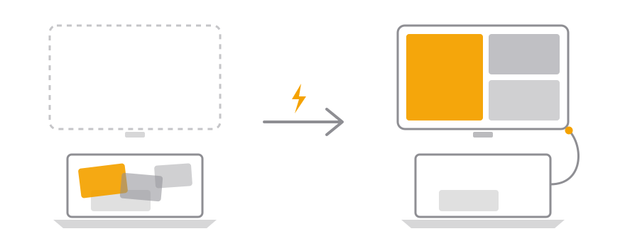

# Plugback

Plug in. Your apps come back. Nothing else moves.

<p align="center">
  
</p>

A macOS menu bar utility that restores your target apps' windows to their saved
positions when you reconnect an external screen — and touches nothing else.

Take your MacBook to the office, work on a different monitor, come home and
plug back in — your home layout is scrambled. macOS only remembers the
latest arrangement. Plugback keeps a profile per display, so every screen
you return to comes back exactly the way you left it.

Status: pre-release. Implementation complete (M1-M5), pending on-device
verification; no signed release yet. Design documents live in
[docs/](docs/) (currently written in Korean).

## Build from source

Requires macOS 13+ and Xcode 16+. There is no signed release yet, so building
it yourself is the only way to run it.

```sh
git clone git@github.com:mabyko/plugback.git
cd plugback
xcodebuild -project App/Plugback.xcodeproj -scheme Plugback \
  -configuration Release -derivedDataPath build build
ditto build/Build/Products/Release/Plugback.app /Applications/Plugback.app
open /Applications/Plugback.app
```

On first launch, grant Accessibility permission in System Settings > Privacy &
Security > Accessibility. It is the only permission Plugback asks for, and it
is what lets it read and move windows.

That build is signed to run locally, which is enough to try it out. macOS ties
the Accessibility grant to the app's bundle ID and signature, so an ad-hoc
signature can make you re-approve the permission after a rebuild. (Saved
profiles live in a fixed path under Application Support and survive identity
changes.) To keep a stable identity, add `App/Config/Local.xcconfig` — it is
gitignored, so your identity never lands in a commit:

```
PLUGBACK_BUNDLE_ID = com.example.plugback.<your-handle>
PLUGBACK_BUNDLE_ID[config=Debug] = com.example.plugback.<your-handle>.dev
DEVELOPMENT_TEAM = <your-team-id>
```

Your team ID is in Xcode > Settings > Accounts (a free Apple ID works). Without
this file the build falls back to `forked.plugback.local`; the canonical bundle
ID is deliberately absent from the repo so that no fork can register it by
accident.

Policy tests live in the Swift package; presentation-mapping tests live in
an app-hosted unit test target:

```sh
swift test   # PlugbackKit — engine/controller policy
xcodebuild test -project App/Plugback.xcodeproj -scheme Plugback -destination 'platform=macOS'
```

## Contributing

Issues and pull requests are welcome. A few things worth knowing before you
open one:

- Read [CONTEXT.md](CONTEXT.md) first. It fixes the vocabulary — profile,
  target app, restore — and the code and docs use those words exactly.
- The design documents in [docs/](docs/) are written in Korean and lead the
  implementation. If a change alters intended behavior, update the relevant
  document in the same pull request.
- Scope is a feature, not a limitation. Plugback moves the windows you asked
  for and nothing else; proposals that broaden that default are likely to be
  declined. [docs/BRANDING.md](docs/BRANDING.md) explains the reasoning.
- Commits follow [Conventional Commits](https://www.conventionalcommits.org).

## Open core

Plugback and its core package, PlugbackKit, are open source under the
[MIT License](LICENSE). The makers may also ship separate closed-source paid
apps built on PlugbackKit — and under the MIT terms, so can anyone.
