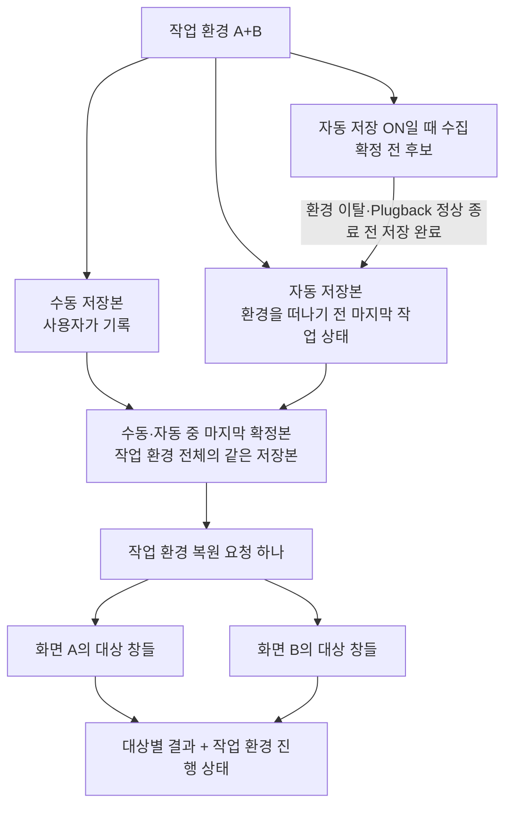
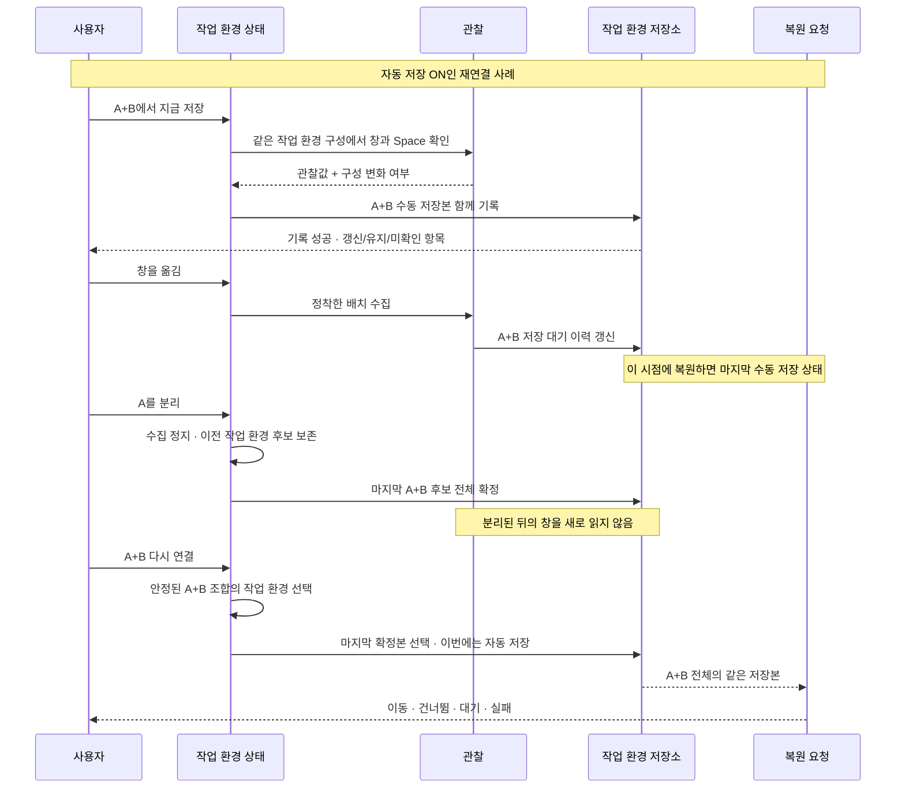
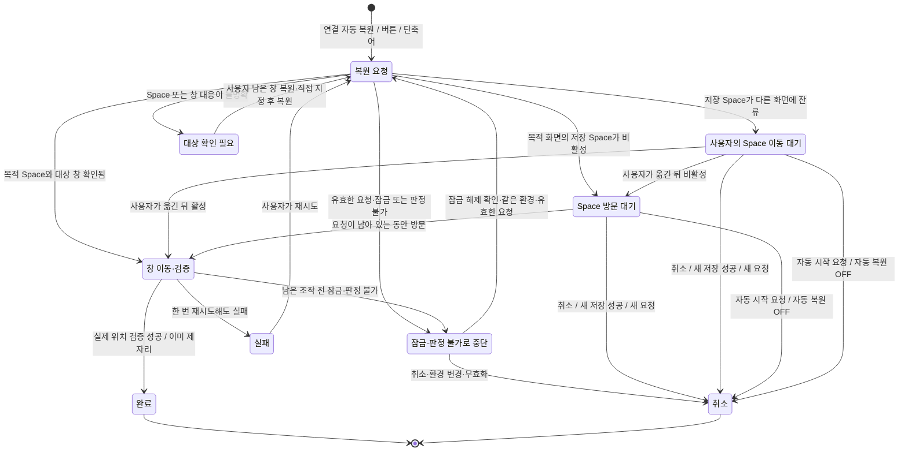

# 작업 환경 중심 제품 설계 검토

2026-09-10 · 분석 기준 `09f9d67`

이 문서는 **현재 동작의 진단과 수정 제안**이다. 제안된 작업 환경 모델과 상태 전이는 아직 제품 코드에 구현되지 않았다. 기존 명세에서 잘못된 사용자 경험을 허용하는 부분도 수정 대상으로 다룬다.

**첫 구현의 지원 범위는 macOS 「각각의 Spaces가 있는 디스플레이」가 켜진 구성으로 확정했다(D6).** OFF 공유 구성에서는 기존 저장 기록을 보존하고 지원 조건을 안내하며, 이 모델로 새 Space 기록을 저장하거나 복원하지 않는다. 설정을 확인할 수 없으면 적용을 보류하고, Space 제약을 버린 위치 전용 복원으로 조용히 전환하지 않는다. 화면별 일반 Space가 하나뿐인 ON 구성도 지원 대상이다. 공유 구성의 지원은 후속 범위이며, 조건 확인·안내와 저장·복원 진입점 제어는 아직 제품에 구현하지 않았다([상태 검토 1절](./SPACE_LAYOUT_STATE_REVIEW.md)).

이번 사용자 요구로 확정된 방향은 **연결된 외장 화면 조합을 하나의 작업 환경으로 다루고, 같은 Space의 같은 앱 창도 각각 따로 저장·복원한다**는 것이다. **A+B와 A 단독은 별도 작업 환경으로 기록을 따로 가진다**(D5). 닫힌 창은 **저장한 환경에서 닫았으면 건너뛰고, 다른 환경·연결 해제 중 닫았으면 원래 환경의 기록을 보존하고 앱 실행·추가 창 생성은 실험 옵션에 따라 처리**한다(D9). **Chrome을 포함한 탭 복구는 이번 범위에서 제외하고 후속 앱별 실험실 기능으로 미룬다.** 자동 저장은 ON/OFF 설정을 유지하고 최초 ON. 화면 추가·분리로 환경을 떠날 때 또는 Plugback 정상 종료 전에 저장을 완료하며, 모든 복원은 수동·자동 구분 없이 해당 환경의 마지막 저장본을 사용한다(D2). 종료 전 저장 실패는 종료를 취소하고 재시도·저장 없이 종료 중 사용자가 선택하며, 이미 종료됐다면 저장 전 이력 유실을 예외로 허용한다. 종료 제어 구현, 연결 준비 판정·정확한 대기 시간과 창 다시 열기·대응의 구체적인 방법은 계속 검토한다.

아래 R1–R6는 재현한 현재 동작이다. 각 행의 수정 계약과 이후 설계도는 그 동작을 검토한 개선안이며, 모든 세부 정책에 합의했다는 뜻은 아니다.

후속 [Space별 창 위치·상태 검토](./SPACE_LAYOUT_STATE_REVIEW.md)는 Space 안의 개별 창 모델과 상태들을 다룬다. D1의 다중 창 지원, D2의 공통 저장·복원 기준, D3의 직접 지정 실험실 옵션·최초 OFF·OFF 자동 배정 순서와 남는 창 유지·확정한 연결의 재사용과 진행 중 ON/OFF 전환 기준, D4의 최초·이후 새 앱 기본 포함과 앱 제외, D5의 작업 환경 정의와 짧은 재확인 후 준비된 조합부터 복원·조작한 창 보호 방향, D6의 개별 Spaces ON 구성 우선 지원·공유 구성 기록 보존과 지원 조건 안내·화면별 Space 순차 번호 표시·포트 위치 우선과 A/B 보조 화면명, D7의 OFF 때 이력 폐기·ON 때 새 수집, D8의 확인 필요 수동 재개·이벤트 기반 방문 대기와 시간 제한 없음·작업 이력 수집·자동 복원 설정 전환·재실행 처리·잠금 중 연결 보류와 복원 중단·재개·단축어의 잠금 해제 요구·판정 불가 시 보류와 피드백 개선, D9의 닫힘 환경별 기록 보존·같은 환경의 다음 저장 성공까지 제외 유지·불확실 시 열기 보류·실험 탭의 앱 다시 열기·창 되살리기·추가 창 생성 구조·실험실 설정 모두 최초 OFF·복원 도중 OFF 적용은 확정했으며, 나머지 정책과 세부 범위는 구분해 검토한다.

**구현 반영(2026-09-11):** 아래 R1–R6는 작업 환경·창별 기록 모델로 구현되어 [재현 검사](../Tests/DesignReviewTests/ProductRestoreReproductionTests.swift)가 모두 통과한다. 현재 계약은 [FUNCTIONAL_SPEC](./FUNCTIONAL_SPEC.md)이며, 구현한 동작·실행한 검사·남은 실기기 검증은 [구현 인계 문서의 완료 보고](./IMPLEMENTATION_HANDOFF.md)에 있다. 이 문서의 「현재」는 `09f9d67` 기준 진단이다.

**구현 인계(2026-09-11):** 사용자는 남은 세 묶음을 권장안으로 정리하고 구현으로 넘어가는 데 동의했다. 예외 처리·기존 설정 이전·확인 UI와 로컬 실패 기록은 [상태 검토 7.1절](./SPACE_LAYOUT_STATE_REVIEW.md)의 구현 기본안을 따른다. 실제 구현은 현재 워크트리의 Claude 세션에 맡기며, 범위·우선순위·검증 기준은 [구현 인계 문서](./IMPLEMENTATION_HANDOFF.md)에 정리했다.

## 1. 제보와 재현 결과

제보는 “데스크탑 2에 두고 저장한 다음 다른 화면으로 옮겨 복원을 눌렀는데 돌아오지 않음”, “이전 버전에서 되던 복원이 두 화면 환경에서 안 됨”이다. 이미지에는 앱 화면·버전·설정이 없어 창을 옮겼는지 Space 전체를 옮겼는지까지는 확정할 수 없다.

실제 창을 움직이지 않는 페이크 어댑터로 **현재 제품의 컨트롤러 또는 저장·복원 코어를 실행**했다. 아래는 확인된 코드 경로이며, 제보자의 실기기에서 어느 경로가 발생했는지는 추가 확인이 필요하다.

| 구분 | 재현한 조건 | 현재 결과 | 수정할 계약 |
|---|---|---|---|
| R1 · 회귀 | A의 데스크탑 2에 저장 → 창을 B로 이동 → A의 데스크탑 2가 비활성인 동안 복원 → 해당 Space 방문 | 복원 안내도 남지 않고 방문 뒤에도 이동 0회 | 명시적으로 시작한 복원의 비활성 대상은 방문 대기로 남긴다 |
| R2 · 창 선택 | A의 창 하나를 저장 → A 안에서 위치 변경 → B에 같은 앱의 다른 창 추가. 저장 Space는 활성 | Space 복원에서 후보가 2개라는 이유로 이동 0회 | 다른 창의 존재만으로 대상 창의 복원을 포기하지 않는다. 창 대응이 모호한 경우는 이유를 표시한다 |
| R3 · 작업 환경 저장 | 자동 슬롯 꺼짐·B의 초기 대상 목록이 비어 있음. A에 저장 → 같은 창을 B로 이동 → 지금 저장 → B 안에서 위치 변경 → 복원 | A의 옛 항목과 B의 새 항목이 함께 남고, 화면 식별자 정렬상 앞선 A로 복원 | 작업 환경 안에서 확인된 대상의 목적 화면을 한 번에 갱신한다 |
| R4 · 작업 환경 확정 | 자동 후보에서 앱이 A에서 B로 이동 → A만 분리·확정 → A+B의 복원 소스 조회 | A의 삭제만 확정되고 B의 추가는 후보에 남아 양쪽 소스에서 앱이 빠짐 | 이전 작업 환경 전체의 마지막 후보를 함께 확정한다 |
| R5 · 자동 슬롯 | 변경 즉시 저장 켬 → 복원 이동 실패 | 실패한 현재 위치가 복원 직후 수집되어 다음 복원 소스로 승격됨 | 복원 실패·중간 배치를 자동 기록의 새 기준으로 삼지 않는다 |
| R6 · 새 앱 포함 | B에 기존 대상 앱이 있는 상태에서 새 앱 창이 B에 나타남 → 지금 저장. 자동 저장 OFF·ON 모두 검사 | 수동 저장의 기존 대상 필터 때문에 새 앱 누락. ON에서 이미 자동 후보로 수집했어도 수동 저장 시 빠짐 | 외장에 들어온 새 앱을 수동·자동 저장 모두 기본 포함하고, 명시적으로 제외한 앱만 뺀다 |

대조군도 확인했다. 저장 Space가 현재 활성인 경우, A에 창이 하나인 경우, Space 연결 정보가 없는 기존 복원 경로, 두 화면 후보를 함께 확정한 경우는 통과했다. 문제는 “외장 화면이 두 대면 항상 실패”하는 형태가 아니다.

추가 대조 검사에서는 새 앱 창의 B에서 열기·내장→B·A→B를 각각 관찰 데이터로 공급했다. 수집 후 두 화면을 함께 확정하면 모두 B의 좌표·Space만 남았다. 이 결과는 수집 코어의 처리를 확인한 것이며, Keynote의 실제 창 생성·이동 이벤트가 수집을 일으킨다는 실기기 검증은 아니다.

R1은 버전 차이까지 확인했다. 안내형 복원 도입 직전인 `56baecb`에서 **일반 Space 복원 설정을 켜고** 같은 저장·이동·방문 시나리오를 실행하면 통과한다. `294b007`에서 방문 대상을 “다른 화면에 잔류한 Space”로 좁힌 뒤 현재 코드에서는 실패한다. 이전 코드의 위험한 Space 자동 이동이나 전체화면 조작을 되살릴 필요는 없다.

현재 근거:

- [RestoreSession.addRecoveries](../Sources/PlugbackKit/RestoreSession.swift): `.stranded`만 세션에 등록한다.
- [RestoreEngine.selectSpaceWindow / claimedApps](../Sources/PlugbackKit/RestoreEngine.swift): 비활성·복수 창은 보류하지만 결과 항목을 만들지 않고, 앱 중복은 화면 식별자 순서로 제거한다.
- [CaptureEngine.capture / collect](../Sources/PlugbackKit/CaptureEngine.swift): 수동 저장은 보이지 않는 기존 항목을 유지하고, 수집은 다른 화면에 보이는 앱을 현재 화면에서 제거한다.
- [ProfileSlots.confirm](../Sources/PlugbackKit/ProfileSlots.swift): 전달된 화면들만 확정한다.
- [PlugbackController.performRestore](../Sources/PlugbackKit/PlugbackController.swift): 복원 회차 뒤 수집을 호출한다.

기존 명세 F-01.6·F-08.5와 `testInitiallyInactiveSpaceNeverBecomesAGeneralVisitRestore`는 R1·R3의 현재 동작을 의도적으로 허용한다. F-08.6은 R5의 위험을 수용한다. 따라서 기존 테스트 통과만으로 이번 제품 요구를 만족한다고 판단하면 안 된다.

### 두 창과 재저장 사례의 정확한 뜻

R2에서 두 창을 함께 저장한 것은 아니다. **처음에는 A에 창 하나만 있을 때 저장했고, 그 뒤 B에 같은 앱의 창을 하나 더 열었다.** Chrome을 예로 들면 다음과 같다.

| 순서 | 화면 A | 화면 B |
|---|---|---|
| 지금 저장 | Chrome 창 ①이 저장 위치에 있음 | Chrome 창 없음 |
| 배치 변경 | 창 ①을 A 안의 다른 위치로 이동 | Chrome 창 ②를 새로 엶 |
| 지금 복원 · 현재 결과 | 창 ①도 움직이지 않음 | 창 ②도 움직이지 않음 |
| 검토하는 기대 동작 | 대상이 창 ①임을 확인할 수 있으면 저장 위치로 복원 | 별도로 저장하지 않은 창 ②는 그대로 유지 |

현재 저장 단위는 화면별 **앱 하나의 좌표와 Space 연결 정보**다. 저장 당시 창 ①을 장기적으로 구별할 창 식별자는 저장하지 않는다. `selectSpaceWindow`는 화면을 구분하지 않고 같은 앱의 창을 모두 후보로 모은 뒤, 정확히 하나일 때만 선택한다. 그래서 B에서 추가로 연 창 때문에 A의 복원도 멈춘다. `.unavailable` 결과는 복원 결과 항목에서도 생략된다.

대조 검사에서는 같은 조건에 Space 연결 정보가 없는 기존 경로를 적용하면 A의 창이 복원된다. 그 경로는 목적 화면에 있는 창을 우선 고른다. 다만 이 규칙도 저장 당시 창과의 동일성을 보장하지 않으므로, 창 두 개 제한만 삭제하는 것으로 해결했다고 볼 수 없다. **각 창을 따로 기억한다는 제품 범위는 D1에서 확정했으며, 개별 창을 대응시키는 처리가 필요하다.**

R3은 재저장이 거부된 사례가 아니다. `captureNow()`가 두 번 모두 성공했으며, Space를 관찰하는 컨트롤러 경로에서도 아래 상태가 확인됐다. 두 화면의 저장 Space는 계속 활성이고 자동 슬롯은 꺼져 있다.

| 순서 | A의 저장 기록 | B의 저장 기록 |
|---|---|---|
| 창 ①이 A에 있을 때 지금 저장 | 앱 → A의 위치 | 비어 있음 |
| 같은 창을 B로 옮겨 지금 저장 | 앱 → **A의 옛 위치 유지** | 앱 → **B의 새 위치 추가** |
| 위치를 다시 바꾼 뒤 지금 복원 | 화면 ID 정렬상 앞선 A의 기록을 적용 | 같은 앱이 이미 선택되어 이 기록은 적용하지 않음 |

수동 저장은 화면마다 기존 기록을 병합한다. A에 창이 없으면 A의 기록을 보존하고, B에서는 새 위치를 기록한다. 이후 복원은 같은 앱을 두 번 옮기지 않으려고 **화면 ID 정렬상 첫 기록만 선택**한다. A가 항상 이기는 것은 아니다. 재현 데이터에서는 `a < b`여서 A가 선택됐으며, 좌우 배치나 최근 이동·저장 의도를 기준으로 고르지 않는다.

B의 기록이 생기는 조건도 있다. 이번 재현에서는 B의 대상 목록이 비어 있어 첫 저장 규칙으로 앱이 추가됐다. B에 기존 대상 목록이 있고 해당 앱이 선택되어 있지 않으면, B에 옮겨 저장해도 그 앱의 새 기록은 추가되지 않는다. 현재 대상 선택부터 화면마다 독립적이기 때문이다.

작업 환경 설계에서 고칠 지점은 **관찰하지 못한 앱의 기록 보존**과 **작업 환경의 다른 화면에서 확인한 같은 대상의 목적지 변경**을 구별하는 것이다. 기존 명세 F-01.6의 화면별 독립 적용과 ID 순서 중복 제거가 그대로면, 두 화면을 함께 저장하는 버튼만으로는 작업 환경 저장 요구를 충족하지 못한다.

## 2. 현재 저장과 복원의 정확한 관계

**자동 복원과 자동 슬롯은 별개의 축이다.** 복원 모드가 자동이어도 자동 슬롯이 꺼져 있으면 백그라운드에서 배치를 기록하지 않는다.

| 현재 설정 | 수집한 값을 파일에 쓰는 때 | 다음 복원이 쓰는 값 |
|---|---|---|
| 자동 슬롯 꺼짐 · 기본값 | 사용자가 저장 버튼을 누른 때 | 수동 슬롯 |
| 자동 슬롯 · 분리할 때 저장 | 각 화면이 분리되거나 앱이 정상 종료될 때 | 화면별로 더 최근에 확정한 슬롯. 연결 중 후보는 사용하지 않음 |
| 자동 슬롯 · 변경 즉시 저장 | 창 이동·앱 전환 등의 수집 직후 | 방금 기록한 자동 슬롯이 더 최근이면 그 값 |
| 자동 슬롯 · 복원 즉시 반영, 분리 시 저장 | 파일 기록은 분리·종료 때 | 후보가 있으면 아직 파일에 쓰지 않은 후보부터 사용 |

창 이동 뒤 “지금 복원”을 눌러도 마지막 두 방식에서는 **옮긴 현재 위치 자체가 이미 복원 기준**일 수 있다. 이때 복원 엔진은 정상 동작해도 사용자는 “저장한 곳으로 돌아가지 않는다”고 느낀다. 제보 당시 자동 슬롯 설정 확인이 필요한 이유다.

현재의 세부 순서는 다음과 같다.

1. 수동 저장은 연결된 모든 외장 화면을 한 번 관찰한 뒤 화면별 수동 프로필을 병합한다. 파일 쓰기가 성공해야 새 상태를 공개하고 이전 후보를 버린다.
2. 수집은 창 이동 정착·앱 활성화/비활성화·Space 변화·Mission Control 닫힘 등에 반응한다. 창 이동은 후행 디바운스, 앱 전환은 기본 10초 간격 제한을 사용한다.
3. 화면 분리 시에는 창을 다시 읽지 않고 그 화면의 후보만 확정한다. 후보가 없는 화면은 쓸 것이 없다.
4. 화면 연결의 자동 복원과 버튼·단축어의 수동 복원은 같은 `restoreNow` 경로로 합류한다. 시작할 때 화면별로 소스를 선택한다.
5. 복원 중·안내가 남은 동안 수집을 미루지만, 회차 종료 후에는 실패 여부와 무관하게 수집을 시도한다.

근거: [ProfileSlots](../Sources/PlugbackKit/ProfileSlots.swift), [컨트롤러](../Sources/PlugbackKit/PlugbackController.swift), [수집 트리거](../Sources/PlugbackKit/CollectTrigger.swift), [반영 방식 테스트](../Tests/PlugbackKitTests/ProfileSlotsTests.swift).

## 3. 수정 설계: 저장과 복원의 단위를 작업 환경으로 올린다

**작업 환경**은 연결된 외장 화면 조합에 따라 구별하는 저장·복원 단위다. 한 대도 독립 작업 환경이며 내장 화면은 조합에 포함하지 않는다. 미러링된 표시 영역은 기존 화면 정규화 결과를 따른다.

작업 환경의 식별 기준은 연결된 외장 화면 식별자의 집합이다. `{A, B}`와 `{B, A}`는 같고, `{A}`, `{B}`, `{A, C}`는 각각 다른 환경이다. 연결 순서·좌우 배치·해상도는 환경 식별자가 아니다. 각 환경의 저장본과 이력을 따로 보관하고, 창 좌표는 각 목적 화면에 대한 비율로 기록한다.

A만 연결되어 준비되면 A 단독 환경을 선택한다. 예전에 A+B를 썼다는 이유로 B를 계속 기다리거나 A+B 기록 중 A 부분을 대신 복원하지 않는다. 순차 연결에서는 현재 구성을 짧게 재확인한 뒤 준비된 조합부터 복원하는 기본 방향에 합의했다. 시작 전에 A+B가 준비되면 바로 A+B를 사용하고, A 복원 도중이나 직후 B가 추가되면 남은 A 작업을 중단하고 준비된 A+B 저장본으로 전환한다. 두 번의 이동은 허용하되 조작한 창은 이번 자동 복원에서 보호한다. 정확한 대기 시간과 준비 판정·충돌 방지는 [Space 상태 검토 1.1절](./SPACE_LAYOUT_STATE_REVIEW.md)의 연결·충돌 실험으로 검증하며 아직 미구현이다. 자동 저장 ON이면 떠나는 A 환경의 전환 전 마지막 유효 상태를 저장하고, A+B 복원에는 별도의 A+B 기록을 사용한다. 복원의 중간 배치만으로 A 저장본을 갱신하지 않는다.



설계의 불변식:

- **작업 환경 전체를 함께 기록하고 함께 선택한다.** A는 수동, B는 자동, C는 후보처럼 다른 저장본을 섞지 않는다.
- 한 저장본 안에서 대상 창의 목적 화면은 하나다. 확인된 창이 A에서 B로 옮겨졌다면 A의 옛 배치와 B의 새 배치를 같은 변경으로 처리한다.
- 보이지 않는 앱·창을 지우는 것과, 다른 구성원 화면에서 발견한 같은 대상의 목적지를 옮기는 것은 다르다. 전자는 이전 기록을 보존하고 후자는 작업 환경 안에서 갱신한다.
- 화면 식별자 정렬은 키를 정규화할 때만 쓴다. 어느 화면에 창을 보낼지 결정하는 우선순위로 쓰지 않는다.
- 대상 앱의 포함·제외는 작업 환경에서 공유한다. 저장본을 바꿨다는 이유로 제외한 앱이 다시 복원 대상이 되지 않는다.
- 최초·이후 새로 외장에 나타난 표준 창을 모두 기본 포함하고 원치 않는 앱만 제외한다(D4). A에 Chrome·VS Code·Slack, B에 Chrome이 있으면 모두 대상이다. A·B의 Chrome 창은 각각 기록한다. Keynote를 B에서 열거나 내장 화면에서 B로 옮겨도 포함하며, 같은 창을 A에서 B로 옮기면 이력의 목적지를 갱신한다.
- 복원 요청은 시작할 때 소스와 대상 집합을 고정한다. 대기 중 자동 후보가 바뀌어도 목적지는 바뀌지 않는다.

## 4. 수정 설계: 언제 저장하고 언제 멈추는가

**합의된 D2:** 자동 저장 ON/OFF 설정을 유지하고, 설정 이력이 없는 첫 실행은 ON으로 시작한다. 사용자가 선택한 값은 유지한다. 수동 저장은 현재 상태를 저장하고, 자동 저장은 작업 중 이력(history)을 모아 **화면 추가·분리로 작업 환경을 떠날 때 또는 Plugback 정상 종료 전** 마지막 유효 상태의 저장을 완료한다. **연결 중 「지금 복원」과 재연결 복원 모두 수동·자동 구분 없이 해당 환경에서 마지막으로 저장이 완료된 상태를 사용한다.** ON/OFF는 새 자동 저장의 발생 여부를 정한다. OFF로 바꿔도 이미 확정된 자동 저장본을 버리거나 과거 수동 저장본으로 돌아가지 않는다.

자동 저장은 **환경을 떠날 때 이전 작업 환경의 마지막 유효 후보를 함께 확정**한다. A → A+B와 A+B → A에 같은 규칙을 적용한다. 작업 중 이력만으로 복원 기준을 갱신하거나 미확정 이력을 복원 소스로 쓰지 않는다. 화면 추가·분리 뒤 흩어진 창을 이전 환경에 기록하지 않으며, 마지막 상태를 확보하지 못했다면 최신 상태를 저장했다고 표시하지 않는다. 연결을 유지한 채 Plugback을 정상 종료할 때도 저장할 변경이 있으면 마지막 유효 이력의 저장을 먼저 완료한다.

공통 저장 순서는 제품의 복원 기준이며 물리적 저장소를 하나로 합친다는 결정은 아니다. 모든 요청은 사용할 작업 환경 저장본을 시작할 때 고정한다. 동시 저장의 순서와 늦은 관찰 처리는 [Space 상태 검토](./SPACE_LAYOUT_STATE_REVIEW.md)의 D2·D7에서 검증한다. 자동 저장과 연결 시 복원을 시작하는 자동 복원 모드도 계속 구별한다.

**D7 합의:** 자동 저장을 끄면 아직 저장하지 않은 이력을 지우고 마지막 저장본을 유지한다. 다시 켜면 그때 현재 작업 환경의 배치부터 새로 이력을 모으며, 전환 자체로 저장을 완료하지 않는다. OFF 전에 시작한 관찰이 늦게 도착해 버린 이력을 되살리지 않도록 구별한다.

**첫 저장본도 수동·자동 모두 가능하다.** 새 작업 환경에 저장본이 없으면 현재 배치를 유지한다. 수동 저장하면 그 상태가 첫 저장본이고, 자동 저장 ON이면 이력을 모아 환경 이탈 또는 Plugback 정상 종료 전에 첫 저장본을 만든다. 두 경로 모두 외장 화면의 표준 창을 기본 포함하되 사용자가 제외한 앱은 뺀다(D4). 관찰하지 못한 Space를 저장 완료로 표시하지 않는다.

새 창을 열거나 내장→B·A→B로 옮겨도 A+B의 연결 조합은 그대로다. 이 경우 새 앱 포함·작업 이력만 갱신하며, D2의 저장 완료 전에는 마지막 저장본을 바꾸지 않는다. A에 저장했던 같은 창을 B로 옮겼다면 새 저장 전 복원은 A를, B 상태의 저장을 완료한 뒤 복원은 B를 기준으로 한다. 자동 저장 OFF에서도 수동 저장은 새 앱을 포함한다.

연결 중 B의 저장 창을 사용자가 내장으로 옮겼다면, 새 이력에서 그 창의 외장 위치 기록을 빼고 **저장 완료 뒤부터** 외장 복원 대상에서 제외한다. 여기서 확정은 저장이 성공적으로 완료됐다는 뜻이다. 그전 복원은 기존 B 위치가 기준이며, 케이블 분리 때문에 내장으로 모인 창의 기록은 이 규칙으로 지우지 않는다.

| 사건 | 수정 설계의 처리 |
|---|---|
| 사용자가 지금 저장 | 작업 환경 구성과 창·Space를 관찰하고, 관찰 전후 작업 환경이 같을 때 작업 환경 수동 저장본을 한 번에 기록 |
| 저장 중 화면 구성이 바뀜 / 관찰 불가 | 저장 거부 사유를 알리고 이전 저장본·후보를 보존 |
| 수동 저장 성공 | 첫 저장본 또는 새 마지막 저장본으로 갱신하고 그보다 앞선 후보·늦게 도착할 옛 관찰·이전 복원 대기를 정리 |
| 정상 작업 중 대상 창 이동·크기 변경 | 자동 저장 ON이면 정착한 창 배치를 이력으로 수집. 마지막 저장본과 진행 중 복원 소스는 바꾸지 않음 |
| 자동 저장 OFF | 저장 전 이력을 지우고 새 자동 수집·저장 중단. 기존 마지막 저장본과 수동 저장 기능 유지 |
| 자동 저장을 다시 ON으로 전환 | 현재 배치부터 새 수집. OFF 전의 후보·늦은 관찰을 재사용하지 않으며, ON만으로 저장 완료하지 않음 |
| 원시 화면 구성 변경 신호 | 안정화 대기가 끝나기 전부터 수집을 멈추고 이전 작업 환경의 마지막 후보를 보존 |
| 작업 환경에서 화면 하나 이상이 실제로 빠짐 | 자동 저장 ON이면 이전 작업 환경의 마지막 유효 후보 전체를 한 번에 확정하여 마지막 저장본 갱신. 이미 흩어진 창은 다시 읽지 않음. OFF이면 기존 마지막 저장본 유지 |
| 화면 추가로 작업 환경이 바뀜 | 자동 저장 ON이면 전환 전에 확보한 이전 환경의 유효 이력을 확정. 새 조합의 환경은 자기 저장본을 사용 |
| 실제 작업 환경 전환 뒤 화면 조합 안정화 | 현재 조합의 작업 환경 선택. 그 환경의 저장본이 있고 자동 복원 모드면 새 요청 시작. 바뀐 환경의 옛 요청은 무효화 |
| 잠금 중 새 환경 연결, 아직 복원 시작 전 | 연결을 보류하고 해제 후 준비된 현재 환경의 마지막 저장 완료본으로 새 요청 시작. 자동 복원 설정·취소 조건 적용 |
| 복원 도중 잠금 | 아직 OS에 보내지 않은 작업 중단. 완료 결과와 고정한 복원 소스 유지. 해제 후 같은 환경에서 여전히 유효한 요청의 남은 항목만 재확인·재개 |
| 잠금·해제만 발생 | 새 복원 요청이나 저장 완료의 원인으로 삼지 않음. 무효가 된 요청을 되살리거나 미확인·중간 배치를 이력에 넣지 않음 |
| 수동 복원 버튼·단축어 | 표시된 작업 환경과 저장본을 고정하여 같은 복원 경로 실행 |
| 자동 복원을 OFF로 전환 | 자동으로 시작한 복원의 남은 작업만 취소. 명시적 사용자 요청·작업 환경 저장본·기존 결과는 유지. 자동 저장 설정과 이력을 바꾸지 않음 |
| 자동 복원을 다시 ON으로 전환 | 전환 자체로 즉시 복원하지 않고 다음 연결·작업 환경 전환부터 최신 저장본으로 새 자동 요청 시작. 즉시 복원은 「지금 복원」 사용 |
| Plugback 실행·재실행 | 이전 복원 요청을 이어가지 않으며 시작 자체로 복원용 검사·이동을 하지 않음. 이미 연결된 화면을 기준선으로 두고 다음 연결·명시적 요청에서 새로 시작 |
| 복원 실행·Space 이동 안내 | 해당 작업 환경의 후보 수집과 확정을 위한 새 관찰을 멈춤 |
| 한 Space의 방문 대기 중 복원 완료한 다른 Space에서 새 사용자 변경 | 확인된 변경만 이력에 수집. 미관찰 Space의 기록·확인 시점과 요청 목적지 유지. 이력 수집만으로 파일 저장·복원 소스를 바꾸지 않음 |
| 확인 필요 결과만 남고 자동으로 재개할 작업은 없음 | 결과 표시만으로 평소 작업의 이력 수집을 계속 막지 않음. 복원의 중간·실패 배치와 미관찰 항목은 기존 보호 규칙 적용 |
| 복원 성공 또는 실패 | 후행 창 이동 이벤트가 정착한 뒤 관찰 기준만 다시 세움. 이 배치를 즉시 새 후보로 기록하지 않음 |
| 이후 별개의 사용자 배치 변경 | 자동 저장 ON이면 후보 수집 재개. 복원의 중간값·실패값이 자동 기록에 섞이지 않도록 함 |
| Plugback 정상 종료 요청 | 자동 저장 ON이고 저장할 변경이 있으면 마지막 유효 이력의 저장을 완료하고 종료. OFF·변경 없음이면 추가 저장 없이 종료 |
| 정상 종료 전 저장 실패 | 종료를 취소하고 이력·기존 저장본을 유지. 실패를 알리고 재시도 또는 사용자가 선택한 저장 없이 종료를 허용 |
| 앱 비정상 종료 | 확정된 저장본을 보존. 메모리에만 있던 미확정 후보는 소실될 수 있음 |

정상 종료 전 저장과 실패 대응은 [Space 상태 검토 4.4절](./SPACE_LAYOUT_STATE_REVIEW.md)처럼 합의했다. 이미 종료되어 저장 전 이력이 사라진 경우에는 다음 실행에서 마지막 저장 완료본을 사용하고, 첫 저장도 못 했다면 기록 없음으로 표시하고 현재 배치를 유지한다. macOS의 [applicationShouldTerminate(_:)](https://developer.apple.com/documentation/appkit/nsapplicationdelegate/applicationshouldterminate%28_%3A%29)는 정상 종료를 취소하거나 지연할 수 있다. 현재 코드는 마지막 종료 알림에서 저장을 시도하며 저장 실패에 따라 종료를 취소하는 경로는 없다.

**추가 합의:** 자동 저장은 마지막 저장 이후의 유효 이력이 있고 현재 마지막 저장본과 내용이 다를 때만 수행한다. 수동 저장 성공 시 이전 후보와 늦게 도착할 옛 관찰을 무효화해, 그 전 이력을 환경 이탈 시각으로 다시 저장하지 않는다. 실패한 저장은 이전 이력을 지우지 않는다.

**방문 대기가 남아 있어도 다른 Space의 확인된 작업 이력을 모은다(D2·D8 합의).** 자동 저장 ON에서 Space 1은 복원 완료, Space 2는 방문 대기 중이라면, Space 1에서 이후에 확인된 사용자 변경만 이력에 반영하고 Space 2의 기록·확인 시점과 진행 중 요청의 목적지는 유지한다. 복원 중간·실패 배치는 제외하며, 실제 저장 완료 시점은 환경 이탈·정상 종료 전으로 유지한다. 현재의 전체 수집 차단을 창별 갱신 범위와 관찰·복원 순서 제어로 바꾸는 작업은 [상태 검토 4.5절](./SPACE_LAYOUT_STATE_REVIEW.md)에 정리한다.

내용 비교는 같은 환경의 Space·창 목록, 위치·크기를 기준으로 하며 저장·관찰 시각은 제외한다. 탭 URL·내용은 수집·저장·비교하지 않으며, 창 배치가 같은 탭 변경만으로 새 자동 저장을 하지 않는다. 중간에 다른 수동 저장이 있었다면, 후보가 예전 자동 저장본과 같다는 이유로 새 자동 확정을 생략하지 않는다. 같은 내용이면 저장 시각만 새로 올리지 않고, 기존 저장본이 없으면 유효 이력으로 첫 저장본을 만든다. 실행 중 선후 판정에는 기존 관찰 순서 번호를 재사용할 수 있으며 재시작을 넘는 순서 처리는 별도 검증한다. 모든 쓰기는 디스크 기록이 성공한 뒤에만 저장 상태와 후보 수명을 함께 갱신한다.



수집 신호만으로 사용자 이동과 앱 자신의 이동을 완벽히 구분할 수 있다고 가정하지 않는다. 복원·화면 구성 변경 뒤의 안정화 구간과 관찰 기준 재설정은 구현·실기기 검증 대상이다. 현재처럼 `isRestoring`만 내리고 즉시 수집하는 흐름으로는 R5를 막을 수 없다.

## 5. 수정 설계: 요청한 복원을 끝까지 추적한다

**평소 Space 방문**과 **이미 요청한 복원을 마치기 위한 방문**을 구분한다. 사용자가 복원을 요청하지 않았는데 Space를 열었다는 이유만으로 창을 움직이지 않는다. 반대로 요청이 이미 있다면 처음부터 비활성이었던 저장 Space도 버리지 않는다.



이 그림은 **이미 성립한 복원 요청의 대상 하나**에 대한 상태다. 단축어의 수동 복원은 시스템에 잠금 해제를 요구하도록 설정하며 별도 예약 기능을 두지 않는다. 요청이 시작된 뒤 잠기는 경우에 그림의 중단·재개 규칙을 적용한다. 작업 환경은 대상별 진행 상태를 함께 보여준다. A의 창이 끝났다고 B의 대기를 지우지 않는다. 프로필 삭제·대상 제외·다른 작업 환경 선택으로 무효가 된 요청도 취소한다.

모든 대상은 결과에 남아야 한다. 예를 들어 `이동 2 · 건너뜀 1 · 방문 대기 1 · 확인 필요 1`처럼 표현한다. `.inactive`나 `.unavailable`을 결과에서 생략하여 `이동 0 · 건너뜀 0 · 실패 0`만 보이는 경로는 없앤다. 실패를 완료로 처리하여 안내를 조용히 지우지 않는다.

**「창 확인 필요 N개」를 누르면 Plugback의 「복원 확인」 상세 창을 열어 확인할 앱·저장 창을 보여준다.** 앱 이름·아이콘, 저장된 화면·Space·위치와 확인이 필요한 이유를 창별로 표시한다. 같은 앱의 여러 창도 개별 항목으로 보이며, 창을 자동으로 띄우지 않는다. 이 목록은 직접 지정 실험실 옵션이 OFF여도 열 수 있다. 동작과 현재 UI의 구현 차이는 [상태 검토 3.8절](./SPACE_LAYOUT_STATE_REVIEW.md)에 정리한다.

**확인 필요 항목은 사용자가 「남은 창 복원」을 눌렀을 때 다시 판정하고 처리한다(D8 합의).** 나중에 창이 발견되거나 상세 창을 열고 닫아도 자동으로 옮기지 않는다. 이미 완료한 창을 다시 옮기거나 무효가 된 옛 요청을 되살리지 않는다. 단순 Space 방문 대기는 유효한 요청이 있을 때 방문 시 복원한다. 확인 필요 결과를 남겨 둔 것만으로 평소 작업의 자동 이력 수집을 계속 막지 않는다.

**방문 대기는 요청이 유효한 동안 시간 제한 없이 이벤트를 기다린다(D8 합의).** 대기 정보와 공유 알림 구독을 유지하며, 대기를 위한 반복 조회·요청별 스레드·반복 타이머를 두지 않는다. 이벤트 직후의 짧은 정착·재확인은 유한하게 수행한다. 카드에 남은 Space와 「남은 복원 취소」를 표시하고, 취소는 자동·수동 요청의 남은 작업에 적용하되 저장 기록·새 작업 이력·설정·완료한 창은 유지한다. 기존의 새 저장·새 요청·환경 변경·종료 등에 따른 무효화 규칙과 「확인 필요」의 수동 재개는 유지한다([상태 검토 3.12절](./SPACE_LAYOUT_STATE_REVIEW.md)).

**자동 복원을 OFF로 바꾸면 자동으로 시작한 요청의 남은 작업만 취소하고, 명시적으로 시작한 사용자 요청은 유지한다(D8 합의).** 작업 환경의 마지막 저장본과 기존 복원 결과·실패 사례도 지우지 않으며, 미처리 자동 항목에 취소 사유를 남긴다. 자동 저장이 켜져 있으면 이후 유효한 이력 수집·저장은 계속 가능하다. 다시 ON으로 켜도 즉시 복원하지 않으며, 다음 연결·작업 환경 전환부터 마지막 저장 완료본으로 새 자동 요청을 시작한다. 취소된 옛 요청을 되살리지 않고, 바로 복원하려면 「지금 복원」을 쓴다([상태 검토 3.10절](./SPACE_LAYOUT_STATE_REVIEW.md), D8 합의).

**Plugback이 종료되면 자동·수동 복원의 남은 요청도 끝내며, 재실행만으로 복원 필요 여부를 검사하거나 창을 옮기지 않는다(D8 합의).** 저장한 작업 환경·위치·Space 지정 사실은 보존하고, 다음 연결·작업 환경 전환 또는 명시적 복원 요청에서 마지막 저장 완료본으로 새로 시작한다. 종료 전 저장은 D2를 따르고, 저장 실패로 종료가 취소됐다면 실제 종료로 취급하지 않는다([상태 검토 3.11절](./SPACE_LAYOUT_STATE_REVIEW.md)).

**잠금 중이거나 판정 불가이면 시작 이유와 무관하게 미전송 조작을 중단하며, 잠금 해제 확인 후 같은 환경의 유효한 남은 항목만 기존 복원 소스로 재개한다(D8 합의).** 실제 이동·재시도·앱 실행·새 창 열기 직전에 잠금과 요청 유효성을 확인한다. 이미 OS에 보낸 조작은 뒤늦게 끝날 수 있고 완료한 창은 유지한다. 새 환경 연결 보류는 해제 후 현재 환경의 마지막 저장 완료본으로 새 요청을 만드는 별도 경우다. 잠금 해제만으로 새 복원하거나 확인 필요·방문 대기의 원래 조건을 건너뛰지 않는다. 취소·환경 변경·설정 전환·재실행과 저장 이력 보호는 [상태 검토 1.1절](./SPACE_LAYOUT_STATE_REVIEW.md)의 확정 표를 따른다.

**단축어에도 실행 전 잠금 해제를 요구하며 Plugback의 별도 예약 기능은 두지 않는다(D8 합의).** 메뉴의 수동 버튼과 단축어 경로를 구별하고, 단축어에는 시스템 인증 정책을 적용한다. 이미 시작한 요청의 재잠금에는 공통 검사를 유지한다. 현재 인증 정책은 기본값이므로 설정 변경과 실기기 확인은 구현 시 수행한다([상태 검토 1.1절](./SPACE_LAYOUT_STATE_REVIEW.md)).

**창을 찾지 못한 사례와 잠금 판정 실패·재시도 결과를 모아 개선한다.** 조회 실패 등으로 잠금 여부를 판정할 수 없으면 미전송 작업을 보류하고 사유를 표시하며, 기존 창·복원 소스·저장 기록을 보존한다(D8 합의). 관련 이벤트·사용자 재시도에서 재확인하고, 사례와 피드백을 바탕으로 버그 수정·잠금 감지 개선을 진행한다. 시간이 지났다는 이유로 강제 실행하지 않는다. 앱·버전, 저장·관찰·후보 창 수, Space 조회·대응 상태, 잠금 판정 실패의 구분과 확인 가능한 오류를 최소 진단 정보로 검토한다. 조회 실패와 창 0개를 구별하고 창 제목·탭 URL·문서 내용·세션 사전 원문은 기록하지 않는다. 로컬 기록과 사용자 피드백 첨부 방식, 보관 범위는 [상태 검토 3.9절](./SPACE_LAYOUT_STATE_REVIEW.md)의 제안이며 자동 원격 전송은 정하지 않았다.

Space 전체 이동은 계속 사용자가 Mission Control에서 수행한다. 설계 수정의 대상은 복원 요청의 수명이며, 비공식 Space 쓰기·합성 드래그·전체화면 재생성을 다시 도입하는 것이 아니다.

## 6. 창과 Space의 식별 계약

현재는 `TargetApp.unitRect` 하나와 앱별 Space binding 하나뿐이다. 확정한 범위를 지원하려면 **Space 안의 창 위치 기록**을 각각 두고 앱 전역 중복 제거를 바꿔야 한다. 같은 Space의 같은 앱 창도 개별 기록으로 다룬다.

아래는 개별 창 저장·복원에 필요한 식별 계약이다. 후속 [상태 검토의 기본 모델](./SPACE_LAYOUT_STATE_REVIEW.md)과 같은 창 단위를 사용한다.

| 개념 | 의미 |
|---|---|
| 대상 앱 | 작업 환경의 저장·복원 대상에 포함된 앱. 사용자가 제외할 수 있는 선택의 단위 |
| 창 위치 기록 | 특정 Space의 대상 앱 표준 창 하나의 위치·크기와 현재 창 대응에 필요한 정보 |
| 작업 환경 저장본 | 작업 환경 구성과 Space별 창 위치 기록들을 같은 기록으로 보존한 값 |
| 관찰값 | 현재 실제로 확인한 창·Space·작업 환경 구성. 저장본과 별개 |
| 복원 요청 | 선택한 저장본에서 끝낼 대상 목록과 대상별 진행 상태 |

같은 앱의 다른 창이 존재한다는 이유만으로 모든 창을 보류하지 않는다. 같은 실행 동안 확인 가능한 창 대응 정보를 우선 사용하고, 다시 열거한 창과 일치하는지 확인한다. 앱 재시작 후 기존 창 활용·새 창 생성·중복 방지 방법은 후속 검토 D3의 대상이다. 창 순서나 현재 위치가 가까운 순서만으로 원래 작업의 동일성을 확인했다고 간주하지 않는다.

**UI에서도 모니터와 Space를 함께 구분하고, 우선 각 모니터의 일반 Space 순서대로 「Space 1, Space 2, …」를 붙이기로 했다.** 모니터마다 1부터 시작하며 macOS 데스크탑 번호와 맞추지 않는다. 전체화면·Split View Space 항목은 이 번호에서 제외한다. 작업 환경 안에서 모니터별로 Space를 묶고, 확인 목록·방문 대기·복원 결과의 단독 항목에는 화면 이름을 함께 표시한다. 번호는 표시용이므로 순서가 바뀌어도 그것만으로 저장한 대상·목적지를 바꾸지 않는다. 현재 순서를 확인할 수 없으면 저장 당시 정보와 확인 필요 상태를 구분하고, 저장 위치와 현재 위치도 구분한다.

**화면 이름은 맥 본체의 포트 위치를 우선 붙이고, 위치를 알 수 없거나 같은 포트를 공유해 구분이 어려우면 A/B를 사용하기로 확정했다(2026-09-11).** 예시는 「LG Fine 24 (왼쪽 위) → Space 1·Space 2」와 「LG Fine 24 (오른쪽) · Space 2 방문 대기」다. 맥북에서 왼쪽 위는 화면 쪽, 왼쪽 아래는 트랙패드 쪽 포트를 뜻한다. 위치 확인 불가이면 「LG Fine 24 (A)」·「LG Fine 24 (B)」, 독의 같은 포트를 공유하면 「LG Fine 24 (오른쪽 · A)」·「LG Fine 24 (오른쪽 · B)」처럼 구분할 수 있다. 같은 모니터·같은 화면 조합에서 포트만 바꾸면 위치 표시만 갱신하고 작업 환경의 저장 배치·Space 연결은 유지한다. 포트 위치·A/B를 실제 화면의 식별 키로 쓰거나 불확실한 화면 대응을 확정하는 근거로 삼지 않는다. 연결 해제 상태의 포트 정보는 마지막 확인 당시 정보임을 구분한다. 현재 M2 Max 맥 한 대에서 포트 위치와 외장 LG HDR 4K의 오른쪽 연결을 읽기 전용으로 확인했으며, 다른 기기·독·동일 모델 여러 대의 대응과 A/B 부여·유지는 구현 시 검증한다. 포트 위치·A/B 이름, 새 그룹·순차 번호 표기는 아직 제품에 구현하지 않았으며 기준과 관찰 근거는 [상태 검토 1절](./SPACE_LAYOUT_STATE_REVIEW.md)에 있다.

**「복원할 창 직접 지정」은 실험실 ON/OFF 옵션으로 두며 최초 기본값은 OFF로 합의했다.** 사용자의 선택은 유지한다. OFF에서는 창 선택 화면을 띄우지 않고, ON이면 구별되지 않는 후보만 사용자가 저장 위치에 연결할 수 있게 한다. 예를 들어 현재 「Chrome · 문서 작업」 창을 저장된 왼쪽 자리에 지정하며, 탭 복구나 새 저장을 뜻하지 않는다. 구체적인 흐름과 API 근거는 [상태 검토 3.7절](./SPACE_LAYOUT_STATE_REVIEW.md)에 있다. 제품 구현은 아직이다.

**확정한 창과 저장 자리의 연결은 같은 실제 창·같은 저장 자리임을 확인할 수 있는 동안 다음 복원에도 재사용한다(D3 합의).** 창을 옮겼다가 다시 복원해도 같은 선택을 반복해서 묻지 않는다. 창 닫힘·대상 앱 재실행 때 옛 창 참조를 폐기하며, 창이나 저장 자리의 동일성을 확인할 수 없으면 기존 자동 배정·직접 지정 규칙으로 다시 판단한다. 연결을 더 이상 쓰지 못해도 저장 위치 기록은 유지한다. 연결 지정·재사용 자체로 저장본을 갱신하거나 확인 필요 항목·끝난 요청을 자동으로 재개하지 않는다. 동일성 확인과 연결 보관 방법은 구현 시 검증한다.

**창 선택 도중 직접 지정 옵션을 OFF로 바꾸면 미확정 선택만 취소하고, 이미 확정한 유효한 연결과 완료한 배치는 유지한다(D3·D8 합의).** 전환만으로 선택 대기 항목을 자동 배정하거나 이동하지 않는다. 이후 「남은 창 복원」을 누르면 현재 조건·요청 유효성과 최신 설정을 확인하고, OFF에서는 기존 자동 배정 규칙으로 남은 항목을 처리한다. 직접 지정 조작은 비활성화하되 확인 목록·사유·결과는 유지한다. 취소된 선택의 늦은 확정은 적용하지 않으며, 저장본·이력과 다른 항목의 유효한 대기는 각 기존 규칙을 따른다([상태 검토 3.7절](./SPACE_LAYOUT_STATE_REVIEW.md)).

**OFF에서 ON으로 켤 때도 확정한 유효 연결·완료한 배치는 유지하며, 앞으로 배정을 결정할 모호한 창만 직접 지정 대상으로 처리한다(D3·D8 합의).** 전환만으로 선택 창을 띄우거나 복원을 시작·재개하지 않는다. 필요할 때 사용자가 상세 창을 열고 골라 복원한다. OFF 때 취소한 미확정 선택과 그 늦은 응답은 다시 ON으로 켜도 되살리지 않는다. 새 선택은 현재 조건·요청 유효성을 확인하며, 저장본·이력과 다른 유효한 복원·대기는 각 기존 규칙을 따른다.

**OFF에서의 자동 배정 순서도 합의했다.** 확인된 기존 창 대응을 먼저 고정하고, 남은 같은 앱의 복원 후보는 전체 이동 거리가 가장 짧은 일대일 배치를 고른다. 이동 거리가 같으면 크기 차이가 작은 쪽, 그래도 같으면 일정한 순서로 정한다. 추정 배정이므로 원래 창 내용을 정확히 식별했다고 표시하지 않는다. 후보 부족과 관찰·Space 조건 실패는 별도 처리한다.

**현재 후보가 더 많으면 남은 저장 자리 수만큼만 골라 배치하고, 나머지 창은 유지하는 정책을 채택했다.** 새로 연 별도 창임이 확인되는 창은 후보에서 제외한다. 예를 들어 저장 자리 둘·현재 후보 셋이면 후보 선택과 배정을 함께 비교해 전체 이동 거리를 최소화한다. 동률 규칙도 동일하다. 원래 창을 구분할 수 없으면 새 창이 선택될 수도 있으므로, 이 기본 정책은 실제 사용 피드백을 받아 개선한다.

닫힌 창은 존재하는 창의 대응 문제와 구별한다. D9에 따라 원래 작업 환경 밖에서 닫힌 창의 기록은 보존하고, 실제 앱 실행·창 생성은 설정에 따른다. **일반 탭의 기존 창 열기를 실험 탭의 「종료된 앱 다시 열기」와, 이 설정이 ON일 때 사용할 「실행 중인 앱 창 되살리기」·「부족한 창 추가로 열기」 두 하위 옵션으로 나눈다.** 실험실의 모든 ON/OFF 설정은 선택 이력이 없으면 기본값 OFF이며, 이 세 설정과 이후 추가하는 실험실 설정에도 적용한다. 사용자가 바꾼 값은 재시작·설정 이전 후에도 유지한다. 위쪽 OFF는 하위 값을 지우지 않고, ON 전환도 하위 값을 자동으로 켜지 않는다.

위쪽 설정이 OFF이면 앱 실행·명시적 창 생성 없이 현재 열린 복원 대상 창을 배치한다. ON이면 필요한 종료 앱을 실행하고, 그 뒤 실제 창이 0개인 경우에는 되살리기 옵션으로 기본 창 열기를 결정한다. 하나 이상 있는 경우의 부족분은 추가 열기 옵션에 따른다. 되살리기 OFF를 추가 열기 ON으로 우회하지 않으며, 기본 창을 아직 확인하지 못했을 때도 추가 생성하지 않는다. 이미 열린 여러 창과 앱 자체가 복구한 창은 먼저 활용하고 하위 OFF여도 위치 복원은 유지한다. 회사의 Aside·Slack 구성은 집에서 Slack을 종료해도 보존하며 회사 복귀 시 앱 다시 열기 ON이면 Slack 실행부터 진행한다. 앱 제외·같은 환경에서 닫은 창의 제외는 그대로 적용하고 탭·문서 내용은 복구하지 않는다. 조합별 기준은 [상태 검토 3.5절](./SPACE_LAYOUT_STATE_REVIEW.md)에 기록했으며 새 UI와 동작은 아직 미구현이다.

**복원 도중 위쪽 설정을 OFF로 바꾸면 아직 실행 요청을 보내지 않은 앱부터 변경을 적용한다(D8·D9 합의).** 앱 실행 직전에는 위쪽 값을, 기본 창·추가 창 생성 직전에는 위쪽 값과 해당 하위 값을 확인한다. 창이 0개일 때 추가 열기로 되살리기 OFF를 우회하지 않는다. 허용이 없으면 새 요청을 보내지 않고 사유를 남기되 저장 기록과 완료한 결과는 유지한다. 이미 OS에 요청한 앱·창은 뒤늦게 열릴 수 있으며 강제로 닫지 않는다. 요청이 여전히 유효하면 실제 창을 확인하고 배치를 계속 복원한다. 수동·자동 복원에 같은 규칙을 적용하며, 다른 취소·제외 조건은 유지한다([상태 검토 3.5절](./SPACE_LAYOUT_STATE_REVIEW.md)).

앱 실행은 macOS API로 가능하다. 현재 옵션은 실행 중인 앱에 새 창을 열게 하는 범위이고 기본 OFF이므로, 종료된 앱 실행과 개별 창 배치 복원은 추가 구현이 필요하다. 앱이 자체적으로 이전 창·탭을 되살렸다면 그 창을 활용하고 탭은 그대로 둔다. Space 작업 기록은 창 목록과 위치·크기를 담으며 다른 환경의 변경으로 원래 기록을 덮지 않는다. 별도의 닫힘 이력 저장이 유일한 구현 방법은 아니다.

**같은 환경에서 닫힌 창은 그 환경의 다음 저장이 성공할 때까지 제외를 유지하는 것을 기본 정책으로 채택했다(D9).** 시간 경과·재연결·Plugback 재실행만으로 제외를 풀지 않는다. 수동 저장 또는 D2의 자동 저장이 성공하면 새 저장본을 따르며, 계속 닫힌 창은 빠지고 다시 열어 저장한 창은 D4에 따라 포함된다. 창을 다시 열거나 수집한 것만으로는 해제하지 않고, 저장 실패·취소·다른 환경의 저장에도 제외를 유지한다. 해당 환경·저장 창에만 적용하며, 부분 관찰을 전체 갱신으로 간주하거나 저장 완료 전에 제외만 먼저 지우지 않는다. 재실행을 넘는 보존과 저장 완료 시 정리는 구현 검증이 필요하다([상태 검토 3.4절](./SPACE_LAYOUT_STATE_REVIEW.md)).

**닫힌 시점·환경을 확인할 수 없으면 원래 기록을 보존하고, 다시 열기 옵션 ON이어도 해당 항목을 위한 앱 실행·창 생성을 보류한다(D9·D8 합의).** 예를 들어 Plugback이 꺼진 사이 Slack을 어디서 종료했는지 알 수 없는 경우다. 「창 확인 필요」에 사유를 표시하고 확인된 다른 대상은 계속 처리한다. 사용자가 앱·창을 직접 연 뒤 「남은 창 복원」을 누르면 현재 창 대응·요청 유효성을 확인하고 배치를 복원한다. 버튼을 누른 것만으로 불확실한 창 생성을 허용하지 않으며, 여전히 판단할 수 없으면 보류한다. 기록을 삭제하거나 영구 제외로 바꾸지 않고, 나중에 창을 발견해도 자동 재개하지 않는다([상태 검토 3.4절](./SPACE_LAYOUT_STATE_REVIEW.md)).

앱별 탭 복구는 나중에 실험실 기능으로 검토한다. 현재 탭 수집·저장 구조나 설정·자동화 권한을 미리 추가하지 않는다. 종료된 앱 실행의 근거와 후속 실험실 참고 자료는 [상태 검토 3.5·3.6·8절](./SPACE_LAYOUT_STATE_REVIEW.md)에 있다.

`WindowGateway`의 “마지막 열거만 유효”한 ID를 장기적인 창 식별자로 저장해서는 안 된다. 창 대응과 참조 유효성은 실제 창 어댑터가 책임지고, 저장·카드 조회가 복원의 참조를 무효화하지 않도록 관찰과 실행 구간을 소유해야 한다.

Space 지정도 재시작 뒤 조용히 사라지면 안 된다. 현재 [ProfileSlots](../Sources/PlugbackKit/ProfileSlots.swift)는 재실행 시 overlay를 `nil`로 로드한다. 수정 설계에서는 **저장 당시 Space가 지정되었다는 사실과 검증 필요 상태를 보존**한다. 재실행 자체로 복원용 식별 검사를 시작하지 않으며, 다음 복원 요청에서 대응을 검증하지 못하면 확인 필요로 남긴다. Space 제약이 없는 평면 복원으로 몰래 바꾸지 않는다.

실행을 넘어 신뢰할 수 있는 Space 식별 기준은 아직 실기기 근거가 부족하다. raw Space ID를 영구 키로 쓰거나 opaque name의 재부팅 후 안정성을 보장한다고 가정하지 않는다. 검증이 안 되는 경우의 제품 경로는 재확인·재저장이다.

수동 저장도 “모든 비활성 Space의 창을 새로 읽었다”고 가정하지 않는다. 현재 관찰할 수 있는 창은 갱신하고, 기존에 저장했으나 현재 보이지 않는 항목은 유지한다. 처음 저장하면서 읽지 못한 Space는 미확인으로 표시한다. 부분 관찰을 전체 저장 완료처럼 표시하지 않는다.

## 7. 외장 화면 두 대에서 반드시 성립해야 할 시나리오

| 상황 | 수정 설계의 기대 결과 |
|---|---|
| 처음 A+B 환경에 A의 Chrome·VS Code·Slack과 B의 Chrome이 있음 | 모두 기본 포함. Chrome도 A·B의 창을 각각 저장. 사용자가 원치 않는 앱만 제외 |
| A+B 저장 후 외장을 분리하고 Chrome을 종료한 뒤 돌아와 복원 | 종료된 앱 복원 ON이면 Chrome 실행부터 진행. OFF이면 기록을 보존하고 건너뜀. 실행 성공과 창 위치 복원 완료를 구별하며 탭은 Plugback이 복구하지 않음 |
| Keynote 창을 B에서 열거나 내장에서 B로 옮김 | 제외한 앱이 아니면 B의 해당 Space에 새 기록 추가. 내장에만 있던 동안은 외장 저장 대상이 아님 |
| 같은 Keynote 창을 A에서 B로 옮김 | 같은 작업 환경 안의 이동으로 이력의 목적지를 B로 갱신. A에 남은 Keynote 창이 없으면 새 이력에 B 기록만 유지하며, 별도 창이 있으면 보존. 확정 전 복원 기준은 마지막 저장본 유지 |
| A+B 연결을 유지한 채 B의 저장 창을 사용자가 내장으로 옮김 | 새 이력에서 해당 창의 외장 위치 기록을 빼고, 다음 저장 완료 뒤에는 그 창을 외장으로 복원하지 않음. 저장 완료 전에는 기존 저장 위치가 기준 |
| A+B에 저장한 뒤 창을 두 화면 사이에서 흩뜨림 | 한 저장본으로 두 화면의 대상 창을 함께 복원 |
| 같은 창을 A에서 B로 옮긴 뒤 다시 저장 | B가 새 목적지. A의 옛 위치가 정렬 우선순위로 되살아나지 않음 |
| A+B 중 A만 빠짐 | 자동 저장 ON이면 A+B의 마지막 유효 후보 전체를 확정. 정착 후 B 단독 환경을 선택하며 B 기록으로 A+B를 덮지 않음 |
| A 단독에서 B를 추가함 | 자동 저장 ON이면 전환 전 A의 마지막 유효 상태를 저장하고 A+B 환경 선택. A+B 복원 소스는 A 기록과 별개 |
| 독 연결 중 A, B가 순차적으로 나타남 | 짧은 재확인 후 준비된 조합부터 복원하는 방향 확정. A 다음 A+B의 두 번 복원은 허용하며 조작한 창 보호. 실제 조합의 저장본만 사용하고 옛 요청·중간 배치 저장을 차단. 정확한 대기 시간·준비 판정·충돌 방지는 실험으로 검증 |
| A 단독 환경과 A+B 환경을 둘 다 저장해 둠 | 현재 안정된 조합에 맞는 환경의 마지막 저장본 사용. 과거 환경이나 마지막 수동 선택 때문에 다른 화면을 계속 기다리지 않음 |
| A만 연결됐으나 A+B 기록만 있음 | A의 현재 배치 유지. D4의 기본 포함 규칙에 따라 수동 저장 또는 자동 저장 ON에서 환경 이탈·Plugback 정상 종료 전 저장으로 첫 저장본 생성 |
| A 단독에서 창을 닫거나 저장한 뒤 A+B로 돌아옴 | A+B의 기록과 복원 대상 유지. A 환경에서 한 변경으로 덮어쓰지 않음 |
| A+B 다음에 A+C를 사용 | 서로 다른 작업 환경 저장본. A의 배치를 다른 작업 환경과 섞지 않음 |
| A+B의 좌우 순서·배율 변경 | 같은 작업 환경 유지. 창은 목적 화면의 현재 좌표계에서 비율 좌표로 복원 |
| 내장 화면이 클램셸로 사라지거나 다시 나타남 | 외장 작업 환경은 동일. 이를 작업 환경 이탈·새 연결로 확정하거나 복원하지 않음 |
| 저장 Space는 A에 있지만 비활성 | 복원 요청을 방문 대기로 유지. 한 번 열면 해당 대상만 이어서 복원 |
| 저장 Space 자체가 내장 화면에 잔류 | 사용자에게 A로 이동하도록 안내하고, 이동·방문 뒤 창 복원 |
| 일반 작업 중 Space 방문, 남은 복원 요청 없음 | 아무 창도 복원하지 않음 |
| 같은 앱의 다른 창 / 관찰 실패 | 대상 대응이 확인되면 해당 창만 복원. 불명확하면 사유와 다음 행동 표시 |
| 복원 부분 실패 직후 화면 분리 | 실패한 배치를 새로 읽어 기록하지 않음. 이전의 유효한 후보·저장본 보존 |
| Plugback 재시작 | 저장한 작업 환경·좌표·Space 지정 사실 보존. 이전 요청은 종료하고 실행만으로 복원 검사·이동을 하지 않음. 다음 복원 요청에서 대응 확인 |

작업 환경의 인식과 그 환경의 저장본 존재 여부는 구별한다. A만 연결되면 A 환경으로 인식하며, 첫 기록은 수동 저장이나 자동 저장 ON에서 환경 이탈·Plugback 정상 종료 전 저장으로 만든다. 기존 화면별 프로필도 자동으로 합쳐 작업 환경 저장본이라고 간주하지 않고 보존한 뒤, 처음 저장하거나 사용자가 가져올 내용을 확인할 때 전환한다.

자동 복원과 겹쳐 사용자가 직접 조작한 창은 이번 자동 복원에서 제외하고, 확인된 다른 창은 계속 복원하는 방향에 합의했다. 영구 제외나 저장본의 즉시 변경은 하지 않는다. 현재 이동 관찰은 알림을 모아 마지막 알림 뒤 인자 없는 콜백을 전하고 구독도 자동 저장과 연결되어 있어, 현재 구현이 이 보호를 제공한다고 볼 수 없다. 별도 관찰 도구로 Chrome의 단독 이동·크기 변경·글자 선택에서 입력과 대상 창·프레임 변화를 구별해 관측했다. 다른 앱·입력 장치와 이미 전송한 복원 명령의 충돌 등 남은 검증은 [상태 검토 1.1절](./SPACE_LAYOUT_STATE_REVIEW.md)에 기록했다. 감지가 불확실할 때의 보류 범위·재개 조건은 별도 검토하며, 연결 복원의 대기 값도 미확정이다.

## 8. 구현에 앞서 바꿀 계약과 검증

| 위치 | 바꿀 책임 |
|---|---|
| `CONTEXT.md`, 최소요구사항·기능명세 | 작업 환경을 프로필·저장·복원 단위로 정의. 최초 비활성 Space 대기와 결과 누락 정책 수정 |
| `ProfileSlots` | 작업 환경 단위 후보·확정·복원 소스. 수동·자동 저장의 새 앱 기본 포함과 명시적 제외를 공유. 저장 시점만 원자적인 것이 아니라 내용도 같은 작업 환경 기록이어야 함 |
| `CaptureEngine` | 작업 환경 안의 대상 이동과 미관찰 항목 보존을 구별. 같은 대상의 목적지를 일관되게 갱신. 다른 Space가 방문 대기 중이어도 확인된 새 사용자 변경만 이력에 반영 |
| `RestoreSession` | 시작한 요청의 비활성 대상까지 추적. 소스 고정, 완료·실패·대기·취소 분리. 대기 중 수집 이력이 바뀌어도 요청 목적지를 유지하고 완료한 창을 다시 옮기지 않음. 확인 필요 결과는 사용자 재개를 기다리고, 방문 대기의 자동 재개와 구별. 유효한 방문 대기는 시간으로 만료시키지 않고 명시적 취소·무효화를 적용. 요청 시작 이유를 구별해 자동 복원 OFF는 자동 요청의 남은 작업만 취소. Plugback 종료를 넘어 요청을 재개하지 않음. 종료된 앱의 복원 대상 판정 후 실제 실행 요청 직전에 최신 실행 옵션을 확인. OFF 이후 새 실행 요청은 보내지 않고 이미 요청한 앱은 강제 종료하지 않음 |
| `RestoreEngine` | 화면 순서에 따른 앱 선점 제거. 확인된 창 대응 우선. 직접 지정 OFF에서는 남은 후보를 전체 이동 거리·동률의 크기 차이·일정한 순서로 일대일 배정. 후보가 더 많으면 남은 저장 자리 수만큼만 선택하고 나머지 창 유지. 누락 없는 결과 |
| 화면 이벤트·컨트롤러 | 안정화 전 수집 중단, 이탈 환경의 기록 보존, 실제 조합의 환경 선택과 옛 요청 취소. 자기 복원 이벤트 재수집 방지. 방문 대기는 공유 이벤트 구독으로 유지하고 대기용 반복 조회 없이 유한한 정착·재확인을 수행. 방문 대기만으로 전체 수집을 막지 않되 실제 복원과 관찰이 창 참조를 무효화하지 않도록 순서 제어. 실행 자체로 복원 검사·이동을 시작하지 않고 이미 연결된 화면을 기준선으로 사용. 미등록 앱의 새 창·외장 진입을 발견할 관찰 범위 검증 |
| `WindowGateway`·`DesktopObservation` | 창 참조의 수명을 실행 구간 안에 가두고, 카드 조회와 복원 사이의 간섭을 막음. 앱 실행·창 다시 열기·위치 복원의 결과를 구분해 확인 |
| 복원 설정 | 실험 탭의 「종료된 앱 다시 열기」 아래에 「실행 중인 앱 창 되살리기」·「부족한 창 추가로 열기」를 둠. 실험실 공통 기준에 따라 세 설정 모두 최초 OFF. 기존 선택 유지·이전 방법 검토. 위쪽 ON 전환도 하위 값을 자동으로 켜지 않음. 실제 창 0개와 하나 이상을 구분해 생성 허용을 적용하고 되살리기 OFF 우회를 막음. 이미 열린 여러 창은 계속 배치 |
| 실험실의 창 직접 지정 | ON/OFF·최초 OFF·선택 유지. ON일 때 모호한 창만 선택받고 OFF에서는 선택 화면 없이 확정된 자동 배정 순서 적용. 확정한 연결은 같은 실제 창·저장 자리 확인 후 다음 복원에도 재사용. 확인할 수 없으면 다시 판단하고 저장 위치 기록 유지. 연결 지정·재사용 자체로 새 저장·자동 재개하지 않음. 선택 도중 OFF는 미확정 선택만 취소하고 유효 연결·완료 배치 유지. ON은 앞으로 배정할 모호한 창만 직접 지정 대상으로 처리하며 취소한 선택을 되살리지 않음. 전환만으로 선택 창을 띄우거나 복원을 시작·재개하지 않고 명시적 재개 때 최신 설정 적용 |
| 복원 결과 UI·앱 창 구성 | 기존 결과 표시를 재사용해 「창 확인 필요 N개」에서 상세 창으로 연결. 모니터별 일반 Space를 1부터 순서대로 표시하고 단독 항목에는 화면 이름을 함께 표시. macOS 번호와 맞추지 않으며 번호를 대상 식별에 쓰지 않음. 저장 창별 앱·위치·사유를 표시하고, 사용자 클릭으로만 열며 직접 지정 실험실 OFF에서도 제공. 「남은 창 복원」으로 명시적 재개. 닫힘 환경 불확실 시 열기 보류 사유를 표시하고 직접 연 창을 재확인. 카드에 방문 대기 대상과 「남은 복원 취소」를 표시해 요청의 남은 작업을 취소 |
| 창 찾기 실패 사례 | 기존 관찰·결과에서 확인된 최소 정보와 재시도 결과를 개선 자료로 기록. 반복 관찰과 별개 실패를 구별하고, 작업 환경 저장본·작업 내용과 분리. 수집 필드·보관·공유 방식은 3.9절 제안을 구체화 |

추가 프레임워크나 범용 이벤트 버스를 도입할 이유는 없다. 기존 모듈의 작업 환경 단위 계약과 요청 상태를 먼저 바로잡는다.

이번 검토의 실행 가능한 재현은 [ProductRestoreReproductionTests.swift](../Tests/DesignReviewTests/ProductRestoreReproductionTests.swift)에 있다. 현재 명세의 정상 테스트와 분리해 두었으며, 다음 명령은 임시 패키지에 현재 코드를 복사하고 실제 창 대신 페이크로 실행한다.

```sh
Scripts/check-product-restore.sh --filter ProductRestoreReproductionTests
```

`09f9d67`에서의 결과:

```text
대조 검사 5개: 통과 (새 앱 검사 하나에서 세 경로를 각각 실행)
문제 검사 6개: 실패
Executed 11 tests, with 8 failures (0 unexpected)
```

실패한 검증식이 8개인 것은 R1이 안내와 최종 위치를, R6이 자동 저장 OFF와 ON을 각각 검증하기 때문이다. 현재 제품 계약의 결함을 드러내는 진단이므로 수정 전에는 종료 코드 1이 예상된다. 정상 패키지 테스트 161개는 최초 검토에서 별도로 통과했으며, 이번 추가 검사는 위 진단 패키지로 실행했다.

이전 버전 비교에서는 `56baecb` 코드에 일반 Space 복원 설정(`labSpaceRelocation=true`)을 적용하여 동일한 현재 Space·비활성 Space 시나리오 두 개가 모두 통과했다. 비교를 위한 설정·표현 인터페이스 차이만 테스트에 반영했으며 이전 제품 코드는 수정하지 않았다.

이번 검토는 설계와 원인 확인 범위다. 제품 코드를 수정하고 회귀 테스트를 정상 테스트 대상으로 편입하는 단계는 아직 수행하지 않았다. 설계를 확정할 때는 위 여섯 문제 경로와 함께 순차 연결·부분 분리·복원 직후 후행 이벤트·다중 창 대응·재시작을 검증해야 한다. 페이크 테스트로 확인할 수 없는 Space 가시성, 창 대응, 새 창·외장 진입의 실제 이벤트 순서는 실기기 검증으로 남는다.

제보자의 정확한 앱 버전, 외장 화면 구성, 이동 대상(창/Space), 복원 당시 목적 Space의 활성 여부, 같은 앱의 창 수, 자동 슬롯 반영 방식은 아직 확인되지 않았다. 따라서 특정 제보의 단일 원인으로 단정하지 않는다.

## 9. 화면 잠금 경로의 추가 재현과 확정 정책

순차 연결의 대기 방식을 비교하면서 잠금·잠자기 순서를 별도로 검사했다. [DisplayLockReproductionTests](../Tests/DesignReviewTests/DisplayLockReproductionTests.swift)는 실제 `DisplayWatcher`에 화면 목록과 잠금 상태를 주입한다. 정상 제품 테스트나 위 11개 제품 문제 검사와 구별하며, 실제 Mac을 잠그거나 창을 이동시키지 않는다.

```sh
Scripts/check-product-restore.sh --filter DisplayLockReproductionTests
```

5개 중 대조 3개가 통과하고 2개가 실패했다. 잠금 중 연결 뒤 안정화보다 먼저 잠금을 풀면 잠자기 억제 때문에 복원 콜백이 누락된다. 기존 A에 잠금 중 B를 추가했다가 B만 다시 분리하면 보류가 남아 해제 후 A에 복원 콜백이 발생한다. 각각 연결을 보류하는 시점과 어떤 연결이 보류됐는지를 잃는 문제다. 현재 명세와의 차이를 드러내는 검사이므로 제품 수정 전 종료 코드 1이 예상된다.

현재 잠금 검사는 연결 콜백에 있으며 단축어·Space 재개·이미 시작한 이동에는 같은 검사가 없다. **잠금 중 연결 보류·미전송 작업 중단·해제 후 유효한 남은 항목 재개·저장 이력 보호·단축어의 잠금 해제 요구와 별도 예약 기능 제외·판정 불가 시 보류와 피드백 개선은 확정했다.** 기존 무효화·설정 전환·재실행 규칙과 함께 [Space 상태 검토 1.1절](./SPACE_LAYOUT_STATE_REVIEW.md)에 기록했으며 제품 구현은 아직 남아 있다. 키 누락을 곧 조회 실패나 잠금 해제로 단정하지 않으며, 정상적인 생략의 의미와 실패 판정 기준은 실기기에서 검증한다. 짧은 대기와 2.5초 잠자기 억제의 결합, 비공식 잠금 신호의 실제 동작도 별도 검토·검증 대상이다.
