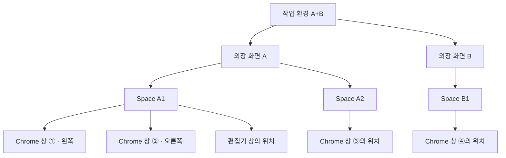
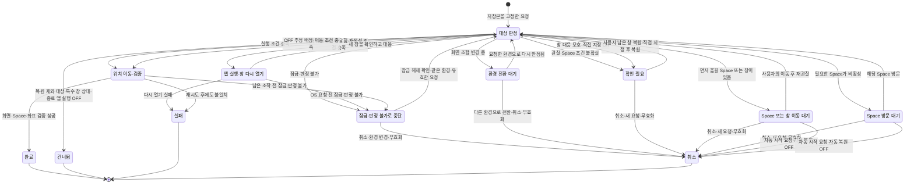

# Space별 창 위치 저장·복원 상태 검토

2026-09-10 · 코드 기준 `09f9d67` · 설계 검토안 · **2026-09-11 구현 반영** — D1–D9와 7.1절의 기본안은 제품 코드에 구현됐다. 현재 계약은 [FUNCTIONAL_SPEC](./FUNCTIONAL_SPEC.md), 구현 범위·검사 결과·남은 실기기 검증은 [구현 인계 문서의 완료 보고](./IMPLEMENTATION_HANDOFF.md)를 본다. 본문의 「현재 구현」「미구현」 서술은 `09f9d67` 기준이다.

외장 화면 조합을 작업 환경으로 다루고, **Space 안의 개별 창 위치를 각각 저장·복원한다**(D1). 창이 닫힌 경우에는 **저장한 외장 환경에서 닫았는지, 다른 환경이나 연결 해제 중 닫았는지에 따라 복원 여부를 구분한다**(D9). **「종료된 앱 다시 열기」는 실험 탭의 ON/OFF로 두고, ON일 때 사용할 「실행 중인 앱 창 되살리기」·「부족한 창 추가로 열기」를 하위에 둔다. 실험실의 모든 설정은 기본값 OFF이며 이 세 설정도 최초 OFF다.** 사용자가 바꾼 값은 유지한다. **Chrome을 포함한 탭 내용 복구는 이번 범위에서 제외하고, 나중에 앱별 실험실 기능으로 검토한다.** 개별 창을 다시 열고 대응시키는 구체적인 방법은 계속 검토한다.

**외장 화면의 조합을 작업 환경이라고 부른다. A+B와 A 단독은 서로 다른 작업 환경이다**(D5). 각 환경의 저장본과 저장 대기 이력을 따로 관리하며, 안정된 현재 조합의 기록을 사용한다.

**자동 저장 ON/OFF 설정은 유지하고 최초 기본값은 ON**이다. 작업 중 자동 이력은 저장 대기 상태이며, **화면 추가·분리로 현재 작업 환경을 떠날 때 또는 Plugback 정상 종료 전** 마지막 유효 상태의 저장을 완료한다. **연결 중 수동 복원과 재연결 복원 모두, 수동·자동 구분 없이 마지막으로 저장이 완료된 상태를 사용한다**(D2).

확정된 정책도 아직 제품 코드에 구현되지는 않았다. 확정과 미결정은 7장에서 구분한다. 기존 구현의 진단은 [제품 설계 검토](./PRODUCT_DESIGN_REVIEW.md)에, 구현된 계약은 [기능 명세](./FUNCTIONAL_SPEC.md)에 있다. 여기서는 잘못된 현재 동작을 새 설계의 정답으로 복사하지 않는다.

읽는 순서: **1–3장은 저장 모델과 Chrome 사례, 4장은 저장 시점, 5장은 상태별 검토표, 6–8장은 판정 순서·정책 결정 현황·검증 근거**다.

## 1. 앱은 포함·제외의 단위, 위치는 Space 안의 개별 창 단위

현재는 화면마다 앱당 좌표 하나와 Space binding 하나를 저장하고, 복원할 때 연결된 화면 전체에서 같은 앱을 한 번만 선택한다. 따라서 같은 앱의 위치를 여러 Space에 따로 기록하고 적용할 수 없다. 저장 시에도 같은 앱의 모든 창을 함께 묶어 Space를 판정하므로, 여러 Space에 걸쳐 있으면 연결 정보를 확정하지 못한다. 근거: [Model](../Sources/PlugbackKit/Model.swift), [CaptureEngine](../Sources/PlugbackKit/CaptureEngine.swift), [RestoreEngine](../Sources/PlugbackKit/RestoreEngine.swift).

설계의 기본 구조는 **작업 환경 → 화면 → 일반 Space → 창 위치 기록**이다. 앱은 계속 포함·제외의 단위로 쓰되, 선택한 앱의 표준 창들은 Space 안에서 각각 위치·크기를 기록한다.

**첫 구현은 macOS의 「각각의 Spaces가 있는 디스플레이」가 켜진 구성을 지원하기로 확정했다(D6, 2026-09-11).** 화면마다 별도 Space 집합을 두는 구성이며, 각 화면에 일반 Space가 하나만 있어도 지원 대상이다. 설정이 꺼진 공유 Space 구성은 이번 구현 범위에서 제외하고, 기존 저장 기록을 보존하며 지원 조건을 안내한다. 공유 구성을 이 모델로 새로 저장하거나 Space별 복원을 실행하지 않고, Space 제약을 버린 위치 전용 복원으로 조용히 전환하지 않는다. 설정 여부를 확인할 수 없어도 적용을 보류하고 확인이 필요함을 표시한다.

설정 위치와 의미는 [Apple의 데스크탑 및 Dock 안내](https://support.apple.com/ko-kr/guide/mac-help/mchlp1119/mac)에서 확인했다. 현재 [SpaceProbe](../App/Plugback/SpaceProbe.swift)의 화면 간 Space 이동 실험에는 개별 Spaces 확인 조건이 있지만, 이것만으로 제품의 저장·복원 진입점 전체가 이 조건을 처리한다고 볼 수 없다. 실제 조건 확인·안내 UI·저장 및 복원 제어는 구현 시 검증한다. 공유 구성의 저장 모델과 복원 지원은 후속 범위이며, 지원 불가능으로 판정한 것은 아니다. 실행 도중 설정 전환과 기존 요청 처리는 D8의 후속 검토 대상이다.



이 문서에서 `A`, `B`는 물리적으로 구별되는 외장 화면이고 `A1`, `A2`, `B1`은 설명을 위한 Space 이름이다. macOS의 `데스크탑 1·2` 번호를 영구 식별자로 쓰겠다는 뜻이 아니다. 사용자 예시의 두 Space는 같은 화면에 있어도, 서로 다른 화면에 있어도 각각 검토한다.

**제품 화면에서도 어느 모니터의 Space인지 함께 구분하는 방향을 반영한다.** 작업 환경 안에서 모니터별로 Space를 묶고, 확인 목록·방문 대기·복원 결과처럼 항목이 단독으로 보이는 곳에는 화면 이름을 함께 표시한다. 「Space 1」만 보여 주어 어느 화면의 대상인지 구별할 수 없게 하지 않는다.

**Space 표시는 우선 각 모니터 안에서 「Space 1, Space 2, …」로 순서대로 붙이기로 했다(2026-09-11).** macOS에 보이는 데스크탑 번호와 맞추지 않는다. 현재 확인한 화면별 일반 Space 목록의 순서대로 1부터 붙이며, 모니터가 다르면 각각 Space 1부터 시작한다. 전체화면·Split View처럼 이번 표준 창 복원 대상이 아닌 Space 항목은 이 번호에서 제외한다.

**화면 이름은 모니터 이름에 연결된 포트의 물리적 위치를 우선 붙이고, 위치를 알 수 없거나 같은 포트를 공유해 구분이 어려우면 A/B를 사용하기로 했다(2026-09-11).** 예를 들어 「LG Fine 24 (왼쪽 위)」와 「LG Fine 24 (오른쪽)」를 상위 그룹으로 두고 각각 Space 1·Space 2를 표시한다. 한 줄 안내도 「LG Fine 24 (왼쪽 위) · Space 2 방문 대기」처럼 화면 소속을 포함한다. 위 이름은 설명용이다. 위치는 맥 본체에 케이블이 꽂힌 포트를 뜻하며, 모니터의 책상 위 위치나 macOS 화면 배치가 아니다. 맥북의 「왼쪽 위」는 화면 쪽, 「왼쪽 아래」는 트랙패드 쪽 포트다.

위치가 확인되지 않으면 「LG Fine 24 (A)」·「LG Fine 24 (B)」처럼 구분한다. 독 하나에 같은 이름의 모니터 두 대가 연결되어 맥 본체 포트를 공유하면 「LG Fine 24 (오른쪽 · A)」·「LG Fine 24 (오른쪽 · B)」처럼 위치에 A/B를 추가할 수 있다. 포트 위치와 A/B는 표시용이며 저장본·화면·Space를 식별하는 키로 사용하지 않는다. **같은 모니터임이 확인되고 연결된 화면 조합이 같다면 케이블을 다른 포트로 옮겨도 위치 표시만 바뀌고, 작업 환경의 저장 배치와 Space 연결은 유지한다.** 위치나 표시 문자가 같다는 이유로 확인되지 않은 화면 대응을 확정하지 않는다. 연결 해제 상태의 포트 정보는 마지막 확인 당시 정보임을 구분한다. A/B의 부여·유지 방법과 화면 동일성 확인은 구현 시 검증한다.

**로컬 확인 근거(2026-09-11, M2 Max 맥 한 대·외장 LG HDR 4K 한 대):** 읽기 전용 `ioreg` 조회에서 DisplayPort 연결의 `ParentBuiltInPortType`·`ParentBuiltInPortNumber`를 DeviceTree의 `port-type`·`port-number`와 대응시켰다. `port-location`은 USB-C 1번 `left-back`, 2번 `left-front`, 3번 `right`였으며, 현재 LG HDR 4K의 연결은 USB-C 3번·오른쪽으로 확인됐다. 이 결과는 현재 기기의 한 연결에서 확인한 근거다. 다른 맥 모델·macOS 버전·독 연결·동일 모델 여러 대에서 실제 화면과 포트를 정확히 대응시킬 수 있는지는 별도 검증한다. 위치 정보가 없거나 대응이 불확실하면 추정 위치를 표시하지 않는다.

표시 이름과 번호는 복원 대상의 식별 근거로 쓰지 않는다. Space 추가·삭제·순서 변경·다른 화면으로의 이동으로 현재 순서가 바뀌면 표시 번호도 바뀔 수 있지만, 그것만으로 저장한 대상이나 목적지를 바꾸지 않는다. 화면명 중복·재연결 때도 실제 화면과 저장 Space의 대응을 확인한다. 현재 [CardPresentation](../App/Plugback/CardPresentation.swift)은 같은 이름의 화면에 입력 순서대로 (1)·(2)를 붙이며, [ScreenProvider](../Sources/PlugbackKit/ScreenProvider.swift)는 포트 위치를 수집하지 않는다. [SpaceSnapshot](../Sources/PlugbackKit/SpaceReader.swift)은 화면별 Space 목록과 관찰 당시 순서를 가진다. 이 순서는 전체화면 항목도 포함하므로 일반 Space를 추린 뒤 표시 번호를 붙여야 하며, 영구 이름이나 macOS의 데스크탑 표시 번호로 취급하지 않는다. 현재 목록·순서를 확인할 수 없는 저장 Space는 저장 당시 정보와 확인 필요 상태를 구분해 표시한다. Space가 다른 화면에 남아 있으면 저장한 목적 화면과 현재 확인한 화면도 구분한다. 포트 위치·A/B 이름, 새 그룹 구성과 순차 번호 표기는 아직 제품에 구현하지 않았다.

| 개념 | 검토안에서의 의미 |
|---|---|
| 작업 환경 | 연결된 외장 화면 조합으로 구별하는 저장·복원 단위. A+B와 A 단독은 서로 다르며 내장 화면은 제외 |
| 작업 환경 저장본 | 작업 환경 전체의 기록을 한 번에 확정한 값. 수동·자동 기록을 화면마다 섞지 않음 |
| 저장 대기 이력 | 작업 중 수집한 상태 기록(history). 저장으로 확정되기 전에는 복원 기준을 바꾸지 않음 |
| 저장된 Space | 저장 당시 어느 일반 Space를 뜻했는지에 관한 기록. 현재의 화면 소속·순서와 별개로 대응을 확인 |
| Space 작업 기록 | 그 Space의 창 목록과 각 창의 위치·크기를 묶은 기록. 탭 URL·작업 내용은 포함하지 않음 |
| 창 위치 기록 | 특정 Space의 대상 앱 표준 창 하나를 놓을 위치와 크기. 같은 앱의 다른 창은 별도 기록 |
| 현재 창 대응 | 창 위치 기록에 이번에 적용할 실제 창을 정한 결과. 저장 항목과 실행 중 창 참조는 서로 다름 |
| 창이 닫힌 환경 | 실제 닫힘 시점의 외장 화면 구성과 저장한 작업 환경의 관계. 복원 버튼을 누른 시점의 연결 상태와 다름 |
| 관찰 범위 | 이번에 새로 확인한 Space·앱과 이전 기록을 유지한 Space·앱의 구분 |
| 복원 요청 | 사용할 작업 환경 저장본을 고정하고 각 항목의 처리 결과와 대기를 추적하는 단위 |

같은 `(작업 환경, 화면, 저장된 Space, 앱)` 안에도 여러 창 위치 기록을 둔다. 각 기록은 개별 창에 대응하며, **같은 앱을 여러 번 선택할 수 있지만, 같은 실제 창을 두 기록에 중복 배정하지 않는다.**

**D1 확정:** A1에 Chrome 창 둘을 왼쪽·오른쪽으로 배치하고 저장했다면, 두 창의 위치를 각각 기억하고 복원한다. 같은 앱인지, 같은 Space인지에 따라 하나만 대표로 남기지 않는다. 실제 창 대응과 창이 사라졌을 때의 처리는 후속 논의 대상이다.

**이번 범위에서는 창의 배치만 기록하며 탭 URL·내용은 수집·저장·복구하지 않는다.** 종료된 앱 실행과 닫힌 창 다시 열기는 D9에 따라 다루되, 새 창의 내용은 해당 앱의 동작에 맡긴다. 앱이 자체적으로 이전 창·탭을 되살렸다면 그 창을 활용하고 탭을 덮어쓰지 않는다. 앱별 탭 복구는 3.6절의 후속 실험실 항목이다.

### 1.1 작업 환경은 연결된 외장 화면 조합으로 구별한다 — D5

| 안정된 외장 화면 조합 | 작업 환경과 복원 기준 |
|---|---|
| A+B | A+B 환경의 마지막 저장본 |
| A만 연결 | A 단독 환경의 마지막 저장본 |
| B만 연결 | B 단독 환경의 마지막 저장본 |

`{A, B}`와 `{B, A}`는 같은 작업 환경이고 `{A}`는 별개다. 같은 A 화면이라도 A+B 환경에서의 Space·창 배치와 A 단독 환경의 기록을 따로 보관한다. **A만 연결된 채 안정되면 A 환경을 사용하며, 예전에 A+B를 썼다는 이유로 B를 계속 기다리지 않는다.** A 환경의 저장본이 없으면 현재 배치를 유지한다. 수동 저장 또는 자동 저장 ON에서 환경 이탈·Plugback 정상 종료 전 저장으로 첫 저장본을 만든다. 최초에는 외장 화면의 표준 창을 기본 포함하고 원치 않는 앱만 제외한다(D4).

독이나 케이블을 통해 A와 B가 차례로 연결될 때 **현재 구성을 짧게 재확인한 뒤 준비된 조합부터 복원하는 기본 방향에 합의했다(2026-09-11).** A만 준비되면 A 저장본으로 먼저 복원한다. 복원 시작 전에 A+B가 준비되면 바로 A+B 저장본을 사용한다. A 복원 도중이나 직후 B가 추가되면 A의 남은 작업을 중단하고, 준비를 확인한 A+B 저장본으로 전환한다. 두 번의 이동은 허용하되 사용자가 조작한 창은 이번 자동 복원에서 보호한다. **정확한 대기 시간은 연결·충돌 실험으로 정하며, 준비 판정과 보호 기능도 구현·검증이 필요하다.** 미래의 B 등장을 예측하거나 이번 Chrome 단독 입력 관찰로 복원 충돌까지 검증했다고 전제하지 않는다.

**자동 저장 ON이면 작업 환경을 떠날 때 이전 환경의 마지막 유효 이력을 확정한다.** A+B에서 B를 분리하면 A+B를 저장하고 A 환경을 선택한다. A에서 B를 추가하면 A를 저장하고 A+B 환경을 선택한다. 모든 외장을 분리하면 떠나는 환경을 저장하며, 외장이 없는 상태에서는 복원하지 않는다. 각 환경의 저장본은 독립적이다.

모니터 추가·분리 뒤 이미 재배치된 창을 이전 환경에 저장하지 않는다. 변화 신호가 오면 이력 수집을 멈추고, 실제 환경 전환이 확인되면 **전환 전에 확보한 마지막 유효 상태**를 이전 환경의 저장본으로 확정한다. 새 환경의 복원은 새 환경에 저장된 기록을 사용한다. 자동 저장 OFF이면 기존 저장본을 유지한다.

#### 순차 연결의 복원 시점 — 기본 방향 합의, 세부 검증·구현 필요

판단 기준은 **첫 창이 움직이는 시점, 최종 배치가 맞는 시점, 작업 방해, 저장 기록 보존, 구현 복잡도**다. 케이블을 꽂은 때부터 걸린 전체 시간과 화면을 사용할 수 있게 된 뒤 Plugback이 추가로 기다린 시간을 구별한다. 빠르게 한 번 움직였어도 나중에 잘못된 배치가 남으면 성공이 아니다.

| 방안 | UX와 장점 | 오류 가능성·비용 | 현재 판단 |
|---|---|---|---|
| 마지막 알림 뒤 1.5초 대기 | 구현이 단순하고 짧게 몰리는 변경을 묶음 | 빠르게 준비된 환경도 기다림. 알림이 계속 오면 시작이 밀리며, 대기 종료 뒤 늦게 오는 B까지 묶지는 못함 | 비교 기준으로 유지. 모든 환경의 최적값으로 확정하지 않음 |
| 첫 유효 목록을 보자마자 복원 | 첫 반응이 빠름. A 다음 A+B 복원 허용 | 양수 크기는 최종 좌표라는 보장이 아님. 짧은 A 환경에서 불필요한 앱·새 창을 열 수 있으며, 같은 식별자의 후행 좌표 변경을 놓칠 수 있음 | 유효성 확인·취소·후행 검증 없이 채택하지 않음 |
| **짧은 상태 재확인 후 시작 + 최신 상태 검증** | 빨리 준비된 환경은 일찍 시작하고 실제 변경에만 대응 | 준비 판정과 요청 취소가 필요. 여전히 늦은 B 때문에 두 번 움직일 수 있고, 필요한 대기 길이는 실측해야 함 | **기본 방향 합의. 정확한 대기 시간과 준비 판정·충돌 방지는 연결·충돌 실험으로 검증하며 아직 미구현** |
| OS의 화면 구성 완료 신호만 사용 | 임의의 긴 대기를 줄일 근거가 있음 | 현재 구성 변경의 완료일 뿐, 모든 독 화면의 등장이나 AppKit·Space·앱 창의 준비 완료를 보장하지 않음 | 준비 판정의 입력 후보로 검토. 단독 완료 조건으로 쓰지 않음 |
| 과거 A+B 또는 학습한 독 구성이 나타날 때까지 대기 | 예상이 맞으면 중간 복원을 줄일 수 있음 | 오늘 A만 쓸 때 불필요하게 기다림. 연결 순서·장치별 예외와 학습 상태가 늘어남 | A 단독도 독립 환경이라는 D5에 맞춰 기본안에서 제외 |
| 화면별 저장본을 따로 복원 | 먼저 연결된 화면부터 처리하기 쉬움 | A 단독과 A+B 기록을 섞으면 같은 창의 목적지가 충돌함 | 저장본을 섞는 방식은 D5와 불일치. 한 A+B 저장본 안에서 필요한 창만 이동하는 것은 가능 |
| 기존 창은 먼저 이동, 앱 실행·새 창 열기는 더 기다림 | 첫 반응을 유지하면서 취소하기 어려운 동작을 줄일 여지 | 두 단계의 요청·대기 관리가 추가되고 늦은 B 문제는 남음 | 불필요한 앱·창 열기가 실측에서 반복될 때 비교할 대안. 기본 복잡도로 먼저 추가하지 않음 |

**현재 구성의 준비와 앞으로 다른 화면이 추가되지 않음을 구별한다.** Apple의 [화면 재구성 콜백](https://developer.apple.com/documentation/coregraphics/cgdisplayreconfigurationcallback)은 변경 전후에 호출되며, 변경 후에는 Core Graphics가 보고하는 화면 상태가 갱신되어 있다고 설명한다. 여기서 AppKit의 `NSScreen`, Space, 각 앱의 창 재배치 완료나 미래의 B 등장을 보장한다고 해석하지 않는다. 따라서 어떤 유한 대기 시간을 골라도 임의로 늦게 연결되는 B까지 항상 한 번의 복원으로 처리할 수는 없다.

합의한 기본 방향을 구현하기 위한 처리안은 다음과 같다. 구체적인 준비 판정·대기 값·재확인 한도와 UX 세부안까지 합의한 것은 아니며, 연결·충돌 실험으로 검증한다. 사용자 조작을 해당 창 단위로 우선하는 방향은 유지하고, 아래에서 감지·실행의 검증 조건을 구분한다.

1. 화면 구성 변경 신호에서 이전 환경의 마지막 유효 이력을 보호하고, 진행 중인 복원이 옛 좌표로 새 조작을 내보내지 않도록 일시 중단한다. 실제 환경 전환이 확인된 뒤 D2에 따라 저장하며, 변경 신호만으로 환경 이탈을 확정하지 않는다.
2. 현재 구성 변경이 끝났다는 신호와 실제 화면 목록·좌표를 함께 확인한다. 짧은 간격의 재확인 사이에 의미 있는 변경이 있으면 새 상태로 다시 판단한다. 동일한 정보의 중복 알림마다 전체 복원을 다시 시작하지 않는다. 시작·완료 신호 자체와 화면 정보가 불완전한 경우는 무의미한 중복으로 지우지 않는다.
3. 확인된 현재 조합의 마지막 저장본으로 요청을 시작한다. A만 확인되어 준비되면 A를 사용하고, A 저장본이 없으면 움직이지 않는다. 시작 전에 A+B가 준비됐다면 A 복원을 거치지 않고 바로 A+B 저장본을 사용한다. 원시 목록에 B가 있으나 식별·크기 조회에 실패한 경우에는, 필터링된 A 목록만으로 A 단독 환경이라고 확정하지 않는다. 아직 등장하지 않은 미래 B를 기다리겠다는 뜻은 아니다.
4. B가 추가되면 A의 남은 요청을 무효화하고 A+B의 저장본으로 새 요청을 만든다. A+B 기록을 기준으로 창 대응을 다시 판단하되 같은 실제 창을 중복 배정하지 않고, 이미 새 목표에 있는 창은 이동하지 않는다. A와 A+B의 저장 항목을 섞거나 A 복원을 끝까지 수행한 후 새 환경을 처리하지 않는다.
5. 이동 후에는 목적 화면·Space·실제 위치를 확인한다. 연결 복원이 진행 중일 때 같은 화면 식별자의 해상도·원점이 바뀌어도 옛 좌표를 계속 쓰지 않는다. 평소의 해상도 변경이나 클램셸 변화만으로 새 자동 복원을 시작한다는 정책은 아니다. 완료 판정 전에 최신 상태와 일치하는지 재확인하며, 확인되지 않은 항목은 성공으로 표시하지 않는다.
6. 연결 정보 재확인과 실제 이동 재시도에는 한도를 두고, 안정되지 않으면 이유와 재시도 경로를 남긴다. 시간 초과를 이유로 불완전한 좌표에 강제 이동하지 않는다. 새 실제 변경 이벤트에서 다시 판단할 수 있지만 대기 때문에 상시 폴링을 만들지는 않는다. 유효한 Space 방문 대기의 시간 제한 없음(D8)은 별개다.

**어느 방안에도 필요한 오류 방지 조건:**

- 새 요청으로 바뀌면 옛 요청의 아직 실행하지 않은 이동·재시도·앱 실행·새 창 열기를 중단한다. 비동기 대기 뒤와 OS에 조작을 보내기 직전에 요청 유효성을 확인한다. 이미 OS로 보낸 조작까지 취소됐다고 가정하지 않으며, 진행 중 조작의 반환·관찰을 정리한 뒤 최신 요청을 처리한다. 늦은 결과가 새 요청의 성공이나 저장 이력으로 채택되지 않아야 한다.
- 앱 실행·새 창 열기의 중복도 검사한다. 이전 요청이 이미 보낸 실행은 강제 종료로 되돌리지 않고, 새 요청에서 실제 나타난 창과 진행 중 실행을 다시 확인한다. 필요 여부를 다시 판단하지 않고 같은 요청을 반복 전송하지 않는다. 연결 중 잠깐 나타난 환경에서만 필요한 앱이 실행되는 잔여 위험도 비교 대상이다.
- 변화 중 OS가 흩뜨린 창과 Plugback이 옮긴 중간 배치를 새 사용자 이력으로 저장하지 않는다. A 환경에서 확인된 새 사용자 변경이 없다면 중간 복원만으로 A 저장본을 갱신하지 않는다. 저장 실패 시에는 기존 D2·D7의 기록 보존 규칙을 따른다.
- 자동 복원과 겹친 사용자 조작은 해당 창 단위로 우선한다. 사용자가 조작한 창은 이번 자동 복원에서 제외하고, 확인된 다른 창은 계속 복원하는 방향에 합의했다. 감지 방법과 불확실할 때의 처리 범위는 아래 검증 대상이며, AX 이동 알림만으로 사용자 조작과 OS·앱·Plugback의 이동을 구별할 수 있다고 가정하지 않는다.
- 화면 식별·Space·창 대응이 불확실한 항목은 추측해서 옮기지 않는다. 확인된 다른 항목은 기존 부분 복원 규칙에 따라 처리한다. 잠금·잠자기·자동 복원 OFF·재실행 관련 규칙을 대기 시간 단축 때문에 우회하지 않는다.

**UX 검토안:** 준비가 길어지면 기존 메뉴바·카드에서 현재 연결과 진행 상태를 확인할 수 있게 한다. 카드를 열었을 때 「화면 연결 확인 중」, 「A+B 창 복원 중」, 「일부 창 확인 필요」처럼 실제 단계와 대상을 보여준다. 매 연결마다 팝업을 띄우거나 포커스를 가져오지 않는다. 짧게 끝나는 작업의 표시가 번쩍이지 않게 하고, 전체 소요 시간을 모르면 가짜 퍼센트·카운트다운을 쓰지 않는다. 메뉴가 닫혀 있을 때의 상태 전달 방식도 실사용에서 확인한다. 「지금 복원」을 눌러도 화면·Space 검증을 건너뛰지 않으며, 남은 작업 취소는 기존 D8 규칙과 연결한다. 이는 Apple의 [진행 표시](https://developer.apple.com/design/human-interface-guidelines/progress-indicators)와 [상태 피드백](https://developer.apple.com/design/human-interface-guidelines/feedback)을 이 제품에 적용한 제안이며, UI가 구현된 상태는 아니다.

| 비교할 상황 | 반드시 확인할 결과 |
|---|---|
| A만 연결되며 빨리 준비됨 | 미래 B를 기다리지 않음. 화면 사용 가능 시점 뒤의 추가 지연 측정 |
| A 뒤 짧은 간격으로 B 등장 | 불필요한 중간 이동·앱 실행 횟수와 최종 A+B 배치 확인 |
| A 복원 도중 또는 완료 직후 B 등장 | 남은 옛 조작·늦은 결과 차단. 최신 A+B 저장본만 사용 |
| A 저장본 없음, A+B 저장본 있음 | A+B의 A 부분을 미리 적용하지 않음. B 등장 후 A+B 복원 |
| B는 열거됐지만 식별 실패·무효 크기 | A 단독으로 오인하여 저장·복원하지 않음 |
| 식별자 집합은 같고 해상도·좌우 원점이 늦게 변경됨 | 진행 중 연결 복원의 좌표를 다시 계산하고 최종 실제 위치 검증 |
| 연결·분리 반복 또는 의미 없는 중복 알림 | 반복 이동·앱 실행·저장 폭주 없음. 무한 재시도나 시간 초과 후 강제 이동 없음 |
| 이미 요청한 앱이 A+B 전환 뒤 늦게 실행됨 | 추가 실행·새 창 중복을 피하고 실제 창을 새 요청에서 다시 판정 |
| 복원 중 사용자가 창을 끌거나 수동 복원·취소를 선택함 | 조작한 창만 이번 자동 복원에서 보호하는 방향을 검증. 명시적 요청·취소는 기존 요청 규칙 적용 |
| 잠금·잠자기 해제·클램셸·Space 정보 지연 | 거짓 환경 이탈·복원과 미확인 Space의 추측 이동을 막음 |

**측정 계획:** 같은 장치·같은 저장본·같은 창 상태에서 기존 1.5초와 짧은 대기 후보(예: 0.25초·0.5초)를 반복 비교한다. 이 수치는 실험 조건이며 제품 기본값·응답 속도 약속이 아니다. 첫 상태 피드백·첫 창 이동·최종 배치 확인까지의 시간, 창별 이동 횟수, 불필요한 앱·창 생성, 잘못된 화면·Space 이동, 저장본 오염을 기록한다. 정상 작업에서 생긴 같은 식별자의 후속 변경도 포함하여 복원 요청의 종료 조건을 검증한다. 빠른 첫 이동의 이득이 최종 완료 지연이나 작업 방해로 상쇄되는지 함께 본다. 실제 장치의 이벤트 순서를 확보하기 전에는 준비 판정과 대기 값을 최적이라고 확정하지 않는다.

**확인한 코드와 검사의 한계:** [DisplayWatcher](../Sources/PlugbackKit/DisplayWatcher.swift)는 현재 마지막 알림 뒤 1.5초를 기다린 다음 외장 화면 식별자 집합만 비교한다. [ScreenProvider](../Sources/PlugbackKit/ScreenProvider.swift)는 무효 크기·식별 실패 화면을 결과 목록에서 제외하며, 그 목록만으로는 일시적인 조회 실패와 실제 분리를 구별하기 어렵다. [PlugbackController](../Sources/PlugbackKit/PlugbackController.swift)는 복원 중 새 등장을 현재 회차가 끝난 뒤 처리하고, [RestoreSession](../Sources/PlugbackKit/RestoreSession.swift)의 취소 세대 검사는 [RestoreEngine](../Sources/PlugbackKit/RestoreEngine.swift)의 각 이동·재시도 안까지 전달되지 않는다. 따라서 타이머 값 하나만 줄이는 변경으로 추천안의 조건을 만족하지 못한다. 이는 코드 검토 결과이며 실제 취소 중 이동의 별도 재현은 아직 하지 않았다.

`swift test --filter DisplayWatcherTests`를 실행하여 기존 9개 검사가 통과했다. 이벤트 묶기·집합 비교·잠금·잠자기·제거 콜백의 기존 계약을 확인한 것이며, 새 준비 판정·실행 취소·실제 독의 속도나 오류 없음은 검증하지 않았다. Apple 콜백의 보장 범위는 공식 문서와 설치된 macOS SDK의 `CGDisplayConfiguration.h`를 대조했다. Context7에서는 해당 API의 Rust 바인딩 자료만 확인되어 준비 완료의 의미는 Apple의 원문을 근거로 삼았다.

#### 자동 복원과 사용자 창 조작 — 창별 보호 방향 합의, 감지 검증 필요

**사용자가 직접 조작한 창만 이번 자동 복원에서 제외하고, 확인된 다른 창은 계속 복원하는 방향에 합의했다(D5·D8).** 예를 들어 A에 복원된 Chrome 창을 사용자가 끌고 있을 때 B가 추가되면, A+B 저장본의 Chrome 목적지가 B여도 그 창을 다시 끌어당기지 않는 것이 목표다. 이는 제품 동작의 합의이며 현재 구현이나 감지 정확성을 검증했다는 뜻은 아니다.

보호는 이번 자동 복원과 그 재시도에 적용한다. 마우스를 놓거나 같은 구성의 중복 알림이 왔다고 즉시 다시 옮기지 않으며, 영구 제외 설정은 만들지 않는다. 나중에 별도로 「지금 복원」을 요청하면 기존 규칙에 따라 다시 판단한다. 보호한 창과 이미 확인된 저장 항목의 대응도 유지하여, 그 자리에 다른 창을 대신 배정하거나 새 창을 열지 않는다. 결과는 사용자 조작으로 건너뛴 상태로 구분하며 복원 성공으로 표시하지 않는다. 조작 중 수동 요청의 우선순위 전체를 여기서 확정하지는 않는다.

자동 저장 ON/OFF와 관계없이 사용자 조작을 존중한다. 보호한 위치로 A+B 저장본을 즉시 덮지 않으며, 안정된 현재 환경에서 확인한 새 사용자 변경만 기존 D2 규칙에 따라 저장 대기 이력으로 수집한다. A 환경의 이력, OS 재배치, Plugback의 중간 이동을 새 A+B 사용자 이력으로 바꾸지 않는다.

**2026-09-11 코드·공식 API 확인:**

- Apple의 [창 이동 알림 문서](https://developer.apple.com/documentation/applicationservices/kaxwindowmovednotification)와 설치된 SDK는 이동 종료 시점의 알림으로 설명한다. 그러나 아래 Chrome 실기기 시험에서는 마우스 버튼을 누른 동안 같은 창의 이동 알림 40회를 받았다. 종료 뒤 한 번만 온다는 전제를 모든 앱에 적용하지 않는다. 현재 [WindowMoveObserver](../Sources/PlugbackKit/WindowMoveObserver.swift)는 알림의 창 요소를 버리고 마지막 알림 뒤 0.3초 후 인자 없는 콜백을 부른다. 이 경로에는 사용자 조작 시작과 대상 창을 보호하는 정보가 없다.
- [전역 입력 관찰](https://developer.apple.com/documentation/appkit/nsevent/addglobalmonitorforevents%28matching%3Ahandler%3A%29)과 [좌표의 접근성 요소 조회](https://developer.apple.com/documentation/applicationservices/1462077-axuielementcopyelementatposition)는 감지 실험에 쓸 수 있는 후보 API다. 입력은 비동기로 전달되고 좌표 조회는 조회 시점의 맨 앞 요소를 반환한다. 따라서 두 API의 존재만으로 입력 당시의 대상 창이나 실제 창 드래그를 정확히 알아낸다고 결론 내릴 수 없다. 단순 클릭·텍스트 선택과 창 조작, 화면 재배치 사이의 구별을 확인해야 한다.
- 현재 [PlugbackController](../Sources/PlugbackKit/PlugbackController.swift)의 이동 관찰 구독은 자동 저장에 묶여 있고, 저장 후보 수집은 복원 중에도 차단된다. 사용자 조작 보호를 이 수집 경로에만 붙일 수 없다. [AXWindowGateway](../Sources/PlugbackKit/AXWindowGateway.swift)의 정수 창 참조도 창 목록을 다시 읽으면 무효가 되므로, 과거 번호나 앱 이름만으로 보호 대상을 이어 붙이지 않는다.

**구현 전 확인할 조건:** 입력 감지와 창 대응을 먼저 작은 실기기 실험으로 확인하고, 보호 여부를 미전송 이동·재시도 직전에 검사하는 흐름을 검증한다. 이미 OS에 보낸 이동은 드래그가 시작된 뒤 끝날 수 있으며, 요청 취소만으로 그 실행까지 되돌렸다고 간주하지 않는다. 이 경계에서 실제로 생기는 끌어당김도 측정해야 한다. 감지가 불확실할 때 영향받을 수 있는 자동 조작을 보류하는 방안은 검토하되, 보류 범위와 재개 조건은 아직 미확정이다. 알림 누락을 모두 탐지하거나 모든 동시 조작을 막을 수 있다는 약속은 하지 않는다.

| 검증할 상황 | 확인할 결과 |
|---|---|
| A 복원 뒤 Chrome을 끄는 동안 B가 추가됨 | 확인한 Chrome만 보호하고 다른 창은 복원. 놓은 뒤 재시도·중복 알림으로 Chrome을 다시 옮기지 않음 |
| 클릭·텍스트 선택, 사용자 입력 없는 OS 재배치·Plugback 이동 | 창을 직접 조작했다고 오인하여 복원 대상을 제외하거나 저장 이력을 만들지 않음 |
| 마우스·트랙패드, 창 크기 변경·화면 경계 이동, 앱별 창 장식 차이 | 감지 시점과 대상 창 대응을 실제 입력으로 확인. 조회 당시 좌표만으로 다른 창을 보호하지 않음 |
| 자동 저장 OFF 또는 복원 진행 중 | 사용자 조작 보호가 계속 동작하며 저장 설정을 바꾸지 않음 |
| 창 재열거·닫힘·관찰 실패·입력과 이동 명령의 동시 발생 | 오래된 참조나 늦은 결과를 다른 창에 적용하지 않음. 이미 전송한 이동의 잔여 영향과 보류가 필요한 범위를 확인 |
| 보호한 창 외에 같은 앱의 다른 후보가 존재함 | 보호한 저장 자리를 다른 창이나 새 창으로 채우지 않음. 저장본 보존과 이후 별도 수동 요청의 정상 판정 확인 |

요청 전환·재시도·중복 배정·저장본 보존은 자동 검사로 검증할 수 있지만, 가짜 입력으로 통과한 검사가 실제 드래그 감지를 증명하지는 않는다. 위 입력 시나리오와 새 보호 로직 검사의 결과는 관찰 도구의 실행 점검과 구별한다. 빠른 복원의 실제 적용 판단에는 이러한 사용자 조작 충돌 결과도 포함하고, 반복해서 충돌한다면 감지 규칙을 계속 늘리기 전에 복원 시작·보류 방식을 다시 비교한다.

**관찰 실험 도구(2026-09-11):** [check-window-interaction.sh](../Scripts/check-window-interaction.sh)를 `bash Scripts/check-window-interaction.sh`로 실행한다. Chrome 일반 창을 준비하고 Enter를 누른 뒤, 제목 표시줄 이동·모서리 크기 변경·페이지 글자 선택을 각각 약 3초 수행하며 동작 사이에 2초 쉰다. 마지막에 실제로 한 동작과 어려웠던 점을 입력하면 관찰을 끝낸다. 최대 관찰 시간은 180초다. 연결 변경 없이 입력 감지를 먼저 확인하고, A→A+B 연결과 실제 자동 복원 충돌 검사는 그 결과를 본 뒤 진행한다.

[관찰 코드](../Scripts/window-interaction-probe.swift)는 전역 마우스 콜백의 수신 여부를 세고, Chrome·Finder에 대응된 입력에서만 창 프레임을 읽는다. 두 앱의 AX 알림도 관찰한다. 창·Space 이동, 앱 실행, 저장본 변경, 키보드 감시는 하지 않으며 창 제목·작업 내용도 읽지 않는다. 실행 동안의 임시 창 번호와 시각·프레임 변화 여부를 `.build/window-interaction-probe/run-*`에 로컬로 기록한다. 입력 중에만 최대 15초·초당 10회 프레임을 읽는 진단용 코드이며, 제품의 확정된 감지 구현이 아니다. `bash Scripts/check-window-interaction.sh --check`로 권한·실행 앱을 확인하고, `--self-check`로 관찰값 집계의 자체 검사를 실행할 수 있다.

도구 준비 단계에서 컴파일, 집계 자체 검사, 접근성 권한, 두 앱의 AX 알림 등록과 2초 자동 종료를 확인했다. 그 짧은 실행에서는 사용자 입력이 없었으며, 드래그 감지 성공으로 세지 않는다. 실제 입력 결과와 사용자의 동작 설명을 함께 확인해야 하며, 현재 도구는 제품 보호 기능의 합격 판정을 내리지 않는다.

**첫 입력 실험과 도구 보완(2026-09-11, macOS 26.6.2):** 내장 화면의 Chrome 일반 창에서 사용자가 이동·크기 변경·글자 선택을 모두 했다고 확인했다. 67.6초 기록에서 `AXWindowMoved` 99회, `AXWindowResized` 558회를 받았으나 입력과 연결한 창 조작 기록은 0개였다(`run-ff2hSU`). 이 첫 도구는 대상 앱 필터 앞의 입력 콜백 횟수를 세지 않아, 입력 미수신과 필터 제외를 구별할 수 없었다. 따라서 제품 감지 방식의 성공·실패로 결론 내리지 않는다. AX 알림 횟수만으로 실제 드래그 중 감지 시점을 확정하지도 않는다.

관찰 도구 2판에서는 일반 `RunLoop.run` 대신 AppKit의 [주 이벤트 루프](https://developer.apple.com/documentation/appkit/nsapplication/run%28%29)를 실행하고, 입력 콜백 수신 횟수·대상 앱 필터 제외 횟수를 별도로 기록했다. 자체 검사와 2초 종료 점검을 다시 통과했다. 이어진 180초 관찰에서는 마우스 누름 12회·끌기 8회·놓기 12회를 받았고, 누름 12회 모두 대상 앱 밖으로 분류됐다(`run-PtNKWw`). 추가로 요청한 Chrome 이동의 완료 응답을 받기 전에 관찰 시간이 끝났으므로, 이 구간에 실제로 그 동작을 했는지는 미확인이다. 마우스 콜백 수신까지 확인한 결과이며 Chrome 창 대응의 성공·실패는 아직 판정하지 않는다. 이 구간은 입력 수신 경로 점검으로 남기고, Chrome 창 대응의 판정에는 이후 사용자가 동작을 확인한 기록을 사용한다.

**Chrome 창 이동 1회 관측 성공:** 사용자가 내장 화면의 Chrome 창 전체를 움직였다가 놓았다고 확인한 `run-hS780Z`에서, 같은 임시 창 번호 1에 마우스 누름·끌기·놓기와 위치 변화가 연결됐다. 해당 조작 구간은 약 4.9초였고 프레임 조회 49회가 성공했으며 실패는 없었다. 버튼을 누른 동안 위치 변화를 관측했고, 같은 창의 `AXWindowMoved` 40회도 버튼을 누른 상태에서 받았다. 이 기록은 알림이 항상 드래그 종료 뒤에만 온다는 가정을 반박하지만, 다른 앱에서도 같은 빈도나 시점을 보장하지는 않는다. 이어서 같은 창에서 위치 변화 없는 입력 두 건도 관측됐으나 사용자가 글자 선택 검사라고 확인한 동작은 아니므로 그 검사 통과로 세지 않는다.

이 단계에서 확인한 범위는 macOS 26.6.2의 Chrome 일반 창 이동 한 번에서 입력과 대상 창·위치 변화를 함께 관측할 수 있다는 것이었다. 이후 글자 선택·크기 변경을 별도 구간으로 관찰했다. 제품의 사용자 조작 보호 로직과 다른 앱·입력 장치, 화면 연결 변화와 실제 복원 명령의 충돌은 아직 검증하지 않았다.

**실험 시작·종료를 사용자에게 맞춤:** 이어진 글자 선택·크기 변경 요청의 `run-06SLkT`는 180초 제한으로 종료됐고 입력이 0건이었다. 사용자의 완료 메시지는 기록 종료보다 약 32.5분 뒤 도착했다. 사용자가 두 동작을 했다고 확인한 사실과, 그 입력이 관찰 시간 안에 기록됐는지는 구별하며 이 구간은 판정에 사용하지 않는다.

대화 시각에 맞춰 관찰을 자동으로 시작하는 대신 `bash Scripts/check-window-interaction.sh --interactive`로 작은 관찰 창을 연다. 준비 시간에는 입력 관찰을 설치하지 않고, 사용자가 「시작」을 눌러야 기록한다. Chrome 글자 선택·크기 변경 뒤 「두 동작 완료」를 누르면 즉시 기록을 끝내고 동작 확인 표시를 남긴다. 시작 후 3분 제한과 남은 시간을 창에 표시하며, 만료 후에는 사용자가 다시 시작할 수 있다. 각 기록은 `run_id`로 구별한다. 채팅 응답이 늦어져도 이미 완료한 기록은 보존된다. 창을 닫으면 진행 중 관찰도 정리한다.

터미널 창에서 직접 시작하는 기존 스크립트도 점검했으나, 이번 환경에서 터미널 실행의 접근성 권한 확인은 실패했다. 같은 관찰 도구를 Codex에서 실행했을 때는 권한 확인이 성공하여 버튼이 있는 관찰 창을 사용한다. 권한을 자동으로 추가하거나 변경하지 않았다. 새 창은 실험의 시작·종료만 제어하며 기존 입력·창 관찰 코드를 사용한다.

**버튼 모드의 글자 선택·크기 변경 관측 성공:** `run-CBLxpe`의 단일 기록 `22FADF9C-5EC8-49EE-AF64-C804D9828ABF`에서 사용자가 시작과 「두 동작 완료」를 눌렀고, 대화에서도 완료를 확인했다. 약 20.5초 뒤 `human_action_confirmation`과 `finished(reason: user_finished)`가 함께 기록되어 입력 관찰이 종료됐다. 준비 시간과 채팅 응답 시간은 입력 기록에 포함하지 않았다.

| 순서와 사용자 확인 | 관찰 결과 |
|---|---|
| 글자 선택 구간 | 같은 Chrome 창의 누름·끌기·놓기 두 건이 약 0.8초·4.1초 동안 기록됨. 프레임 표본 8회·41회 모두 위치·크기 변화가 없었고 이동·크기 변경 알림도 없었음. 사용자는 구간의 글자 선택 완료를 확인했으며, 두 입력 각각의 세부 동작까지 따로 확인한 것은 아님 |
| 이어진 오른쪽 아래 모서리 크기 변경 | 같은 창의 약 7.8초 조작에서 크기만 변함. 프레임 표본 79회가 성공했고 버튼을 놓기 전에 크기 변화를 관측함. 같은 창의 `AXWindowResized` 525회도 모두 이 조작 중 버튼을 누른 상태에서 수신 |

세 입력은 모두 실제 `mouse_up`으로 끝났고 대상 창 조회 실패·프레임 조회 실패·화면 변경 알림은 없었다. 누른 좌표의 요소 역할은 글자 선택 구간에서 `AXGroup`, 크기 변경 시작에서 `AXWebArea`로 기록됐다. 요소 역할만으로 글자 선택과 창 조작을 분류할 수 있다고 가정하지 않는다.

앞선 이동 1회와 이번 두 구간을 합쳐, **Chrome의 단독 조작에서 이동·크기 변경·글자 선택에 따른 창 프레임의 차이를 입력 및 대상 창과 함께 관측했다.** 이는 감지 후보의 기초 확인이며 제품 보호 기능이나 오탐률의 검증은 아니다. 다음은 다른 앱·입력 장치에서도 같은 구별이 유지되는지, 입력 없는 OS 재배치와 실제 복원 명령이 겹칠 때 대상을 잘못 보호하거나 사용자의 창을 끌어당기는지 확인하는 것이다. 이 결과를 바탕으로 감지 실패 시 보류 범위와 연결 복원의 정확한 대기 시간을 판단한다.

#### 화면 잠금·잠자기와의 교차 검토 — 확정 정책과 남은 검증

**잠금 중 연결 보류, 진행 중 복원의 중단·재개, 저장 이력 보호, 단축어의 잠금 해제 요구, 판정 불가 시 보류·사유 표시와 피드백 기반 개선을 확정했다(D2·D5·D8).** 아래에서 현재 구현의 재현 결과와 확정한 상태별 동작을 구분한다. 새 정책은 아직 제품 코드에 구현되지 않았으며, 잠금 감지·잠자기 억제의 세부 동작은 계속 검토한다.

현재 [DisplayWatcher](../Sources/PlugbackKit/DisplayWatcher.swift)의 순서는 다음과 같다.

1. 화면 변경 알림 뒤 1.5초 대기한다. 잠금 여부는 이 대기가 끝난 뒤 읽는다.
2. 외장 화면 식별자 집합을 비교하고 기준선을 갱신한다. 제거 콜백은 잠금·잠자기 판정보다 먼저 호출한다.
3. 새 등장이 있거나 보류한 등장이 있을 때, 잠겨 있으면 `deferredUntilUnlock = true`로 남긴다. 어느 연결을 보류했는지 대신 불리언 하나를 보관한다.
4. 잠금 해제 알림은 이 보류가 있을 때만 같은 1.5초 대기를 다시 시작한다. 이후 잠기지 않은 것을 확인하면 보류한 등장을 한 번 소비한다.
5. 잠자기 해제 뒤 2.5초 동안은 일반 등장을 억제하지만, 잠금 때문에 보류한 등장은 예외로 통과시킨다. 억제 여부는 연결 알림 시각이 아니라 최종 판정 시각으로 결정한다. 억제되어도 화면 기준선은 이미 갱신되며, 억제 종료 때 자동 재시도하지 않는다.
6. 외장이 전부 없어지면 보류를 지운다. 일부가 남으면 현재 코드에는 보류한 연결이 사라졌는지를 별도로 확인하는 처리가 없다.

기존 9개 검사는 대기가 끝날 때까지 잠긴 채 유지한 뒤 해제하는 경로를 포함한다. **해제가 대기보다 빠른 경우와 추가한 화면만 다시 분리하는 경우는 확인하지 않았다.** 실제 watcher에 화면·잠금 상태와 짧은 검사 시간을 주입한 [추가 검사](../Tests/DesignReviewTests/DisplayLockReproductionTests.swift)에서 다음 결과를 얻었다. OS 알림을 구독하거나 실제 Mac을 잠그거나 창을 옮기는 검사는 아니다.

| 상태 순서 | 현재 계약의 기대 | 검사 결과 |
|---|---|---|
| 잠자기 해제 → 잠금 중 A 연결 → 안정화 대기 전에 잠금 해제 | 잠금 중 받은 연결을 해제 후 한 번 처리 | **실패: 복원 콜백 0회.** 보류를 기록하기 전에 잠금이 풀리면 일반 등장으로 처리되어 잠자기 억제에 소비됨 |
| 기존 A에서 잠금 → B 추가·대기 → B만 분리·대기 → 잠금 해제 | B의 보류를 없애고 원래 A에 불필요한 연결 복원을 하지 않음 | **실패: A에 복원 콜백 1회.** A가 남아 보류 불리언이 유지됨. 실제 창 이동 여부는 배치·후속 게이트에 따름 |
| 잠자기 억제 없이 A 연결 직후 대기 전에 잠금 해제 | A 연결을 한 번 처리 | 대조 통과: 1회 |
| 잠금·잠자기 억제 중 A 다음 B 연결, 각 변경 판정 뒤 잠금 해제 | 잠금 중 0회, 해제 후 최신 A+B를 한 번 처리. 다음 해제는 무동작 | 대조 통과: A+B 1회 |
| 잠금 중 연결한 외장을 전부 분리한 뒤 해제 | 보류 폐기, 복원 없음 | 대조 통과: 0회 |

```sh
Scripts/check-product-restore.sh --filter DisplayLockReproductionTests
```

결과는 `Executed 5 tests, with 2 failures (0 unexpected)`다. 현재 명세 [F-01.3](./FUNCTIONAL_SPEC.md)·[US-009](./user-stories/US-009-sleep-and-clamshell.md)의 누락·불필요한 연결 복원 문제를 드러내는 검사이므로 수정 전 종료 코드 1이 예상된다. 기존 제품 문제 11개 검사와 별도이며 제품 코드는 수정하지 않았다. 새 D5 모델에서 잠금 중 A → A+B → A로 돌아왔을 때 실제 환경 이탈로 볼 범위와 A의 복원 필요 여부는 연결 정착 정책과 함께 검토한다. 위 콜백 검사의 기대만으로 새 모델의 모든 저장·복원 동작을 확정하지 않는다.

**순차 연결 대안에 주는 영향:** 잠긴 동안에는 빠른 A 복원의 UX 이득이 없다. 아직 실행하지 않은 연결 복원은 잠금 중 받은 변경을 모아, 해제 후 준비된 현재 조합으로 한 번 처리한다는 정책을 확정했다. 그 뒤 새로 화면이 추가되면 별도의 환경 전환으로 판단한다. 잠금 상태였다는 연결의 맥락이 대기 도중 사라지지 않아야 하며, 이미 없어진 연결의 보류는 남은 다른 화면으로 잘못 전달되면 안 된다. 대기 길이는 연결 사실·보류 이유·현재 유효성을 보관하는 처리를 대신할 수 없다.

현재 2.5초 억제와의 결합도 주의한다. 예를 들어 잠자기 해제 2초 뒤 잠기지 않은 상태로 같은 연결 알림을 받았다면, 1.5초 대기는 3.5초 시점에 판정하여 통과하지만 0.25초 대기는 2.25초에 판정하여 억제될 수 있다. 이는 코드의 시간 비교에서 도출한 예이며 실기기 측정값이 아니다. 짧은 대기가 정상 연결 누락으로 이어지지 않게 해야 한다. 가짜 재등장을 막는 목적은 유지하되 억제된 실제 연결을 버릴지 다시 확인할지, 판정 근거와 시점은 아직 결정하지 않는다.

**잠금 검사가 빠진 공통 실행 경로도 있다.** [컨트롤러](../Sources/PlugbackKit/PlugbackController.swift)의 「지금 복원」·[단축어](../App/Plugback/RestoreIntent.swift)는 watcher를 거치지 않는다. Space 방문·Mission Control 닫힘에 따른 재개, 진행 중 이동·재시도, 새 창 열기에도 같은 잠금 검사가 없다. watcher가 확인한 뒤 실제 실행 전에 다시 잠기는 경우도 가능하다. OS가 해당 AX 조작을 막을 가능성과 Plugback이 잠금 정책을 보장하는 것은 다르다. 이 경로들은 코드로 확인했으며 실제 잠금 중 AX 동작은 아직 검증하지 않았다.

**공통 실행 조건 확정(D8):** 자동 연결·명시적 사용자 요청·Space 방문 후 재개 등 시작 이유와 무관하게, 실제 이동·재시도·앱 실행·새 창 열기 직전에 잠금 상태와 요청 유효성을 확인한다. 잠겨 있거나 잠금 여부를 판정할 수 없으면 아직 OS에 보내지 않은 조작을 중단하며, 잠금과 판정 실패의 사유를 구별한다. 이미 OS에 보낸 조작은 뒤늦게 끝날 수 있으며, 취소됐다고 가정하거나 실행된 앱을 강제 종료하지 않는다. 완료한 결과를 유지하고, 잠금 해제가 확인된 뒤 현재 상태를 다시 확인한다.

**수동 복원의 잠금 조건 확정(D8):** 메뉴의 「지금 복원」 버튼은 잠금 화면에서 누를 수 없다. 같은 복원을 노출한 단축어에는 `authenticationPolicy = .requiresLocalDeviceAuthentication`을 적용하여 실행 전 잠금 해제를 요구한다. Plugback 안에 별도 예약 기능을 추가하지 않으며, 요청이 시작된 뒤 다시 잠기는 경우는 위 공통 실행 조건을 따른다. 현재 [RestoreLayoutIntent](../App/Plugback/RestoreIntent.swift)는 인증 정책을 지정하지 않았다. Apple의 [기본 정책](https://developer.apple.com/documentation/appintents/appintent/authenticationpolicy)은 잠금 중 실행도 허용하고, [로컬 기기 인증 정책](https://developer.apple.com/documentation/appintents/intentauthenticationpolicy/requireslocaldeviceauthentication)은 실행할 기기의 잠금 해제를 요구한다. 코드와 API 계약을 확인한 것이며, 실제 잠금 중 단축어 전달·인증 화면 동작은 구현 시 검증한다.

**아직 시작하지 않은 연결 복원과 이미 시작한 요청의 일시 중단을 구별한다.** 전자는 해제 뒤 확인한 현재 환경의 마지막 저장 완료본으로 새 요청을 시작한다. 후자는 D2에 따라 고정한 복원 소스를 유지하고, 같은 환경에서 여전히 유효한 요청의 남은 항목만 재관찰하여 이어간다. 잠금 해제를 이유로 진행 중 요청의 소스를 바꾸지 않으며, 새 저장·환경 변경·사용자 취소 등 기존 무효화 조건을 먼저 적용한다. 이미 완료한 창은 다시 복원하지 않는다.

| 상태·사건 | 확정한 동작 |
|---|---|
| 유효한 요청·보류 연결 없이 잠금·해제만 함 | 잠금 해제 자체로 새 복원하지 않음 |
| 단축어 등 외부 경로에서 수동 복원 호출 | 시스템에 잠금 해제를 요구하도록 설정. 별도 예약 기능을 두지 않고, 시작한 요청의 잠금·취소 처리는 공통 규칙 적용 |
| 잠금 중 A·B 순차 연결, 아직 복원 시작 전 | 연결을 보류. 해제 후 준비된 현재 조합의 마지막 저장 완료본으로 새 요청 시작. 자동 복원 설정·기존 취소 조건을 적용하며 잠금 중 중간 A의 앱 실행·새 창 열기를 하지 않음 |
| A 복원 도중 다시 잠김 | 아직 OS에 보내지 않은 조작을 일시 중단. 완료한 창과 항목별 결과·고정한 복원 소스 유지 |
| 해제 후 같은 환경이고 중단한 요청이 여전히 유효함 | 화면·Space·현재 창을 재확인하고 남은 항목만 기존 복원 기준으로 진행. 완료한 창을 다시 옮기지 않음 |
| 조회 실패 등으로 잠금 여부를 판정할 수 없음 | 미전송 작업 보류·사유 표시. 완료한 창·요청의 복원 소스·저장 기록을 유지하고, 관련 이벤트·사용자 재시도에서 재확인. 실패 사례와 피드백으로 버그 수정·잠금 감지 개선 |
| 잠금 중 작업 환경이 A에서 A+B로 바뀜 | 옛 A 요청은 D5에 따라 무효화. 해제 후 현재 A+B 환경의 저장본과 새 요청 조건으로 판단하며 옛 A의 남은 이동을 이어가지 않음 |
| 잠금 중 사용자 취소·새 저장 성공·새 요청 등으로 기존 요청이 무효화됨 | 기존 요청의 남은 작업을 재개하지 않음. 기존 완료 결과와 저장 기록은 각 무효화 규칙에 따라 보존 |
| 잠금 중 자동 복원 OFF → ON | OFF에서 이전 자동 요청·보류 연결 취소. ON·잠금 해제로 되살리지 않음. 명시적으로 시작한 사용자 요청은 자동 복원 설정과 별개로 기존 유효성 규칙 적용 |
| 잠금 중 종료된 앱 복원 옵션 OFF | 해제 후 실행 직전 최신 설정 적용(D9). 이미 OS에 요청한 앱은 늦게 실행될 수 있으며 강제 종료하지 않음 |
| 잠금 중 Plugback 종료·재실행 | D8 유지: 이전 보류·요청 종료, 저장 기록 보존. 실행·잠금 해제만으로 옛 요청을 재개하지 않음 |
| 잠금 중 자동 이력 수집·저장 | 잠금 자체는 저장 시점이 아님. 새 관찰의 신뢰성을 확인하고 미확인·흩어진 배치를 이력에 넣지 않음. 실제 환경 이탈이 확인되면 이미 확보한 유효 이력의 확정은 D2에 따라 가능 |

잠금 해제는 다른 대기의 조건을 대신하지 않는다. Space 방문·이동 안내는 원래 조건을 다시 확인하며, 「확인 필요」는 사용자의 「남은 창 복원」 요청을 기다린다. 잠금 중단을 해제했다는 이유로 이들을 자동 실행하지 않는다.

| 남은 검토 | 아직 정하지 않은 부분 |
|---|---|
| 화면이 꺼졌다가 같은 외장 화면들이 돌아옴 | 화면·시스템 잠자기와 실제 케이블 분리를 구별할 근거 확인. 일시적인 열거 누락만으로 환경 이탈 저장·새 복원을 확정하지 않음 |
| 비공식 키의 생략·해제 알림 누락과 대체 신호 | 판정 불가 때 보류하는 정책은 확정. 키가 없는 상태의 의미와 신호의 우선순위·대체 방법은 실제 OS에서 검증 |

**공개 신호와 비공식 판정의 한계:** Apple의 [화면 깨움 알림](https://developer.apple.com/documentation/appkit/nsworkspace/screensdidwakenotification)은 화면의 깨움을, [세션 활성 알림](https://developer.apple.com/documentation/appkit/nsworkspace/sessiondidbecomeactivenotification)은 사용자 세션의 전환을 뜻한다. 잠금 해제와 같은 사건이라고 간주하지 않는다. 현재 잠금 키 `CGSSessionScreenIsLocked`와 해제 알림 `com.apple.screenIsUnlocked`는 [비공식 이름](./UNDOCUMENTED_APIS.md)이다. 설치된 SDK의 공개 세션 키에는 잠금 키가 없음을 다시 확인했다.

현재 `screenIsLocked()`는 세션 조회 실패·키 누락·형식 불일치를 모두 `false`로 처리한다. 따라서 다른 조건이 통과하면 잠금 중 복원을 시도할 여지가 있으며, 「이름이 깨져도 잘못된 복원은 없다」고 보장할 수 없다. 이번 단일 조회에서도 세션 사전은 있었지만 해당 키는 없었다. 이것만으로 현재 실제 잠금 상태나 API 고장을 단정할 수 없으며, 키가 없다는 이유만으로 모든 복원을 막는 변경도 바로 채택하지 않는다. 실제 잠금 전·중·후 값과 알림 순서를 함께 확인해야 한다.

**잠금 판정이 불확실할 때 — 보류·사유 표시·피드백 개선 확정(D8):** 조회 실패 등으로 잠금 여부를 판정할 수 없으면 해당 복원의 미전송 작업을 보류하고 이유를 표시한다. 확인하지 못한 상태를 잠금 해제로 처리하지 않는다. 실패 사례와 사용자 피드백을 모아 구현 버그를 수정하거나 잠금 감지를 개선한다.

2026-09-11에 같은 키만 다시 조회한 결과도 `session query succeeded; lock key absent`였다. 실제 잠금 조작은 하지 않았으며, 키가 없는 상태가 잠금 해제를 뜻하는지는 이 조회로 확인하지 못했다. 세션 전체 조회 실패와 정상 조회에서 특정 키만 없는 경우를 구별해야 한다. 설치된 SDK의 `CGSession.h`는 Quartz GUI 세션 밖이거나 WindowServer가 비활성인 경우 세션 조회가 `NULL`을 반환한다고 설명하지만, 비공식 잠금 키가 없는 경우의 의미는 정의하지 않는다.

| 관찰 결과 | 확정한 처리와 남은 검증 |
|---|---|
| 지원 환경에서 검증한 방식으로 잠금 또는 잠금 해제를 판정할 수 있음 | 확정한 잠금 정책 적용. 잠금 해제 판정만으로 새 복원을 만들지 않음 |
| 세션 조회 실패·예상하지 못한 형식·신호 간 모순으로 판정 불가 | 해당 복원의 미전송 작업을 보류하고 이유를 표시. 완료한 창·요청의 복원 소스·저장 기록은 유지 |
| 세션은 반환됐으나 비공식 잠금 키만 없음 | 정상적인 키 생략인지 판정 경로의 문제인지 실제 잠금 전·중·후에 확인. 키 누락만으로 잠금 해제 또는 판정 불가를 새 정책으로 확정하지 않음 |

관련 이벤트나 사용자 재시도에서 다시 확인하고, 이벤트 직후의 유한한 재확인으로 회복되지 않으면 현재 카드에 「잠금 상태를 확인하지 못해 복원 대기 중」처럼 보류 이유를 표시한다. 시간이 지났다는 이유로 강제 실행하거나 대기용 상시 폴링을 추가하지 않는다. 판정이 회복돼도 이미 취소·무효화된 요청을 되살리지 않으며, 진행 중이던 요청과 아직 시작하지 않은 연결 보류의 복원 소스 규칙은 위 합의를 유지한다. 불확실한 새 관찰로 저장 이력을 덮지 않되, 실제 환경 이탈이 별도로 확인되면 이미 확보한 유효 이력의 저장은 D2를 따른다. 구체적인 재확인 한도와 최종 표시 문구는 구현 시 정한다.

판정 불가로 보류한 사례는 3.9절의 실패 사례 수집에 함께 포함한다. 조회 실패·키 누락·형식 불일치를 구별하고, 실제 수신한 관련 알림과 재확인 결과를 사용자 피드백과 함께 검토한다. 같은 요청의 반복 조회를 매번 별개 실패로 세지 않으며, 피드백으로 확인한 구현 오류는 수정하고 잠금 판정의 한계는 감지 방식 개선으로 다룬다. 판정이 불확실하다는 이유만으로 사용자 배치를 추측해서 바꾸지는 않는다.

비공식 키가 잠금 중에만 존재하는 것으로 실기기에서 확인되더라도, 이후 OS 변경으로 키가 사라진 경우와 정상적인 생략을 값 하나만으로 항상 구별할 수 있다는 뜻은 아니다. 지원하는 macOS에서 잠금 전·중·후와 관련 알림을 함께 검증해야 하며, 위 판정 불가 처리가 모든 비공식 API 변경을 감지한다고 보장하지 않는다.

**다음 검증:** 위 두 실패를 수정할 때 기존 9개 검사와 새 5개 검사를 함께 유지한다. 실제 장치에서는 빠른 Touch ID 해제, 해제 뒤 늦게 나타나는 B, 잠긴 채 B만 분리, 복원 도중 재잠금, 화면 꺼짐과 시스템 잠자기를 나눠 관찰한다. 잠금·해제 신호 시점, 현재 화면 조합, 첫 이동·최종 검증 시점, 보류·취소 사유를 비교한다. 실제 잠금 조작·OS 알림 수신·해당 버전의 비공식 키 동작은 이번 상태 주입 검사로 검증되지 않았다.

### 1.2 처음과 이후 모두 기본 포함하고 원치 않는 앱만 제외한다 — D4

**첫 포함 규칙 확정:** 처음 작업 환경을 만들 때 구성원 외장 화면에 있는 앱의 표준 창을 모두 저장 대상으로 포함한다. 사용자는 원치 않는 앱만 제외한다. 수동·자동 첫 저장에 같은 선택을 적용한다.

| 처음 A+B 환경에 놓인 창 | 첫 저장의 대상 |
|---|---|
| A의 Chrome·VS Code·Slack 창 | 모두 포함. 각 창의 Space·위치·크기를 따로 기록 |
| B의 Chrome 창 | 함께 포함. A의 Chrome 창과 별도 기록 |

앱 선택은 작업 환경에서 공유하며, 위치 기록은 창마다 둔다. 따라서 Chrome은 대상 앱 목록에는 한 번 나오지만 A·B의 창은 모두 기록한다. Chrome을 제외하면 이 환경의 두 화면에 있는 Chrome 창이 함께 제외된다. 제외한 앱은 첫 저장에서도 빼며, 저장본이 바뀌었다는 이유로 다시 포함하지 않는다.

포함 대상이라고 모든 Space를 관찰한 것으로 간주하지는 않는다. 현재 확인한 창을 기록하고 미확인 Space는 표시한다(S01).

**이후 새 앱의 포함도 확정:** 작업 중 외장 화면에 새로 나타난 표준 창은 별도 선택 없이 포함하며, 사용자가 제외한 앱은 계속 제외한다. 다음 세 경우 모두 A+B가 연결된 같은 작업 환경이고, Keynote는 제외하지 않은 앱이다.

| Keynote 창이 외장 화면에 나타난 경로 | 포함과 작업 이력의 처리 |
|---|---|
| B에서 새 창을 엶 | B의 해당 Space에 새 창 위치 기록을 추가 |
| 내장 화면에서 새 창을 열고 B로 옮김 | 내장에만 있을 때는 외장 저장 대상이 아님. B에 들어온 뒤 B의 해당 Space에 새 기록 추가 |
| A에서 새 창을 열고 같은 창을 B로 옮김 | 처음에는 A에 기록하고, 이동이 확인되면 이력에서 그 창의 목적 화면·Space를 B로 갱신. 같은 창의 옛 A 항목을 함께 정리 |

창 이동만으로 연결된 외장 화면 조합이 바뀌지는 않는다. 따라서 세 경우 모두 **자동 저장 ON이면 작업 이력만 갱신하며, 저장 완료 시점은 D2를 따른다.** 수동 저장 또는 실제 작업 환경 이탈·Plugback 정상 종료 전 저장으로 복원 기준을 바꾼다. A에 있던 상태가 마지막 저장본이면 B로 옮긴 뒤에도 새 저장 전의 「지금 복원」은 A를 기준으로 한다. B 상태의 저장을 완료한 뒤부터 B가 복원 목적지다. 아직 저장한 적 없는 새 창은 저장 완료 전 복원 대상에 넣지 않는다.

같은 창의 이동과 별도 창 추가를 구별한다. A의 Keynote 창을 그대로 두고 B에 다른 창을 열었다면 두 창을 모두 기록한다(D1). **같은 창이 B로 이동한 것을 확인했고 A에 남은 Keynote 창이 없다면, 새 이력에는 B의 Keynote 기록만 남긴다.** A에 빈 Keynote 항목이나 옛 위치를 중복으로 남기지 않으며, 마지막 확정본은 다음 저장까지 유지한다. 화면 이동을 이유로 앱 제외를 해제하지 않으며, 내장 화면에 남아 있는 별도 창을 대신 기록하지 않는다. 자동 저장 OFF에서도 수동 저장은 현재 외장 화면의 새 앱을 포함하되, 작업 중 이력 수집과 자동 확정은 하지 않는다.

**연결을 유지한 채 외장 창을 내장으로 옮긴 경우도 합의했다.** A+B가 연결된 상태에서 사용자가 B의 저장 창을 내장으로 옮긴 것을 확인하면, 새 이력에서 그 창의 외장 위치 기록을 뺀다. 이 상태의 저장이 완료된 뒤에는 그 창을 외장으로 복원하지 않는다. 저장 완료 전 복원은 마지막 저장 위치인 B를 기준으로 한다. 내장 위치를 새 목적지로 저장하거나 같은 앱의 다른 외장 창까지 제외한다는 뜻은 아니다. 케이블 분리로 창이 내장에 모인 경우에는 분리 전의 외장 기록을 보존한다(W17).

외장에 들어온 새 창을 발견하는 관찰 범위는 이미 저장한 대상 앱 목록과 같을 필요가 없다. 내장 화면에만 있던 앱을 아직 복원 대상으로 등록하지 않았더라도 B로 옮겨 온 순간을 놓치지 않아야 한다. 기존 수집 경로를 재사용하되 신규 앱·새 창·외장 진입을 알리는 실제 이벤트와 관찰 범위는 구현 시 검증한다.

## 2. 표현할 수 있는 배치와 실제로 복원할 수 있는 배치를 구분한다

Space별 저장은 필요한 변화다. 복원에는 **Space 대응, 실제 창 대응, 이동 가능 여부**가 추가로 필요하다.

| 상황 | 필요한 처리 | 현재 코드에서 확인한 범위 |
|---|---|---|
| 창이 원래 Space에 있고 좌표만 달라짐 | 해당 Space의 창을 골라 위치·크기 적용 | 기존 창 이동 경로를 재사용할 수 있음. 앱 전체에 대한 중복 제거와 후보 판정은 수정 필요 |
| 원래 Space가 비활성 | 복원 요청을 남기고 사용자가 방문한 뒤 계속 | 기존 세션에 방문 안내가 있지만, 처음부터 비활성인 Space는 등록하지 않는 문제가 있음(R1) |
| 창 하나가 다른 화면의 현재 Space로 이동함 | 같은 창인지 확인하고 화면 간 이동 후 목적 Space 소속까지 재확인 | 현재 엔진은 이 경우 frame 이동을 시도함. 실제 Space 소속의 사후 검증은 추가 필요 |
| 창 하나가 같은 화면의 다른 Space로 이동함 | 그 창을 목적 Space로 보내는 절차가 필요 | 현재 게이트웨이에는 지정 Space로 창을 보내는 동작이 없음. 기본안은 사용자의 창 이동 후 위치 복원을 안내 |
| Space 전체가 다른 화면으로 이동함 | Space 소속을 먼저 되돌린 뒤 그 안의 창 위치 복원 | 현재 제품은 사용자가 Space를 옮기도록 안내함. 창 하나의 이동과 구분해야 함 |
| 저장 창이 다른 외장 환경 또는 연결 해제 중 닫힘 | 원래 작업 환경의 복원 대상으로 유지하고 돌아왔을 때 창을 다시 열고 배치하는 절차 필요(D9) | 현재 코드는 이 환경별 기록을 관리하지 않음. 기존 새 창 열기는 창이 없는 실행 중 앱을 위한 기능이며, 여러 저장 창의 재생성을 보장하지 않음 |
| 대상 앱이 재시작됨 | 실제 창 대응을 다시 판정 | 현재 창 참조는 마지막 열거에만 유효. 임시 ID를 영구 창 식별자로 저장하면 안 됨 |
| 저장한 Space를 현재 찾을 수 없음 | 삭제·식별 실패를 구분하고 재지정 또는 재저장 요청 | 번호가 같은 다른 Space를 대신 선택해서는 안 됨 |

이는 **현재 프로젝트의 구현 범위와 남은 검증 사항**을 설명한 표다. macOS에서 어떤 방법으로도 자동화할 수 없다는 결론은 아니다. 현재 제품의 Space 관찰은 읽기 전용이며, 임의의 Space로 창을 보내거나 Space를 생성·이동하는 새 경로까지 검증한 상태는 아니다. 근거: [WindowGateway](../Sources/PlugbackKit/WindowGateway.swift), [SpaceReader](../Sources/PlugbackKit/SpaceReader.swift), [기존 조사](./research/mission-control-spaces-on-external-screens.md).

**복원 성공은 좌표만으로 판정하지 않는다.** Space를 지정한 기록이라면 `목적 화면 + 목적 Space 소속 + 창 위치·크기`가 확인되어야 한다. 좌표가 같아도 다른 Space에 있으면 완료가 아니다. 두 일반 Space 사이의 창 이동이 필요한 상황에서, 목적 Space를 한 번 여는 것만으로 그 창까지 자동으로 이동한다고 약속하지 않는다.

## 3. 새 창, 기존 창의 이동, 저장하지 않은 이동

### 3.1 A1의 Chrome은 두고 B1에 새 창을 연다

| 순서 | 관찰·조작 | 저장 기록과 기대 결과 |
|---|---|---|
| 1 | A1의 Chrome 창 ①을 저장 | A1 → Chrome 위치 ① |
| 2 | B1에 Chrome 창 ②를 새로 열고 저장 | A1의 기록 유지 + B1 → Chrome 위치 ② 추가 |
| 3 | 두 창의 위치를 각 Space 안에서 바꿈 | 수동 저장본은 유지. 자동 기록에 따른 차이는 4장에서 별도로 판단 |
| 4 | 사용할 저장본을 지정하여 복원 | A1과 B1의 Chrome을 각각 처리 |
| 5 | 한 Space만 현재 활성 | 가능한 쪽은 복원하고 나머지는 방문 대기. 같은 앱이라는 이유로 생략하지 않음 |
| 6 | 나머지 Space를 방문 | 남은 기록만 복원하고 요청 종료. 이후 평소 방문에는 복원하지 않음 |

A1과 A2처럼 **같은 화면의 서로 다른 Space**에서도 같은 기록 모델을 사용한다. 모든 Space를 자동으로 순회하거나 강제로 활성화하는 동작은 기본안에 포함하지 않는다.

### 3.2 창 ① 자체를 A1에서 B1로 옮겨 다시 저장한다

**같은 실제 창이 옮겨진 것이 확인된다면**, B1을 새 목적지로 갱신하고 그 창에 대응하던 A1의 옛 기록을 함께 정리한다. 다른 앱이나 다른 창에 대한 A1의 기록은 유지한다. B1에서 새 창을 연 3.1과 같은 처리로 만들면 안 된다.

여기에는 조건이 있다. A1과 B1에 다른 Chrome 창이 있어도 각각 별도 기록으로 유지한다. 앱 재시작 등으로 어느 창이 이동했는지 구분할 수 없으면 앱 이름만으로 옛 기록을 삭제하지 않는다. 같은 실제 창을 여러 기록이 요구하는 등 대응이 충돌하면 해당 기록의 창을 확인해야 한다. 창별 기록을 추가한다고 실제 창 대응까지 자동으로 해결되는 것은 아니다.

### 3.3 창을 옮겼지만 다시 저장하지 않는다

A1에 저장한 뒤 B1으로 창을 옮겨도, 작업 중 자동 이력만으로 복원 기준이 바뀌지는 않는다. 연결 중 「지금 복원」을 누르면 마지막 저장 상태인 A1으로 돌아간다. B1에서 수동 저장하거나, 자동 저장 ON으로 B1에서 작업하다 연결을 해제하여 저장을 확정하면 이후 복원 목적지는 B1이다(D2). 복원 버튼은 **어느 시점의 어떤 저장본을 적용하는지** 보여줘야 한다.

### 3.4 닫힌 창은 닫은 환경에 따라 처리한다 — D9

회사 작업 환경에 창 ①·②를 저장했다고 할 때의 요구다.

| 창 ②를 닫은 환경 | 회사 작업 환경에 대한 복원 처리 |
|---|---|
| 저장한 회사 외장 환경을 사용하는 중 닫음 | 창 ②는 건너뛰고 남은 창만 복원 |
| 회사 환경을 벗어나 다른 외장 환경에서 닫음 | 회사 기록의 복원 대상은 유지. 복귀 시 앱 실행·추가 창 생성은 3.5절의 실험 옵션에 따름 |
| 외장 화면 연결을 해제한 뒤 닫음 | 회사 기록의 복원 대상은 유지. 재연결 시 앱 실행·추가 창 생성은 3.5절의 실험 옵션에 따름 |
| 닫힌 시점·환경을 확인할 수 없음 | 원래 기록을 보존하고 해당 항목을 위한 앱 실행·창 생성을 보류. 「창 확인 필요」에 사유 표시. 사용자가 직접 연 창은 「남은 창 복원」에서 다시 확인하여 배치 |

핵심은 **다른 환경에서의 창 닫힘을 원래 작업 환경의 배치에서 제거하라는 뜻으로 처리하지 않는다**는 것이다. 복원 시점의 연결 상태와 창 목록만 읽어서는 이 구분을 할 수 없다. 다만 닫힌 환경을 매번 별도 이력으로 저장하는 구현만 가능한 것은 아니다.

검토할 수 있는 모델은 **사용 중인 작업 환경의 Space 작업 기록만 갱신하고, 그 환경을 떠나면 이전 기록을 보존하는 것**이다. 회사에서 창을 닫으면 회사의 복원 대상에 그 의도를 반영하고, 회사 환경을 떠난 뒤에는 집에서 같은 창을 닫아도 회사 기록을 변경하지 않는다. 돌아왔을 때는 보존한 회사 기록으로 복원한다. 복귀 직후 현재 창 목록으로 기록을 먼저 갱신하면 밖에서 닫힌 창이 삭제되므로, 보존한 기록의 복원 대상 판정이 먼저다. 원시 화면 변경 뒤에는 이미 흩어진 창을 새로 읽어 옛 기록에 반영하지 않는다.

복원의 창 배치 기준은 수동·자동 구분 없이 마지막으로 저장이 확정된 상태다(D2). **자동 저장 ON이면 같은 작업 환경에서 닫힘이 확인된 창을 제외한 상태를 저장 대기 이력에 반영한다.** 예를 들어 창 세 개를 저장한 환경에서 두 개를 닫았다면 새 이력에는 남은 한 개가 기록된다. 수동 저장 또는 작업 환경 이탈·Plugback 정상 종료 전 자동 저장이 성공할 때 새 저장본으로 확정하며, 작업 중 이력만으로 마지막 저장본을 즉시 덮지 않는다.

저장 확정 전에도 같은 환경에서 닫은 것으로 확인한 창은 D9에 따라 복원 대상에서 제외한다. 따라서 새 창 열기를 허용하더라도 방금 닫은 두 창을 옛 저장본의 부족분으로 보고 다시 열지 않는다. 자동 저장 OFF에서는 작업 중 이력 갱신·자동 확정을 하지 않으며, 수동 저장과 닫힘에 따른 복원 제외 판단은 별개다. 구체적인 관찰 방법은 구현 시 검증한다. 관찰 누락은 닫힘으로 취급하지 않고, 앱이 꺼져 있던 구간처럼 마지막 창 배치를 확보하지 못했다면 그 불확실성을 남긴다.

**같은 작업 환경에서 닫힌 것으로 확인한 창의 제외는, 그 환경의 다음 저장이 성공할 때까지 유지하는 것을 기본 정책으로 채택했다(2026-09-11).** 시간 경과·모니터 재연결·Plugback 재실행만으로 제외를 풀지 않는다. 예를 들어 자동 저장 OFF에서 회사의 Slack 창을 닫았다면, 다음 날 회사에 다시 연결해도 옛 저장본의 Slack 자리를 새 창으로 채우지 않는다. 제외는 해당 환경의 저장 창에 적용하며 앱 전체를 영구 제외하거나 다른 환경의 기록에 옮겨 적용하지 않는다.

수동 저장 또는 D2에 따른 자동 저장이 성공하면 그 환경의 새 저장본을 기준으로 삼는다. 계속 닫힌 창은 새 저장본에서 빠지고, 사용자가 다시 연 창은 D4의 대상 규칙에 따라 새 배치에 포함된다. 창을 다시 열거나 저장 대기 이력에 수집한 것만으로 옛 제외를 해제하지 않는다. 저장 실패·취소나 다른 환경의 저장도 제외를 해제하지 않는다. 부분 관찰을 전체 갱신으로 간주하지 않으며, 확인한 닫힘과 현재 창 상태가 새 저장본에 반영되어야 한다. 이전 제외만 먼저 지워 옛 저장 자리에서 창이 다시 생성되지 않도록 저장 완료와 제외 정리를 함께 처리한다. 제외 판단은 자동 저장 대기 이력과 구별하고, 재실행을 넘어 보존하는 방법과 저장 실패 시 일관성은 구현 시 검증한다.

**창이 닫힌 시점·환경을 확인할 수 없으면 원래 저장 기록을 보존하고, 해당 항목을 위한 앱 실행·창 생성을 보류하기로 합의했다(2026-09-11).** 예를 들어 Plugback이 꺼진 사이 Slack을 종료하여 회사에서 닫았는지 집에서 닫았는지 알 수 없는 경우다. 3.5절의 다시 열기 옵션이 ON이어도 불확실한 항목의 자동 열기를 허용하지 않는다. 「창 확인 필요」에 확인할 수 없는 이유를 표시하고, 닫힌 것으로 확정하거나 영구 제외한 것으로 기록하지 않는다. 보류는 해당 항목에 적용하며 확인된 다른 대상은 계속 처리한다.

사용자가 앱·창을 직접 연 뒤 「남은 창 복원」을 누르면 현재 창과 저장 자리의 대응·요청 유효성을 다시 확인하고 기존 창의 배치를 복원한다. 버튼을 누르는 것만으로 불확실성을 해제하여 앱 실행·새 창 생성을 허용하지는 않는다. 다시 확인해도 불확실하면 보류와 사유를 유지한다. 이후 창이나 근거를 발견한 것만으로 확인 필요 항목을 자동 재개하지 않는 D8 규칙도 유지한다. 창이 다른 Space에 있거나 관찰에 실패한 경우 역시 닫힘으로 간주하지 않고, 실제 창과 재생성 조건을 확인할 때까지 새 창을 만들지 않는다.

이는 새 설계의 D2·D9 관계를 설명한 것이며 현재 구현의 보장이 아니다. 현재 [CaptureEngine](../Sources/PlugbackKit/CaptureEngine.swift)은 보이지 않는 기존 앱 항목을 유지하고, 수집 때 다른 화면에 있는 것으로 확인한 앱을 정리한다. 개별 창 닫힘을 위와 같이 이력과 복원 제외에 반영하는 처리는 아직 구현되지 않았다.

D5에 따라 A+B와 A 단독은 서로 다른 작업 환경이다. A 단독에서 창을 닫거나 저장해도 A+B의 복원 대상과 기록은 그대로 보존하고, 실제 앱 실행·추가 창 생성은 3.5절의 설정에 따른다. **A+B 연결을 유지한 채 A에서 연 창을 B로 옮겨 닫으면 같은 작업 환경에서 닫은 것으로 처리한다.** 물리적으로 닫은 화면이 다르다는 이유로 그 창을 다시 만들지 않는다. 제외는 위의 같은 환경 저장 완료 기준을 따르며, 닫힘 처리 자체가 저장본의 좌표를 즉시 덮어쓴다는 뜻은 아니다.

실제로 닫혀 사라진 창을 복원하려면 창을 다시 열어야 한다. **지금은 새로 열린 창의 위치를 복원하며 원래 탭·문서 내용의 복구는 포함하지 않는다.** 앱 전체가 종료됐다면 3.5절의 실행 옵션도 적용한다. 앱이 창을 열지 못하거나 여러 창의 대응이 불명확하면 그 사유를 남긴다. 현재의 “꺼진 앱은 실행하지 않음”·“창 없음은 기본 건너뜀” 규칙만으로 새 요구가 구현되어 있다고 볼 수 없다.

### 3.5 실험 탭의 앱 다시 열기와 추가 창 생성 — D3·D9

**일반 탭의 기존 창 열기 옵션을 실험 탭으로 옮기고, 「종료된 앱 다시 열기」 아래에 「실행 중인 앱 창 되살리기」와 「부족한 창 추가로 열기」를 각각 ON/OFF할 수 있게 두기로 했다(2026-09-11).** 위쪽 설정이 ON일 때만 두 하위 옵션을 사용할 수 있다. 되살리기는 실제 창이 0개인 앱에 기본 창 하나를 여는 허용이고, 추가 열기는 창이 하나 이상 있는 앱에서 부족한 복원 대상을 채우는 허용이다. 이미 열린 여러 창의 위치 복원은 두 하위 옵션과 관계없이 유지한다.

**실험실의 모든 ON/OFF 설정은 선택 이력이 없으면 기본값 OFF다(2026-09-11 확정).** 「종료된 앱 다시 열기」·「실행 중인 앱 창 되살리기」·「부족한 창 추가로 열기」 모두 최초 OFF이며, 이후 추가하는 실험실 설정에도 같은 기준을 적용한다. 사용자가 바꾼 값은 유지하고, 재시작이나 설정 이전 때 기본값으로 덮어쓰지 않는다. 위쪽 설정이 OFF이면 두 하위 선택값은 효력이 없지만 저장한 값은 유지한다. 위쪽을 ON으로 바꿔도 하위 값을 자동으로 ON으로 바꾸지 않는다. 기존 설정값을 새 구조로 이전하는 구체적인 방법은 구현 전에 검토한다.

| 종료된 앱 다시 열기 | 실행 중인 앱 창 되살리기 | 부족한 창 추가로 열기 | 복원 시 처리 |
|---|---|---|---|
| OFF · 최초 기본값 | 비활성 · 최초 OFF | 비활성 · 최초 OFF | 앱 실행·명시적 창 생성 없이 이미 열린 복원 대상 창들을 배치하고 저장 기록 유지 |
| ON | OFF | OFF | 필요한 종료 앱을 실행하고 앱이 열어 준 창들로만 복원 |
| ON | ON | OFF | 실제 창이 0개이면 기본 창 하나 열기를 시도. 하나 이상이면 현재 창들로 복원 |
| ON | OFF | ON | 실제 창이 0개이면 생성 없이 건너뜀. 하나 이상이면 유효한 저장 대상의 부족분만 추가 열기 시도 |
| ON | ON | ON | 실제 창이 0개이면 기본 창 하나를 먼저 준비하고, 창이 확인된 뒤에도 부족한 유효 대상만 추가 열기 시도 |

예를 들어 회사 환경에 Aside와 Slack을 저장하고 집에서 Slack을 종료했더라도 회사 기록은 유지한다. 회사 모니터로 돌아왔을 때 위쪽 설정이 ON이면 Slack을 실행한다. 앱은 실행 중이고 창만 0개라면 「실행 중인 앱 창 되살리기」에 따라 기본 창 열기를 시도한다. 앱 실행 뒤에도 창이 0개인 경우에 같은 기준을 적용한다. 이미 열린 Aside 창들의 배치는 계속 복원한다. 앱 자체가 여러 창을 복구했다면 그 창들을 먼저 활용하며, 하위 OFF를 이유로 창을 닫거나 복원을 한 개로 제한하지 않는다.

세 옵션 모두 앱 제외와 원래 환경에서 닫은 창의 제외(D9)를 해제하지 않는다. 복원 대상에서 제외된 저장 자리를 새 창으로 채우지 않으며, 앱을 실행할 대상 자체가 없으면 실행하지 않는다. 앱 실행과 창 생성의 성공만으로 위치 복원까지 성공한 것으로 표시하지 않는다. 탭·문서 내용은 복구하지 않고, 앱이 지원하는 생성 경로와 실제 화면·Space·위치의 확인이 필요하다. 최소화·다른 Space에 있는 창이나 관찰 실패를 실제 창 0개로 취급하지 않는다.

**「실행 중인 앱 창 되살리기」가 OFF이면 「부족한 창 추가로 열기」가 ON이어도 0개에서 창을 생성하지 않는다.** 기본 창 열기에 실패했거나 요청 뒤 실제 창을 아직 확인하지 못했다면 추가 창 생성으로 우회하지 않는다. 이 두 단계는 생성 요청 전에 최신 상태로 판정하고, 이미 나타난 창을 중복 생성하지 않는다. 자동 저장 ON/OFF와 복원 모드는 별개이며, 수동 복원과 연결에 따른 자동 복원에 같은 옵션을 적용한다.

**복원 도중 위쪽 설정을 OFF로 바꾸면 아직 실행 요청을 보내지 않은 앱부터 변경을 적용한다(D8·D9).** 앱 실행 직전에는 위쪽 값을, 기본 창·추가 창 생성 직전에는 위쪽 값과 해당 동작의 하위 값을 함께 확인한다. 필요한 허용이 없으면 새 요청을 보내지 않는다. 실제 창이 0개일 때 추가 열기로 되살리기 OFF를 우회하지 않는 조건도 함께 확인한다. 기존 창 이동과 저장 기록·이미 처리한 결과는 유지한다.

이미 OS에 요청한 앱 실행·창 생성은 OFF 전환 뒤에 완료될 수 있다. 해당 앱·창을 강제로 닫거나 완료한 배치를 되돌리지 않으며, 복원 요청이 여전히 유효하면 실제 창을 확인하고 배치를 이어간다. 자동 복원 OFF에 따른 요청 취소와 앱 제외·닫힘 환경 판정 등 기존 규칙은 별도로 적용한다.

현재 [SettingsView](../App/Plugback/SettingsView.swift)의 「창이 없는 앱은 새 창을 열어 복원」은 일반 탭에 있고, 실행 중인 앱만 대상으로 하며 기본 OFF다. 이번 실험 탭 구조·종료된 앱 실행·개별 창 추가 생성은 아직 제품 UI와 복원 경로에 구현하지 않았다. 기존 옵션을 켜는 것만으로 새 동작이 지원되지는 않는다.

### 3.6 앱별 탭 복구는 후속 실험실 기능으로 미룬다

Chrome의 저장된 탭 복구는 이번 구현 범위에서 제외한다. **나중에 지원을 확인한 앱별로 탭 복구를 실험실 기능으로 검토한다.** 탭 수집·저장·복구, 탭 변경에 따른 자동 저장, 이를 위한 앱별 자동화 권한 처리는 현재 구현 항목에 넣지 않는다. 후속 기능을 위한 설정이나 저장 필드도 미리 추가하지 않는다.

현재 창 위치 복원은 앱이 열어 준 창을 대상으로 한다. 앱 자체가 이전 탭을 복구할 수는 있지만, 이를 Plugback이 저장한 탭을 복구한 것으로 표시하지 않는다. 실험실 기능을 시작할 때 지원 앱과 복구할 탭 상태의 범위를 정한다. 미리 확인한 Chrome 자동화 근거는 8.1절에 참고로 남긴다.

### 3.7 창 대응과 실험실의 직접 지정 — D3

**「복원할 창 직접 지정」은 실험실의 ON/OFF 옵션으로 제공하며 최초 기본값은 OFF로 합의했다.** 실험실 공통 기준을 따르며 사용자가 바꾼 선택은 유지한다. 창을 고르는 화면이 작업을 가리고 조작을 늘리므로, OFF에서는 수동 선택 화면을 띄우지 않는다. 종료된 앱 다시 열기와는 별도 설정이다.

| 실험실 옵션 | 창 대응 처리 |
|---|---|
| OFF · 최초 기본값 | 확인된 기존 창 대응을 우선 사용. 구별되지 않는 후보는 아래 확정한 순서로 선택 화면 없이 자동 배정 |
| ON | 확인된 기존 창은 그대로 복원하고, 구별되지 않는 후보에 한해 현재 창을 직접 지정할 수 있게 함 |

**OFF의 자동 배정 순서는 다음과 같이 합의했다.** 이미 복원 대상으로 판정된 같은 앱의 창과 저장 위치 사이에서 적용하며, 원래 창을 식별한 결과와 위치를 참고한 추정 배정은 구별한다.

1. 같은 기존 창임을 확인할 수 있는 대응을 먼저 고정한다.
2. 남은 후보는 목적 화면·Space 조건을 확인한 뒤, 전체 이동 거리가 가장 짧은 일대일 배치를 고른다. 두 창이면 가능한 두 배치를 비교하면 된다. 현재 위치와 저장 위치를 같은 화면 좌표계로 비교하며, 이미 제자리인 창의 불필요한 교환을 피한다.
3. 이동 거리가 같으면 크기 차이가 작은 배치를 우선하고, 그래도 같으면 일정한 순서로 결정한다. 같은 관찰 결과에서 매번 무작위로 배치를 바꾸지 않는다. 동률을 구별할 현재 창의 유효한 식별 기준은 구현 시 검증한다.

예를 들어 현재 왼쪽에 있는 창과 오른쪽에 있는 창을 각각 가까운 저장 자리로 배치한다. 이 방식은 창 내용과 과거 위치의 정확한 대응을 보장하지 않는 **추정 배정**이다. 같은 실제 창을 두 위치에 쓰거나, 앱 이름만 보고 관련 없는 창을 후보로 끌어오지 않는다. 후보 부족과 관찰·Space 대응 실패는 별도 처리하며, OFF라는 이유로 조건을 무시하지 않는다.

**현재 창이 저장 자리보다 많을 때도 이 순서를 기본 정책으로 채택하고, 실제 사용 피드백으로 개선하기로 했다.** 직접 지정 OFF에서는 새로 연 별도 창임이 확인되는 창을 후보에서 제외하고, 확인된 기존 창 대응을 먼저 고정한다. 남은 후보가 복원할 저장 자리보다 많으면, 그 자리를 채울 수만큼만 고른다. 후보 선택과 자리 배정을 함께 비교해 전체 이동 거리를 최소화하며, 동률은 위의 크기 차이·일정한 순서로 처리한다. 선택되지 않은 창은 그대로 둔다.

예를 들어 같은 Space에 Chrome 창 두 개를 왼쪽·오른쪽으로 저장했는데 재실행 후 후보 창이 세 개이고 원래 창을 구분할 수 없다면, 가장 적게 움직이는 두 창의 배치를 고르고 남은 하나는 유지한다. 구분할 근거가 없으면 새 창이 선택될 수도 있다. 잘못 고른 창이나 불필요한 이동에 관한 피드백을 보고 배정 기준을 조정한다.

ON에서의 직접 지정은 사용자가 **지금 열린 어느 창을 어느 저장 위치에 놓을지** 고르는 방식이다. 다음은 같은 화면·Space 안에서 두 창을 연결한 예시이며, 현재 창 제목은 설명용이다.

| 저장된 위치 | 사용자가 고른 현재 창 |
|---|---|
| A / Space A1 / 왼쪽 | Chrome · 문서 작업 |
| A / Space A1 / 오른쪽 | Chrome · 메일 |

현재 창 목록에서 골라 「복원」을 누르면 선택한 창을 해당 저장 위치로 옮긴다. 제목만으로 구별하기 어려우면 지원되는 창을 앞으로 가져와 「창 확인」을 할 수 있게 한다. 사용자가 이번 배치를 지정하는 것이므로 과거 창의 동일성을 자동으로 알아냈다는 뜻은 아니다. 탭을 복구하거나 이 선택만으로 저장본을 갱신하지 않는다. 창 제목은 현재 선택 화면의 표시 정보로만 쓰며 탭 목록 수집·저장을 다시 도입하지 않는다.

**사용자가 확정한 창과 저장 자리의 연결은, 같은 실제 창과 같은 저장 자리임을 확인할 수 있는 동안 다음 복원에도 재사용하기로 합의했다(2026-09-11).** 예를 들어 문서 창을 왼쪽, 메일 창을 오른쪽으로 지정했다면, 그 창들을 옮겼다가 다시 복원할 때 같은 선택을 반복해서 묻지 않는다. 복원할 때 연결의 유효성을 다시 확인하며, 같은 작업 환경의 해당 저장 자리에만 적용한다.

창이 닫히거나 대상 앱이 재실행되면 옛 창 참조를 폐기한다. 현재 창 또는 저장 자리의 동일성을 확인할 수 없으면 그 연결을 근거로 배치하지 않고 기존 자동 배정·직접 지정 규칙으로 다시 판단한다. 새 저장 뒤 같은 저장 자리인지 확인할 수 없는 경우도 같다. 창 제목이나 비슷한 위치만으로 옛 연결을 새 창에 이어 붙이지 않는다. 연결을 더 이상 쓰지 못해도 저장한 작업 환경·창 위치 기록은 유지하며, 연결을 지정하거나 재사용하는 것만으로 저장본을 갱신하지 않는다. 연결 재사용은 유효한 복원 요청 안에서만 수행하고, 확인 필요 항목이나 끝난 요청을 자동으로 재개하는 근거로 쓰지 않는다.

**창 선택 도중 「복원할 창 직접 지정」을 ON에서 OFF로 바꾸면 미확정 선택만 취소하기로 합의했다(2026-09-11).** 이미 확정한 유효한 창 연결과 완료한 배치는 유지한다. OFF 전환만으로 선택을 기다리던 창을 자동 배정하거나 이동하지 않는다. 사용자가 이후 「남은 창 복원」을 누르면 현재 창·저장 자리·요청 유효성과 최신 설정을 다시 확인하고, OFF이면 확인된 연결을 우선 사용하는 기존 자동 배정 규칙으로 남은 항목을 처리한다. 완료한 창은 다시 옮기지 않으며 무효가 된 요청은 재개하지 않는다.

OFF에서는 직접 지정 조작을 비활성화하고, 취소한 미확정 선택이 늦게 도착해도 연결 확정이나 이동으로 이어지지 않게 한다. 「복원 확인」 상세 창은 기본 UI이므로 확인 목록·사유·결과는 계속 볼 수 있다. 이 전환은 선택 대기 항목에 관한 규칙이며, 다른 항목의 유효한 Space 방문 대기나 이미 확정한 연결의 복원은 각 기존 규칙을 따른다. 저장본과 자동 저장 이력은 이 설정 전환만으로 변경하지 않는다.

**「복원할 창 직접 지정」을 OFF에서 ON으로 켜도 이미 확정한 유효한 연결과 완료한 배치는 유지하기로 합의했다(2026-09-11).** 앞으로 배정을 결정할 창 중 구별이 어려운 창에만 직접 지정을 적용한다. ON 전환만으로 선택 창을 띄우거나 복원을 시작·재개하지 않는다. 확인이 필요하면 사용자가 상세 창을 열고 현재 창을 골라 복원하며, 이미 열려 있는 상세 창에서는 직접 지정 조작을 다시 사용할 수 있다.

OFF 전환 때 취소한 미확정 선택은 다시 ON으로 켜도 되살리지 않는다. 취소된 선택의 늦은 응답도 계속 무효이며, 새 선택은 현재 창·저장 자리·요청 유효성을 다시 확인한 뒤 확정한다. 이전 확인 필요·취소·종료 요청을 ON 전환으로 재개하지 않고, 이미 진행 중인 다른 유효한 복원이나 Space 방문 대기는 기존 규칙을 따른다. 저장본과 자동 저장 이력도 전환만으로 변경하지 않는다.

Apple의 [창 제목 속성](https://developer.apple.com/documentation/applicationservices/kaxtitleattribute)과 [창 앞으로 가져오기](https://developer.apple.com/documentation/applicationservices/kaxraiseaction), 설치된 SDK의 `AXUIElementCopyAttributeValue`·`AXUIElementPerformAction` 선언을 확인했으므로 접근성 API로 구현할 경로는 있다. 다만 앱별 속성·동작 미지원과 응답 실패가 가능하다. 현재 `WindowInfo`에는 창 제목이 없고 게이트웨이에는 창 확인 동작·수동 연결 UI가 없으므로 추가 구현과 실기기 검증이 필요하다.

선택 후 창이 닫혔거나 참조가 바뀌면 재확인하고, 같은 실제 창을 두 위치에 중복 배정하지 않는다. 목적 Space와 요청 유효성도 기존 규칙을 따른다. 실험실 옵션·기본 OFF·자동 배정 순서·확정한 연결의 재사용 기준·진행 중 ON/OFF 전환은 합의했다. 같은 창·저장 자리의 확인 방법과 연결 보관·설정 전환을 처리하는 구체적인 구현은 검증이 필요하며, 선택 화면의 구체적인 형태는 추가 검토 대상이다. ON이어도 자동으로 구별되는 창마다 선택을 요구하지 않는다.

### 3.8 「창 확인 필요」에서 확인할 대상을 연다

**「창 확인 필요 N개」를 누르면 Plugback의 「복원 확인」 상세 창을 열어 어떤 앱의 어떤 저장 창을 확인해야 하는지 보여준다.** 사용자가 눌렀을 때만 열며, 여러 항목은 하나의 상세 창에서 함께 보여준다. 이미 열려 있으면 같은 창을 다시 보여준다. 확인 목록은 기본 UI이므로 「복원할 창 직접 지정」 실험실 옵션이 OFF여도 열 수 있다.

목록과 N은 **확인이 필요한 저장 창 단위**다. 같은 앱의 두 창을 하나의 앱 항목으로 합치지 않는다. 각 항목에 앱 이름·아이콘, 저장된 화면·Space·위치, 확인이 필요한 이유를 표시한다. 알 수 없는 닫힘 원인이나 창 내용을 지어내지 않는다. 다음은 표시할 정보의 예시다.

| 앱 | 저장한 위치 | 확인이 필요한 이유 |
|---|---|---|
| Chrome | 화면 A / Space A1 / 오른쪽 | 저장된 창을 현재 확인할 수 없음 |

**확인 필요 항목은 사용자가 「남은 창 복원」을 눌렀을 때 다시 확인하고 처리하기로 합의했다(D8).** 시간이 지나 창을 발견하거나 관찰 정보가 갱신돼도 자동으로 복원을 재개하지 않는다. 상세 창을 열고 닫는 동작도 복원을 시작하지 않으며, 닫기는 상세 창만 닫고 결과와 저장 기록을 유지한다.

「남은 창 복원」은 현재 창·Space와 요청 유효성을 다시 확인하고, 해당 요청에서 확인 필요로 남은 항목만 처리한다. 이미 완료한 다른 창은 다시 옮기지 않는다. 새 저장·새 요청·작업 환경 변경 등으로 무효가 된 옛 요청을 되살리지 않으며, 닫힌 창을 다시 여는 조건은 D9를 따른다. 키보드로 진입·조작·닫기가 가능하고, 확인 건수와 사유는 색상만으로 전달하지 않는다.

단순히 목적 Space가 비활성이어서 방문을 기다리는 항목은 유효한 요청이 있는 동안 방문 시 복원한다. 확인 필요 결과를 읽기 위해 남겨 둔 상태와 자동으로 재개할 방문 대기를 구별한다. 확인 필요 결과만 남았다는 이유로 평소 작업의 자동 저장 이력 수집을 계속 막지 않으며, 복원 중간·실패 배치를 새 기준으로 삼지 않는 D2의 보호 규칙은 유지한다.

실험실 ON에서 현재 창을 저장 위치에 직접 연결하는 조작은 3.7절을 따른다. 상세 목록을 열어 읽는 동작과 실제 창 배정을 구별한다. 닫힌 시점·환경을 확인할 수 없는 항목은 3.4절·W21에 따라 기록을 보존하고 앱 실행·창 생성을 보류하며 사유를 표시한다. 사용자가 직접 연 창은 「남은 창 복원」에서 다시 확인한다. 닫힘·현재 창을 확인하는 구체적인 방법은 구현 검증이 필요하다.

현재 [CardResultStrip](../App/Plugback/CardComponents.swift)은 카드 안에서 결과를 펼쳐 앱 이름과 사유를 표시한다. 이 표시 방식을 재사용하되 상세 창으로 여는 진입점과 저장 창별 결과 정보가 필요하다. 현재 [RestoreResult.Entry](../Sources/PlugbackKit/Model.swift)는 앱 이름·앱 식별자·결과만 가지며, [PlugbackApp](../App/Plugback/PlugbackApp.swift)에는 복원 확인용 상세 창이 없다. 이 절은 UI 설계이며 제품 구현·실기기 검증은 아직이다.

### 3.9 창 확인·잠금 판정 실패 사례를 모아 개선한다

**창을 찾지 못한 사례, 조회 실패로 잠금 여부를 판정하지 못한 사례와 이후 재시도 결과를 모아 개선하기로 합의했다.** 원인으로 확인된 사실과 추정을 구별하고, 사용자 피드백에서 드러난 재현 상황을 함께 살펴본다. 확인한 버그는 수정하고 관찰·창 대응·잠금 감지의 한계는 해당 판정을 개선한다. 같은 요청·저장 창의 반복 관찰을 매번 별개의 실패 사례로 세지 않는다.

최소 진단 정보는 앱과 버전, Plugback·macOS 버전, 복원 시작 방식, 저장한 창 수·현재 관찰된 창 수·복원 후보 수, 화면 구성과 Space 조회·대응 상태, 확인 가능한 오류 코드, 「남은 창 복원」 이후 결과를 우선 검토한다. 조회 실패로 창 수를 알 수 없으면 0개로 기록하지 않는다. 창 제목·탭 URL·문서 내용이나 화면 캡처는 이 사례 기록에 포함하지 않는다.

잠금 판정 실패 사례에는 조회 실패·키 없음·예상하지 못한 형식의 구분, 관련 알림 수신 여부, 보류와 재확인 결과처럼 원인을 비교할 최소 정보만 검토한다. 세션 사전 원문은 수집하지 않는다. 정상적인 키 생략으로 확인된 경우를 키가 없다는 이유만으로 실패 사례에 넣지 않는다.

우선 로컬에 사례를 남기고 사용자가 피드백에 첨부할 수 있는 방식을 제안한다. 구체적인 필드·보관 상한·공유 경로는 구현 시 정하며, 자동 원격 전송은 정하지 않았다. 사례 기록은 작업 환경 저장본과 구별하고, 기록에 실패해도 저장본을 바꾸거나 복원 결과를 지우지 않는다. 현재 개발용 [SpaceProbe](../App/Plugback/SpaceProbe.swift)는 DEBUG의 별도 조회·실험 경로이므로 사용자용 사례 수집이 이미 구현된 것으로 보지 않는다.

### 3.10 자동 복원 OFF는 저장 기록을 지우지 않는다 — D8

**자동 복원을 OFF로 바꾸면 자동으로 시작한 복원의 남은 작업·방문 대기를 취소하고, 사용자가 명시적으로 시작한 복원 요청은 유지하기로 합의했다.** 요청이 자동 연결 복원에서 시작됐는지, 「지금 복원」·단축어·「남은 창 복원」 같은 사용자 조작에서 시작됐는지 구별한다. 자동 복원에서 남은 항목을 사용자가 명시적으로 재개하면 그 재개 작업은 사용자 요청으로 취급한다. 이미 처리한 창을 되돌리지 않으며 취소된 자동 요청은 후행 관찰이나 Space 방문으로 재개하지 않는다.

**저장된 창 배치와 마지막 저장본은 그대로 유지한다.** 마지막 복원 결과도 지우지 않고, 취소된 미처리 항목에는 「자동 복원 OFF로 취소」라는 사유를 남긴다. 이미 기록한 창 찾기 실패 사례도 이 설정 변경으로 지우지 않는다. 자동 복원 OFF는 자동 저장 OFF와 다르므로, 자동 저장이 켜져 있으면 이후 유효한 작업 이력의 수집·저장은 D2·D7을 따른다. 자동 복원 설정 변경 자체가 저장본을 삭제하거나 현재 배치로 덮어쓰는 동작은 아니다.

**다시 ON으로 켜도 즉시 복원하지 않기로 합의했다.** ON 전환 자체로 창을 옮기지는 않고, 이후 화면 연결·작업 환경 전환에 따른 자동 복원부터 다시 허용한다. 이때 그 작업 환경의 마지막 저장 완료본으로 새 요청을 시작하며, OFF 때 취소한 요청을 되살리지 않는다. 이미 연결된 환경에서 바로 복원하려면 「지금 복원」을 사용한다. OFF 동안 별도의 저장이 성공했다면 그 최신 저장본이 복원 기준이고, 저장한 적 없는 환경이면 현재 배치를 유지한다.

현재 [restoreMode](../Sources/PlugbackKit/PlugbackController.swift)는 변경 시 설정만 보존하고, 연결 이벤트와 「지금 복원」에서 복원을 시작한다. ON 전환만으로 즉시 실행하지 않는 현재 동작을 확인했으며, 요청의 시작 이유에 따른 OFF 취소는 추가 구현이 필요하다.

### 3.11 Plugback 재실행은 복원을 시작하지 않는다 — D8

**Plugback이 종료되면 남아 있던 복원 요청도 끝내고, 다시 실행할 때 이어가지 않기로 합의했다.** 자동·수동으로 시작한 요청 모두 해당한다. 저장한 작업 환경·창 위치·Space 지정 사실은 보존하며, 실행 중 요청을 저장해 다음 실행에서 재개하는 기능은 두지 않는다.

**자동 복원 ON이어도 앱 실행 자체로 복원 필요 여부를 검사하거나 창을 옮기지 않는다.** 이미 연결된 화면은 이후 변경을 판단할 기준으로 삼는다. 복원용 창 열거·Space 대응 확인은 다음 화면 연결·작업 환경 전환 또는 「지금 복원」·단축어 같은 새 요청에서 수행하고, 그때 현재 환경의 마지막 저장 완료본을 사용한다. 설정·저장본 로드, 이벤트 구독과 자동 저장용 관찰은 각각의 규칙을 따른다.

예를 들어 Space 1은 복원됐고 Space 2는 방문 대기 중이었다면, Plugback 재실행 후 Space 2를 방문해도 옛 요청으로 창을 옮기지 않는다. 종료 전 저장은 D2를 따르며, 저장 실패로 종료를 취소했다면 실제 종료로 취급하지 않는다. 비정상 종료로 저장 전 이력을 잃는 예외도 D2를 따른다.

현재 [AppServices](../App/Plugback/AppServices.swift)는 컨트롤러 초기화 후 화면 감시를 시작하고, [DisplayWatcher](../Sources/PlugbackKit/DisplayWatcher.swift)는 이미 연결된 화면을 기준선으로 둔 채 이벤트를 구독한다. 실행만으로 복원을 요청하지 않으며 [RestoreSession](../Sources/PlugbackKit/RestoreSession.swift)의 대기는 메모리에만 있다. 이는 현재 시작 경로의 코드 확인이며, 새 작업 환경 모델의 기록 보존과 재실행 후 새 요청 처리는 구현 시 검증한다.

### 3.12 방문 대기는 시간 제한 없이 이벤트를 기다린다 — D8

**목적 Space가 비활성이어서 방문을 기다리는 요청은, 유효한 동안 시간 제한 없이 유지하기로 합의했다.** 오전에 복원을 시작하고 오후에 해당 Space를 처음 열어도 남은 항목을 복원한다. 관찰 누락·창 대응 불명으로 「확인 필요」가 된 항목은 이 규칙으로 자동 재개하지 않고, 3.8절의 명시적 재개를 따른다.

대기는 요청 정보와 공유 이벤트 구독으로 유지한다. 대기 요청마다 스레드나 반복 타이머를 만들지 않으며, 시간이 흘렀다는 이유만으로 창·Space를 주기적으로 조회하지 않는다. Space 전환·Mission Control 닫힘 등의 이벤트가 오면 요청 유효성을 다시 확인하고 필요한 항목을 처리한다. 연속 알림은 묶어서 처리하고 이벤트 직후의 짧은 정착 대기·재확인은 유한하게 수행한다.

카드에 「모니터 이름 · Space 2 방문 대기」처럼 화면 소속을 함께 표시하고 **「남은 복원 취소」**를 제공한다. 누르면 표시 중인 복원 요청의 남은 작업을 자동·수동 시작 여부와 관계없이 취소한다. 완료한 창을 되돌리거나 저장 기록·새 작업 이력·자동 복원 설정을 바꾸지 않으며, 미처리 결과에 「사용자가 취소」 사유를 남긴다. 이후 Space 방문이나 늦은 관찰로 취소된 요청을 되살리지 않는다.

새 수동 저장 성공·새 복원 요청·작업 환경 변경·대상 무효화·Plugback의 실제 종료에는 기존 취소 규칙을 적용한다. 자동 복원 OFF는 자동으로 시작한 요청의 남은 작업만 취소한다. 방문 대기가 길어져도 다른 Space의 확인된 새 작업 이력은 4.5절을 따라 모은다. Space 이동 안내 등 방문 대기 외 상태의 수명은 별도 검토 대상이다.

현재 [ActiveSpaceWatcher](../Sources/PlugbackKit/ActiveSpaceWatcher.swift)는 Apple의 [Space 변경 알림](https://developer.apple.com/documentation/appkit/nsworkspace/activespacedidchangenotification)을 구독하고, [MissionControlWatcher](../Sources/PlugbackKit/CollectTrigger.swift)도 AX 이벤트를 받아 닫힘을 판정한다. [PlugbackController](../Sources/PlugbackKit/PlugbackController.swift)의 재확인은 이벤트 뒤 제한된 횟수로 실행된다. 대기 자체를 위한 상시 조회는 없지만, 구독·요청 정보의 메모리와 이벤트 처리 비용은 있다. 실제 CPU·배터리 사용량을 측정한 것은 아니며, 이벤트가 잦을 때의 조회 비용과 새 UI·취소 동작은 구현 시 검증한다.

## 4. 저장 시점과 복원 기준

### 4.1 합의: 저장 대기 이력과 마지막 저장본 — D2

이 문서에서 **확정은 저장이 성공적으로 완료되어 복원에 쓸 마지막 저장본이 되는 것**을 뜻한다. 사용자 설명에서는 '저장 완료'로 표현한다. 작업 이력 수집은 저장 완료 전의 대기 단계다.

**자동 저장 설정을 유지하며, 설정 이력이 없는 첫 실행의 기본값은 ON**이다. 사용자가 선택한 ON/OFF는 유지한다.

수동 저장과 자동 저장은 **하나의 저장 순서**를 공유한다. 수동 저장은 버튼을 누른 상태를 저장하고, 자동 저장은 작업 중 이력(history)을 모으다가 **화면 추가·분리로 작업 환경을 떠날 때 또는 Plugback 정상 종료 전** 마지막 유효 상태의 저장을 완료한다. **복원은 해당 환경에서 두 방식 중 마지막으로 저장이 완료된 상태를 사용한다.** 연결 중 「지금 복원」과 재연결 복원에 같은 규칙을 적용한다.

**첫 저장본도 수동·자동 두 경로로 만들 수 있다.** 정상적으로 조회했으나 저장본이 없는 새 환경에서는 현재 배치를 유지하고, 자동 저장 ON이면 이력 수집을 시작해 환경 이탈 또는 Plugback 정상 종료 전에 첫 유효 상태의 저장을 완료한다. 사용자가 먼저 수동 저장하면 그 상태가 첫 저장본이다. OFF이면 수동 저장 전까지 저장본이 없는 상태를 유지한다. 저장소 읽기 실패는 첫 실행으로 취급하지 않는다.

| 사건 | 저장 대기 이력 | 마지막 저장본과 복원 기준 |
|---|---|---|
| 왼쪽 배치를 수동 저장 | 그보다 오래된 이력은 이후 저장에 사용하지 않음 | 왼쪽으로 갱신 |
| 오른쪽으로 이동 · 자동 저장 ON | 오른쪽 상태 수집 | 왼쪽 유지 |
| 연결 중 「지금 복원」 | 미확정 이력을 복원 소스로 쓰지 않음 | 마지막 저장 상태인 왼쪽 복원 |
| 오른쪽에서 작업하다 연결 해제 · 자동 저장 ON | 해제 전 마지막 유효 상태를 확정 | 오른쪽으로 갱신. 이후 복원도 오른쪽 |
| A에서 B를 추가해 A+B로 전환 · 자동 저장 ON | 전환 전 A의 마지막 유효 상태를 확정 | A 저장본 갱신. A+B 복원은 별도의 A+B 마지막 저장본 사용 |
| 그 뒤 다시 왼쪽에 수동 저장 | 이전 이력 정리 | 수동 저장이 가장 최근이므로 왼쪽으로 갱신 |
| 자동 저장 OFF | 저장 전 이력을 지우고 새 자동 수집·확정 중단 | 이미 확정된 마지막 저장본 유지. 이후 수동 저장으로 갱신 가능 |
| 자동 저장을 다시 ON으로 전환 | 현재 배치부터 새 이력 수집 | 마지막 저장본 유지. 다시 켜기만으로 저장 완료되지는 않음 |
| 자동 저장 ON에서 Plugback 정상 종료 요청 | 저장할 변경이 있으면 마지막 유효 이력을 저장 | 저장 성공 후 새 마지막 저장본 사용. 실패·비정상 종료 대응은 4.4절의 합의 규칙 참조 |

**합의된 자동 저장 조건:** 이력이 최신 저장 이후의 것인지와 저장할 내용이 달라졌는지로 판단한다. 오래된 이력과 같은 내용의 중복 저장은 다음과 같이 건너뛴다.

| 자동 저장 시점의 상태 | 자동 저장 처리 |
|---|---|
| 수동 저장보다 오래된 이력만 있거나 이후 이력이 없음 | 추가 저장 없이 마지막 저장본 유지 |
| 저장 이후의 유효 이력이 있으나 마지막 저장본과 내용이 같음 | 중복 자동 저장 생략. 저장 시각도 새로 올리지 않음 |
| 저장 이후의 유효 이력이 있고 내용이 다름 | 새 자동 저장본으로 확정 |
| 기존 저장본이 없고 유효 이력이 있음 | 첫 자동 저장본 생성 |

구현은 **수동 저장 성공 시 그 이전 자동 저장 후보와 진행 중 관찰 결과를 무효화하고, 그 뒤의 수집만 새 후보로 받는 방식**이 단순하다. 실패한 수동 저장은 이전 이력을 지우지 않는다. 이미 시작한 옛 관찰이 늦게 도착하는 경우까지 구별해야 한다. 실행 중에는 기존 [관찰 순서 번호](../Sources/PlugbackKit/DesktopObservation.swift)를 재사용할 수 있으며, 저장 성공 경계와 연결하는 구체적인 처리는 검증 대상이다.

내용 비교는 같은 작업 환경의 **Space·창 목록, 창별 위치·크기**를 대상으로 한다. 탭 URL·내용은 수집·저장하지 않으며 비교에도 포함하지 않는다. 저장·관찰 시각과 임시 창 참조도 제외하고, 단순 열거 순서 차이는 정규화한다. 좌표의 미세 오차는 기존 근사 비교 규칙을 재사용하고, 미관찰·대응 불명 항목은 같다고 단정해 버리지 않는다. 비교 대상은 예전 자동 저장본이 아니라 **현재 마지막 저장본**이다.

시각을 비교한다면 이력의 관찰 시점과 수동 저장의 선후를 구별해야 한다. 환경을 떠나 파일에 쓰는 시각으로 옛 이력의 최신 여부를 판단하면 안 된다. `savedAt` 같은 표시용 시각만으로 실행 순서를 추정하지 않으며, 재시작을 넘는 저장 순서 처리는 별도 검증한다.

ON/OFF는 **자동 저장이 발생할지**를 정하며, 복원 소스를 수동·자동 중 하나로 제한하는 설정은 아니다. OFF로 바꿔도 이미 확정된 자동 저장본을 버리거나 과거 수동 저장본으로 돌아가지 않는다. 자동 저장을 사용하지 않은 환경에서는 마지막 저장이 수동 저장이므로 그 상태가 복원된다. 앞선 대화의 OFF 설명은 이 공통 규칙으로 정리한다.

**D7 합의:** 자동 저장을 끄면 아직 저장하지 않은 이력을 지우고, 각 작업 환경의 마지막 저장본은 유지한다. 다시 켜면 그때 현재 작업 환경의 관찰 가능한 배치부터 새로 이력을 모은다. 끄기 전 후보를 다시 사용하거나 ON 전환만으로 저장을 완료하지 않는다. OFF 전에 시작한 관찰이 늦게 도착해 이전 이력을 되살리지 않도록 수집 순서도 구별한다. 다시 켠 뒤 관찰에 실패하면 마지막 저장본을 유지하며 현재 배치를 수집했다고 표시하지 않는다.

이것은 복원 기준을 하나로 정의한 것이며, 저장 파일 하나로 합치거나 수동·자동 기록의 물리적 보관 방식을 확정한 것은 아니다. 「자동 저장」과 연결 시 복원을 시작하는 「자동 복원」도 계속 구별한다. 복원 모드가 수동이면 재연결만으로 창을 움직이지 않는다.

첫 저장의 앱 포함 범위는 D4, ON/OFF 전환 때 이력 처리는 D7을 따른다. 정상 종료 전 저장과 저장 실패 시 대응은 합의했으며, 종료 선택과 이미 종료된 경우의 처리는 4.4절을 따른다. 작업 이력을 수집한 시각과 저장을 완료한 순서를 혼동하지 않으며, 수동 저장보다 오래된 후보가 뒤늦게 저장되어 최신 상태를 되돌리지 않게 한다.

아래는 **현재 구현의 자동 슬롯 세 방식**이다. 현재 최초 기본값은 OFF이며 새 요구와 다르다. 새 설계의 D2는 이력을 수집하다 작업 환경 이탈 또는 Plugback 정상 종료 전에 저장을 완료하는 방식이다. 「변경 즉시 저장」과 「미확정 후보로 복원」은 이 계약에 포함하지 않는다.

| 현재 반영 방식 | 파일 기록 시점 | 현재 복원 기준에 미치는 영향 | 작업 환경·Space 모델에서 검토할 점 |
|---|---|---|---|
| 분리할 때 저장 | 해당 화면 분리·앱 정상 종료 | 확정 전 후보는 복원에 사용하지 않음 | 화면 추가로 환경을 떠날 때도 이전 환경 전체를 함께 저장하도록 수정. 정상 종료 때도 저장 결과에 따른 처리가 필요 |
| 변경 즉시 저장 | 수집 직후 | 새 자동 기록이 더 최근이면 바로 복원 기준이 됨 | 작업 중 이력이 복원 기준을 바꾸지 않는 D2와 충돌 |
| 복원 즉시 반영, 분리 시 저장 | 파일 기록은 분리·종료 | 연결 중에는 미확정 후보를 우선 사용 | 확정 저장본만 복원하는 D2와 충돌 |

**한 요청이 사용할 소스는 시작할 때 고정**한다. 해당 작업 환경의 마지막 저장본을 쓰며, A1은 어제 수동 기록, B1은 방금 자동 기록처럼 화면별 소스를 조합하지 않는다. 환경 전환 전 마지막으로 정상 관찰한 기록을 보존하고, 화면 추가·분리 뒤 흩어진 창을 새로 읽어 이전 환경에 저장하지 않는다. 확보하지 못한 최신 상태까지 저장했다고 표시하지 않는다.

### 4.2 함께 저장한다는 뜻과 이번에 확인했다는 뜻

작업 환경 저장본을 한 번에 기록한다고 모든 비활성 Space의 모든 창을 그 순간 읽었다고 볼 수는 없다. 기본안은 다음 세 상태를 구별한다.

| 관찰 상태 | 저장 처리 | 사용자에게 알릴 내용 |
|---|---|---|
| 이번에 확인함 | 위치·Space 대응이 확인된 항목을 갱신 | 이번에 갱신한 Space·앱 수 |
| 이전 기록 유지 | 현재 관찰하지 못한 기존 항목과 이전 확인 시점을 보존 | 예전 기록을 유지한 Space·앱 수 |
| 아직 확인하지 못함 | 새 위치나 빈 상태를 지어내지 않음 | 방문하거나 다시 확인할 Space |

Space를 차례로 방문하며 저장하면 작업 환경 기록을 누적해서 채울 수 있다. 이때 **작업 환경 기록을 확정한 시점**과 **각 Space를 마지막으로 관찰한 시점**은 다르다. “전체 저장 완료” 표시는 실제로 확인한 범위를 넘어서는 약속이 되어서는 안 된다.

여기서 유효한 작업 환경 후보는 해당 작업 환경의 조합이 안정된 상태에서 얻은 기록이다. 갱신 항목의 창·Space 대응은 확인되어야 하며, 미관찰 Space는 이전 값을 유지했다고 표시한다. A만 연결된 관찰값은 A 환경에 속하며 A+B의 후보를 대체하지 않는다.

### 4.3 사건별 기록 원칙

| 사건 | 검토안의 처리 |
|---|---|
| 지금 저장 | 연결된 작업 환경과 관찰 가능한 Space를 읽고, 같은 작업 환경 구성에서 얻은 갱신·유지 항목을 함께 기록. 기존 저장본이 없으면 첫 저장본 생성 |
| 저장 중 화면 구성 변경 | 성공으로 공개하지 않고 이전 저장본과 후보 유지 |
| 수동 저장 성공 | 마지막 저장본을 갱신하고 앞선 후보·늦게 도착할 옛 관찰·이전 복원 대기를 정리. 쓰기 실패 시에는 정리하지 않음 |
| 작업 중 창 이동·크기 변경·Space 방문 | 자동 저장 ON에서 복원 실행·창 참조와 충돌하지 않는 관찰로 확인된 사용자 변경을 이력에 수집. 다른 Space의 방문 대기만으로 전체 수집을 막지 않음(4.5절) |
| 원시 화면 변경 신호 | 안정화 판정 전부터 수집을 멈추고 이전 작업 환경 후보 보존 |
| 작업 환경 구성원의 실제 분리 | 자동 저장 ON이면 흩어진 창을 새로 읽지 않고 이전 작업 환경의 마지막 유효 후보를 함께 확정하여 마지막 저장본 갱신. OFF이면 기존 마지막 저장본 유지 |
| 작업 중 새 화면을 추가해 다른 작업 환경으로 전환 | 자동 저장 ON이면 전환 전의 마지막 유효 이력을 이전 환경의 저장본으로 확정. 정착한 새 조합의 환경을 선택하며 새 환경 기록과 섞지 않음 |
| 연결 이벤트가 안정화 전 원상 복귀 | 작업 환경 이탈로 단정하지 않음. 구성이 같음을 확인한 뒤 관찰 재개 |
| 복원 실행·Space 이동 안내 | 사용 중인 소스를 고정하고 복원으로 생긴 중간 배치를 후보로 수집하지 않음 |
| 한 Space는 방문 대기, 복원 완료한 다른 Space에서 새 사용자 변경 | 확인된 변경만 이력에 모으고 미관찰 기록·진행 중 복원 목적지는 유지. 확정 시점은 기존 규칙 적용(4.5절 합의) |
| 복원 성공·실패 뒤 | 후행 이벤트가 정착하면 관찰 기준만 다시 세움. 복원 결과 자체를 곧바로 새 자동 기록으로 승격하지 않음 |
| 이후 별개의 사용자 변경 | 자동 저장 ON일 때 수집 재개 |
| Plugback 정상 종료 요청 | 자동 저장 ON이고 저장할 변경이 있으면 마지막 유효 이력을 저장. OFF·변경 없음이면 기존 저장본 유지. 저장 실패 시 종료 선택은 4.4절의 합의 규칙 적용 |
| 비정상 종료 | 확정 저장본은 유지. 메모리 후보와 진행 중 요청의 소실은 구별해서 처리 |

사용자 이동과 Plugback이 일으킨 이동을 이벤트 하나만으로 완벽히 구분할 수 있다고 전제하지 않는다. 수집 중단, 후행 이벤트 정착, 기준 재설정은 실제 이벤트 순서로 검증할 항목이다.

### 4.4 정상 종료와 저장 실패

자동 저장 ON에서 **Plugback 정상 종료 전에 마지막 유효 이력을 저장 완료하는 것**은 합의했다. 저장할 변경이 없거나 자동 저장 OFF이면 추가 저장 없이 종료한다. 여기서 정상 종료는 사용자가 Plugback의 종료를 요청하는 경우이며, 다른 대상 앱의 종료나 macOS 종료 때의 전체 사건 순서까지 검증했다는 뜻은 아니다.

저장하지 못한 경우의 대응도 다음과 같이 합의했다.

| 상황 | 합의한 처리 |
|---|---|
| 정상 종료 전 저장 실패를 확인했고 앱이 살아 있음 | 종료를 취소해 이력과 기존 저장본을 유지하고 실패를 알림. 재시도 또는 사용자가 선택한 저장 없이 종료를 허용 |
| 강제 종료·충돌·전원 차단 등으로 저장 전에 이미 종료됨 | 저장 전 이력의 유실은 예외로 두고 다음 실행은 마지막 저장 완료본 사용. 첫 저장도 못 했다면 기록 없음으로 표시하고 현재 배치 유지 |

저장 실패를 성공으로 표시하거나 불완전한 새 내용으로 기존 저장본을 덮지 않는다. 이미 종료되어 저장되지 않은 이력을 되살릴 수 없다면, 종료 직전 상태가 복구됐다고 표시하지 않는다. 다음 실행에서 종료 원인이나 저장 실패를 확인할 근거가 없다면 그 원인을 단정하지 않는다.

macOS는 정상 종료를 허용하기 전 [applicationShouldTerminate(_:)](https://developer.apple.com/documentation/appkit/nsapplicationdelegate/applicationshouldterminate%28_%3A%29)에서 종료를 취소하거나 지연할 수 있다. 반면 [applicationWillTerminate(_:)](https://developer.apple.com/documentation/appkit/nsapplicationdelegate/applicationwillterminate%28_%3A%29)는 반환 뒤 종료되고 갑작스러운 종료에서는 호출되지 않는다. 따라서 정상 종료의 저장 결과를 판정하는 처리를 마지막 종료 알림에만 맡기지 않는다.

### 4.5 방문 대기 중에도 확인된 작업 이력을 모은다 — D2·D8

**자동 저장 ON에서는 다른 Space의 방문 대기가 남아 있어도, 복원을 마친 Space에서 사용자가 새로 바꾼 배치를 이력에 모으기로 합의했다.** 예를 들어 Space 1은 복원 완료, Space 2는 방문 대기 중이라면, Space 1에서 이후에 확인된 사용자 변경만 저장 대기 이력에 반영한다. 아직 관찰하지 못한 Space 2의 창 기록·마지막 확인 시점과 진행 중 복원의 목적지는 유지한다.

이력 수집만으로 마지막 저장본이나 진행 중 요청의 소스를 바꾸지 않는다. 환경 이탈·Plugback 정상 종료 전 저장은 D2를 따르며, Space 1의 새 유효 이력과 Space 2에서 유지한 기록을 함께 저장한다. 유지한 Space 2까지 이번에 새로 확인했다고 표시하지 않는다. 이후 Space 2를 방문하면 기존 요청의 남은 항목만 복원하고, Space 1에서 완료한 창을 다시 옮기지 않는다.

현재 관찰된 창 목록으로 작업 환경 전체를 교체하지 않고, 대응이 확인된 창만 갱신한다. 같은 앱이 두 Space에 있어도 앱 이름만으로 다른 Space의 창 기록을 덮어쓰거나 삭제하지 않는다. 대응이나 변경의 출처가 불분명한 항목은 기존 기록을 유지한다. 이 합의는 방문 대기 때문에 다른 Space의 유효한 작업 이력까지 막지 않는 규칙이다. 방문 대기의 시간 제한 없는 유지와 이벤트 처리는 3.12절을 따른다.

복원 재개·창 이동과 수집 관찰은 창 참조를 무효화하지 않도록 실행 순서를 지킨다. 복원 중간·실패 위치와 복원으로 생긴 후행 이벤트를 새 사용자 변경으로 기록하지 않으며, 수집 도중 복원이 재개되거나 환경·설정이 바뀌면 결과의 유효성을 다시 확인한다. 단일 이동 이벤트만으로 사용자 조작임을 확정하지 않는다.

현재 [PlugbackController.collectCandidate](../Sources/PlugbackKit/PlugbackController.swift)는 `hasPendingRecovery`가 있으면 수집 전체를 막는다. [CaptureEngine](../Sources/PlugbackKit/CaptureEngine.swift)의 기존 기록 병합과 [ProfileSlots](../Sources/PlugbackKit/ProfileSlots.swift)의 이력·저장본 분리는 재사용할 수 있으나, 현재 앱 단위 기록을 합의한 창별 모델로 바꾸고 수집할 범위를 구별해야 한다. [RestoreSession](../Sources/PlugbackKit/RestoreSession.swift)의 재판정에는 슬롯에서 다시 조회한 소스가 전달되므로, 대기 중 이력이 바뀌어도 요청의 목적지가 유지되는지 함께 검증한다. 수집을 막는 조건만 제거해서 충족되는 기능은 아니다.

## 5. 상태별 검토표

아래는 **기대 동작을 정하기 위한 목록**이다. 전체 조합을 모두 실기기에서 실행했다는 뜻이 아니다. `R1–R6`는 제품 설계 검토의 재현 결과, `D1–D9`는 7장의 정책을 가리킨다. D1, D2의 기본 저장·복원 규칙, D3의 직접 지정 실험실 옵션·최초 OFF·OFF 자동 배정 순서와 남는 창 유지·확정한 연결의 재사용과 진행 중 ON/OFF 전환 기준, D4의 최초·이후 새 앱 포함 규칙, D5의 작업 환경 정의·독립 기록과 짧은 재확인 후 준비된 조합부터 복원·조작한 창 보호 방향, D6의 개별 Spaces ON 구성 우선 지원·공유 구성 기록 보존과 지원 조건 안내·화면별 Space 순차 번호 표시·포트 위치 우선과 A/B 보조 화면명, D7의 OFF 때 이력 폐기·ON 때 새 수집, D8의 확인 필요 수동 재개·이벤트 기반 방문 대기와 시간 제한 없음·작업 이력 수집·자동 복원 설정 전환·재실행 처리·잠금 중 연결 보류와 복원 중단·재개·단축어의 잠금 해제 요구·판정 불가 시 보류와 피드백 개선, D9의 환경별 기록 보존·같은 환경의 다음 저장 성공까지 닫힌 창 제외 유지·닫힘 환경 불확실 시 열기 보류·실험 탭의 앱 다시 열기·창 되살리기·추가 창 생성 구조·실험실 설정 모두 최초 OFF·복원 도중 OFF 적용은 확정했다. 탭 복구는 후속 실험실 범위이며 현재 합격 조건에 포함하지 않는다. 나머지 정책과 세부 범위는 미결정이다. 새로운 상태가 생기면 사건 자체뿐 아니라 저장본·후보·진행 중 요청에 미치는 영향도 함께 검토한다.

### 5.1 앱과 창

| ID | 상태·사건 | 기대 동작 또는 결정할 사항 |
|---|---|---|
| W01 | 앱 창 하나가 저장한 Space 안에서 위치만 달라짐 | 그 창의 위치·크기 복원 |
| W02 | 같은 화면의 A1·A2에 Chrome이 하나씩 있음 | Space별 기록 두 개 유지. 방문한 Space부터 각각 복원 |
| W03 | 다른 화면의 A1·B1에 Chrome이 하나씩 있음 | 각각 처리. 앱 식별자로 전역 중복 제거하지 않음(R2) |
| W04 | A1의 창을 두고 B1에 새 창을 연 뒤 저장 | A1 유지, B1 기록 추가 |
| W05 | 같은 창이 A1에서 B1로 이동한 것을 확인하고 저장 | 해당 창에 대응한 목적지 변경을 작업 환경 안에서 함께 기록(R3) |
| W06 | 창은 이동했지만 다시 저장하지 않음 | 선택한 기존 저장본의 목적지로 복원. Space 이동이 필요하면 안내 |
| W07 | 두 Chrome 창이 서로의 Space로 이동함 | 기존 창 대응이 유지되면 각 원래 목적지 사용. 현재 Space와 앱 이름만으로 원본 창을 찾았다고 주장하지 않음(D3) |
| W08 | 같은 Space에 같은 앱의 창이 둘 이상 있음 | 각 창의 위치·크기를 따로 저장하고 각각 복원. 대표 창 하나로 줄이지 않음(D1 확정) |
| W09 | 저장 기록보다 현재 창이 더 많음 | 직접 지정 OFF에서는 확인된 별도 새 창을 후보에서 제외하고 기존 대응 우선. 남은 후보가 저장 자리보다 많으면 필요한 수만 골라 전체 이동 거리가 가장 짧은 일대일 배치 적용. 동률은 크기 차이·일정한 순서. 미선택 창은 유지. 기본 정책으로 채택하고 실사용 피드백으로 개선(D3) |
| W10 | 기록은 둘인데 현재 창은 하나뿐임 | 같은 창을 두 기록에 재사용하지 않음. 「종료된 앱 다시 열기」·「부족한 창 추가로 열기」가 모두 ON이면 실제로 부족한 유효 대상에 한해 추가 창 생성 시도. 추가 생성이 꺼져 있으면 있는 창만 배치하고 남은 항목은 사유와 함께 결과에 남김 |
| W11 | 저장한 외장 환경을 사용하는 중 저장 창 하나를 닫음 | 해당 창은 건너뛰고 남은 창 복원. 작업 환경 밖에서 닫은 W19·W20과 구분(D9) |
| W12 | 원래 환경 밖에서 대상 앱을 종료하고 돌아와 복원 · 종료된 앱 다시 열기 ON | 복원할 저장 창이 있으면 앱 실행 후 창 다시 열기·위치 복원을 이어감. 앱 실행만으로 복원 완료로 표시하지 않음 |
| W13 | 실행 중인 앱에 표준 창이 없음 | 닫힘 환경·복원 대상 여부와 실제 창 0개를 확인한 뒤 「종료된 앱 다시 열기」와 「실행 중인 앱 창 되살리기」가 모두 ON이면 기본 창 열기 시도. 되살리기 OFF이면 추가 열기 ON으로 우회하지 않음. 기본 창을 실제 확인한 뒤 추가 열기 옵션 적용 |
| W14 | 대상 앱을 껐다 다시 켬 | 옛 창 참조 폐기. 저장한 위치 기록과 현재 창을 다시 대응(D3). 창 내용은 앱의 동작에 맡기며 Plugback이 탭을 복구하지 않음 |
| W15 | 대상 앱에서 제외함 | 작업 환경의 모든 Space에서 해당 앱의 새 저장·복원 제외. 기존 위치 기록 보존 여부와 삭제는 구분 |
| W16 | 다른 앱은 종료·응답 없음, Chrome은 정상 | 확인 가능한 대상은 계속 처리. 관찰 실패와 앱 종료 사유를 혼동하지 않음 |
| W17 | 외장에 저장한 대상 창이 분리 뒤 내장 화면에 있음 | 그 창과 목적 Space가 확인되고 허용된 이동 경로가 있으면 외장으로 복원. 내장 화면의 다른 창과 작업 공간은 유지 |
| W18 | 내장 화면에 같은 앱의 별도 창이 새로 열림 | 외장의 저장 대상 창과 구별. 내장의 새 창 때문에 외장 복원이 차단되거나 그 새 창이 대신 이동하지 않음 |
| W19 | 원래 작업 환경을 벗어나 다른 외장 환경에서 저장 창을 닫음 | 원래 작업 환경의 복원 대상으로 유지. 복귀 시 앱 실행·추가 창 생성은 3.5절의 부모·하위 옵션에 따름(D9) |
| W20 | 외장 화면 연결을 해제한 상태에서 저장 창을 닫음 | 원래 작업 환경의 기록 유지. 재연결 시 앱 실행·추가 창 생성은 3.5절의 부모·하위 옵션에 따름(D9) |
| W21 | 닫힌 시점·환경 또는 마지막 작업 상태를 확보하지 못했거나 창이 안 보일 뿐임 | 원래 기록 보존. 다시 열기 옵션 ON이어도 불확실한 항목을 위한 앱 실행·창 생성은 보류하고 「창 확인 필요」에 사유 표시. 사용자가 직접 연 창은 「남은 창 복원」에서 현재 대응·요청 유효성 확인 후 배치. 재확인에도 불확실하면 보류 유지. 다른 확인된 대상은 계속 처리(D9·D8 확정) |
| W22 | 복원할 앱이 종료됨 · 종료된 앱 다시 열기 OFF | 앱 실행 없이 사유를 표시하고 다른 실행 중인 앱은 복원. 해당 앱의 저장 기록은 유지 |
| W23 | 앱 다시 열기와 두 하위 실험실 설정을 처음 사용하거나 변경 뒤 재시작 | 세 설정 모두 선택 이력이 없으면 OFF. 사용자가 선택한 OFF 또는 ON은 재시작·설정 이전 후에도 유지. 위쪽 OFF는 하위 선택값을 지우지 않으며, ON 전환도 하위 값을 자동으로 켜지 않음 |
| W24 | 대상 앱을 찾지 못하거나 실행·새 창 열기·위치 이동 실패 | 사유를 구분해 표시하고 다른 대상을 계속 처리. 기존 저장본 보존. 앱 실행과 창 위치 복원 성공을 혼동하지 않음 |
| W25 | Chrome을 다시 실행하거나 복원 대상인 닫힌 창을 다시 엶 | 확인된 창의 위치를 복원. Plugback이 저장한 탭 URL을 다시 열지 않으며 앱 자체가 복구한 탭은 유지 |
| W26 | 같은 앱의 후보 창 둘과 저장 자리 둘의 대응이 모호함 · 직접 지정 OFF | 선택 화면을 띄우지 않음. 전체 이동 거리가 가장 짧은 일대일 배치로 자동 배정하고, 동률이면 크기 차이·일정한 순서로 결정(D3 확정). 과거 창을 정확히 식별한 것으로 표시하지 않음 |
| W27 | 같은 앱의 후보 창 대응이 모호함 · 직접 지정 ON | 모호한 후보만 사용자가 저장 위치에 직접 연결할 수 있게 함. 확정한 연결은 같은 실제 창·저장 자리를 확인할 수 있으면 다음 복원에도 재사용. 창 닫힘·대상 앱 재실행·동일성 확인 불가이면 기존 규칙으로 다시 판단하고 저장 위치 기록은 유지. 확인된 다른 창은 복원 진행 |
| W28 | 창 직접 지정 설정을 처음 사용하거나 변경 뒤 재시작 | 처음에는 실험실 OFF. 사용자가 바꾼 ON/OFF는 유지. 종료된 앱 실행 옵션과 구별 |
| W29 | 「창 확인 필요 N개」를 누름 | Plugback의 상세 창에서 확인할 저장 창별로 앱·화면·Space·위치·사유 표시. 자동으로 창을 띄우지 않으며 실험실 OFF에서도 열 수 있음. 같은 앱의 여러 창도 개별 항목으로 표시 |
| W30 | 같은 환경에서 창을 닫은 뒤 다음 저장 전 재연결·Plugback 재실행 또는 새 저장을 시도함 | 해당 환경·저장 창의 제외 유지. 시간 경과·재연결·재실행·저장 실패·다른 환경 저장으로 해제하지 않음. 같은 환경에서 수동·자동 저장이 성공하면 닫힌 창을 뺀 새 저장본 적용. 다시 연 창을 저장하면 D4에 따라 포함. 수집만으로 해제하거나 저장 완료 전에 제외를 먼저 지우지 않음(D9 기본 정책) |

### 5.2 Space와 특수 창 상태

| ID | 상태·사건 | 기대 동작 또는 결정할 사항 |
|---|---|---|
| P01 | 목적 Space와 대상 창이 현재 활성 | 현재 대응을 재확인한 뒤 위치 복원 |
| P02 | 요청 시작부터 목적 Space가 비활성 | 방문 대기 등록. 방문 뒤 같은 요청을 이어감(R1) |
| P03 | 남은 요청 없이 평소 Space를 방문 | 창을 움직이지 않음 |
| P04 | 저장된 Space 전체가 다른 화면에 남음 | Space 자체의 이동을 안내. 사용자가 이동·방문한 뒤 창 위치 복원 |
| P05 | Space는 제자리고 창 하나만 다른 Space에 있음 | 창 이동이 필요함을 안내. Space 전체를 옮기라는 안내를 내지 않음 |
| P06 | 저장 Space가 삭제되었거나 현재 발견되지 않음 | 기록 유지, Space 재지정·재저장 필요 표시. 번호가 같은 다른 Space를 대신 고르지 않음 |
| P07 | Space 순서나 표시 번호만 바뀜 | 식별이 확인되면 같은 기록 사용. 순번 변경을 새 Space나 목적지 변경으로 해석하지 않음 |
| P08 | Space 대응 정보가 중복되거나 누락됨 | 해당 항목은 확인 필요. 다른 Space로 추측 이동하지 않음 |
| P09 | 새 Space를 만들었지만 저장한 적은 없음 | 저장되지 않은 Space로 표시. 다른 Space의 같은 앱 위치를 자동 복사하지 않음 |
| P10 | 저장한 Space가 현재 비어 있음 | 기존 기록 보존. 빈 Space라는 이유만으로 창을 만들거나 Space를 삭제하지 않음. 저장 창의 재생성 여부는 닫힘 환경에 따라 판단(D9) |
| P11 | 한 창의 membership이 복수로 관찰됨 | 같은 창을 여러 Space의 독립 창으로 기록하지 않음. 모든 데스크탑 표시 등의 경우를 별도 지원 여부로 판단 |
| P12 | 「각각의 Spaces가 있는 디스플레이」가 꺼져 있거나 설정을 확인할 수 없음 | 첫 구현은 ON 구성 지원. OFF 공유 구성의 새 Space 기록·복원은 실행하지 않고 기존 기록 보존·지원 조건 안내. 설정을 확인할 수 없으면 적용 보류·확인 필요 표시. 위치 전용 복원으로 조용히 전환하지 않음(D6 확정) |
| P13 | 대상 창이 최소화됨 | 기본은 건너뜀. 복원 옵션을 켰다면 꺼낸 뒤 Space·실제 크기를 다시 확인 |
| P14 | 대상 앱이 숨김 상태임 | 저장은 기존 기록 유지. 복원 가능한 창은 숨김을 강제로 풀거나 포커스를 가져오지 않는 범위에서 처리 |
| P15 | 창이 native fullscreen·Split View 상태임 | 상태를 해제·재생성하지 않고 건너뜀. 다른 Space의 별도 표준 창까지 일괄 차단하지 않음 |
| P16 | 전체화면 여부를 알 수 없음 | 해당 창의 이동 보류. 일반 창이라고 추측하지 않음 |
| P17 | 팝업·패널·툴팁·시트만 보임 | 창 위치 기록의 표준 창으로 선택하지 않음 |
| P18 | Stage Manager 등의 환경에서 창 관찰이 불완전함 | 관찰하지 못한 항목 보존. 누락이 실제 창 종료인지 추측하지 않음. 실기기 검증 필요 |
| P19 | 사용자가 Space 전체를 A에서 B로 옮긴 뒤 지금 저장 | 같은 Space임이 확인되면 그 Space와 관찰 가능한 앱 기록의 목적 화면을 함께 갱신. A에 같은 Space의 옛 목적지를 중복 유지하지 않음 |
| P20 | 여러 화면의 Space를 목록·방문 대기·복원 결과에 표시함 | 화면별 일반 Space 순서대로 각각 Space 1부터 번호를 붙이며 macOS 데스크탑 번호와 맞추지 않음. 전체화면 항목은 번호에서 제외. 화면명은 맥 본체 포트 위치 우선, 위치 확인 불가·같은 포트 공유로 구분이 어려우면 A/B 사용. 화면별로 묶고 단독 항목에도 화면 이름 표시. 같은 모니터·같은 화면 조합에서 포트만 바꾸면 위치 표시를 갱신하고 저장 배치·Space 연결 유지. 화면명 중복·Space 순서 변경·재연결에도 이름과 번호만으로 같은 대상으로 판단하지 않음. 현재 순서 확인 불가·연결 해제이면 저장 당시 정보와 현재 확인 상태를 구분. 저장한 목적 화면과 현재 확인한 화면이 다르면 구분 |

### 5.3 작업 환경과 연결

| ID | 상태·사건 | 기대 동작 또는 결정할 사항 |
|---|---|---|
| G01 | 외장 화면이 하나도 없음 | 저장·복원 실행 불가. 작업 환경과 저장 기록은 유지 |
| G02 | 외장 화면 한 대만 쓰는 작업 환경 | A 단독도 독립 작업 환경이며 A+B와 별도 저장·복원(D5) |
| G03 | A+B가 모두 연결되고 안정됨 | A+B 환경 선택. 해당 환경의 마지막 저장본과 설정에 따라 복원 |
| G04 | 이전에는 A+B였으나 지금은 A만 연결되어 안정됨 | A 단독 환경 선택. A 기록이 없으면 기록 없음 표시. B를 기다리는 상태로 고정하지 않음(D5) |
| G05 | 독 연결 시 A 다음에 B가 나타남 | 짧은 재확인 후 준비된 조합부터 복원하는 방향 확정. 시작 전 A+B가 준비되면 바로 A+B를 사용하고, A 복원 중·직후 B가 추가되면 남은 A 작업을 중단해 준비된 A+B로 전환. 두 번의 이동은 허용하되 조작한 창 보호·옛 요청 차단·중간 배치 저장 방지가 필요. 정확한 대기 시간과 구현 검증은 1.1절의 연결·충돌 실험으로 결정 |
| G06 | A 단독 환경과 A+B 환경이 모두 저장돼 있음 | 안정된 현재 화면 조합과 일치하는 환경의 기록 사용. A 환경 선택에 별도 수동 선택을 요구하지 않음(D5) |
| G07 | A+B에서 A만 분리됨 | 자동 저장 ON이면 마지막 유효 A+B 후보 전체를 확정(R4). 정착 후 B 단독 환경 선택. OFF이면 A+B 마지막 저장본 유지 |
| G08 | A+B가 함께 분리됨 | 자동 저장 ON이면 이전 환경 후보를 한 번 확정. 이미 이동된 창은 다시 읽지 않으며 외장 없는 상태에서는 복원하지 않음 |
| G09 | A+B 대신 A+C를 사용함 | 다른 작업 환경 기록 사용. A의 기존 기록을 서로 다른 환경끼리 섞지 않음 |
| G10 | 같은 작업 환경에서 화면의 좌우·상하 배치가 바뀜 | 작업 환경 유지. 목적 화면의 현재 좌표계로 변환 |
| G11 | 해상도·배율·회전이 바뀜 | 비율 좌표로 계산하고 표시 가능한 실제 크기를 확인. 앱 최소 크기 때문에 조정되면 그 결과를 구분해 표시 |
| G12 | 덮개를 닫거나 열어 내장 화면만 바뀜 | 외장 작업 환경 이탈·새 연결로 확정하거나 복원하지 않음 |
| G13 | 잠자기 후 같은 외장 구성이 돌아옴 | 같은 구성의 재등장만으로 사용자 배치를 덮어쓰지 않음. 억제·안정화 상태 재확인 |
| G14 | 잠금 중 새 작업 환경을 연결함 | 해제 후 준비된 현재 조합의 마지막 저장 완료본으로 새 요청 시작. 해제 자체는 새 복원 원인이 아님. 진행 중 재잠금은 미전송 작업 중단·같은 환경의 유효한 남은 항목만 재개(D8 확정, 1.1절). 빠른 해제·추가 화면만 분리하는 두 구현 실패의 수정은 남음 |
| G15 | 분리·재연결이 같은 이벤트 묶음 안에서 끝남 | 최종 구성과 이전 작업 환경을 비교. 실제 이탈 여부가 확정되기 전에는 수집 중단 |
| G16 | 미러링을 켜거나 끔 | 표시 영역 정규화 뒤 작업 환경을 판정. 같은 창을 두 물리 패널에 중복 저장하지 않음 |
| G17 | 화면 ID가 같지만 지문이 다르거나 화면 식별 실패 | 해당 구성을 안전한 작업 환경으로 확정하지 않고 확인 필요 표시. 저장 기록을 삭제하거나 다른 화면에 적용하지 않음 |
| G18 | 창이 두 화면에 걸쳐 있음 | 한 실제 창의 목적 화면은 하나. 기본 중심점 규칙과 Space 소속이 충돌하면 확인 필요 |
| G19 | 외장이 이미 연결된 상태에서 Plugback을 실행함 | 작업 환경·저장본을 불러오고 연결된 화면은 변경 판단의 기준선으로 사용. 앱 시작 자체로 복원용 검사·이동을 하지 않고 이전 대기를 되살리지 않음. 다음 연결·명시적 요청에서 새 복원 시작(D8 확정) |
| G20 | 화면 추가로 A → A+B 또는 A+B → A+B+C 전환 | 자동 저장 ON이면 이전 환경의 마지막 유효 이력을 확정하고 새 환경 선택. 화면 추가 후 재배치된 창을 옛 환경에 기록하지 않음(D2·D5) |
| G21 | A 환경의 저장본이 없고 A+B 기록만 있음 | A의 현재 배치 유지. 수동 저장 또는 자동 저장 ON에서 환경 이탈·Plugback 정상 종료 전 저장으로 첫 저장본 생성. A+B에서 A 부분을 대신 복원하지 않음 |
| G22 | A 단독에서 저장한 뒤 A+B로 다시 전환함 | A+B의 마지막 저장본 사용. A의 더 최근 저장으로 A+B 기록을 대체하지 않음 |

### 5.4 수동 저장과 관찰 범위

| ID | 상태·사건 | 기대 동작 또는 결정할 사항 |
|---|---|---|
| S01 | 수동·자동 첫 저장에서 현재 Space만 관찰 가능 | 제외하지 않은 앱의 표준 창을 기본 포함하되, 관찰한 범위만 새로 기록하고 미확인 Space를 표시 |
| S02 | 다른 Space를 방문하여 다시 저장 | 새로 확인한 기록을 갱신하고 미관찰 Space의 기록 유지 |
| S03 | 같은 앱의 새 창 또는 새 앱이 다른 외장 Space에 나타남 | 제외한 앱이 아니면 별도 창 위치 기록으로 포함(D4). 기존 창의 이동과 새 창 추가를 구별 |
| S04 | 기존 대상 앱이 어느 창 목록에도 안 보임 | 앱 종료·비활성 Space·관찰 실패를 구별. 안 보인다는 이유만으로 기존 항목 삭제하지 않음 |
| S05 | Space snapshot을 얻지 못함 | Space별 저장을 성공으로 표시하지 않음. 이전 저장본·후보 유지 |
| S06 | AX 창 목록과 Space 관찰 도중 구성이 바뀜 | 서로 다른 시점의 창·Space를 결합해 저장하지 않음 |
| S07 | 저장 시작과 끝 사이에 화면이 분리·교체됨 | 이전 작업 환경에 부분 결과를 기록하지 않음. 같은 요청에서 새 작업 환경으로 목적지를 바꾸지 않음 |
| S08 | 저장 파일 쓰기 실패 | 새 저장 시각·성공 표시를 공개하지 않고 이전 기록·후보·요청 유지 |
| S09 | 수동 저장 성공 시 더 오래된 후보가 남아 있음 | 옛 후보와 늦게 도착할 이전 관찰을 무효화. 이후 새 이력이 없으면 환경 이탈 시 자동 저장 생략 |
| S10 | 앱 선택을 끄거나 기존 위치 기록만 지우려 함 | 포함·제외와 기록 삭제를 구별. 작업 환경 전체 적용 범위가 보이도록 표시 |
| S11 | 처음 A+B 환경에 A의 Chrome·VS Code·Slack과 B의 Chrome이 있음 | 모두 기본 포함. A·B의 Chrome 창을 각 Space의 별도 위치 기록으로 저장 |
| S12 | 첫 저장 전에 원치 않는 앱을 제외함 | 수동·자동 첫 저장 모두 해당 앱을 제외. 앱 선택은 작업 환경의 모든 구성원 화면에 적용 |
| S13 | 사용 중인 A+B 환경의 B에 Keynote 새 창을 엶 | B의 해당 Space에 새 기록 추가. 이력만으로 복원 기준을 바꾸지 않으며, 수동 저장에서도 기존 대상 목록 때문에 새 앱을 누락하지 않음(R6) |
| S14 | 내장 화면에서 Keynote 새 창을 열고 B로 옮김 | 내장에만 있을 때는 외장 저장 대상이 아님. B로 들어오면 새 기록 추가. 아직 대상 앱이 아니라는 이유로 외장 진입을 놓치지 않음 |
| S15 | A에서 Keynote를 열고 같은 창을 B로 옮김 | 같은 작업 환경 안의 이동. 이력에서 해당 창의 A 목적지를 B로 갱신. A에 남은 Keynote 창이 없으면 B의 기록만 남기며, 별도 창이 있으면 유지. 마지막 확정본은 다음 저장까지 보존 |
| S16 | 제외한 앱의 창을 B에서 새로 열거나 내장·A에서 B로 옮김 | 세 경로 모두 앱 제외 유지. 화면 이동·새 창 발견으로 대상에 다시 넣지 않음 |
| S17 | 자동 저장 ON·A+B 연결을 유지한 채 B의 저장 창을 사용자가 내장 화면으로 옮김(같은 환경에서 외장에 있는 것을 확인한 뒤 내장에서 발견) | 확인된 같은 창의 외장 위치 기록을 새 이력에서 빼고, 다음 저장 완료 뒤에는 그 창을 외장으로 복원하지 않음. 저장 완료 전 복원은 기존 저장 위치 사용. 화면 분리로 내장에 모인 W17과 구분 |

### 5.5 자동 후보·확정·복원 소스

| ID | 상태·사건 | 기대 동작 또는 결정할 사항 |
|---|---|---|
| A01 | 자동 저장 OFF | 새 자동 수집·확정 중단. 복원은 수동·자동 구분 없이 기존 마지막 저장본 사용 |
| A02 | 자동 저장 ON에서 창 이동 | 이력만 갱신. 저장 확정 전 복원 소스 유지 |
| A03 | 현재 구현의 변경 즉시 저장 모드 | 작업 중 이력이 복원 기준을 바꾸는 동작은 새 D2에서 사용하지 않음 |
| A04 | 현재 구현의 미확정 후보 복원 모드 | 미확정 이력을 복원 소스로 쓰는 동작은 새 D2에서 사용하지 않음 |
| A05 | 후보 내용이 이전 자동 기록과 같음 | 현재 마지막 저장본과 비교. 중간에 다른 수동 저장이 있었다면 과거 자동 기록과 같다는 이유로 새 자동 확정을 생략하지 않음 |
| A06 | 자동 저장 ON에서 작업 환경 일부만 분리됨 | 이전 작업 환경 전체의 마지막 유효 후보를 함께 확정(R4) |
| A07 | 수집 이벤트가 누락되거나 읽기 실패함 | 마지막 유효 후보·저장본 유지. 최신 상태를 기록했다고 표시하지 않음 |
| A08 | 복원 실행 중이거나 그 후행 이동이 정착하지 않음 | 복원으로 생긴 중간 배치를 자동 기록하지 않음. 다른 Space의 방문 대기만 남았을 때의 새 사용자 변경은 A29 적용 |
| A09 | 복원 이동 실패 직후 자동 이벤트 발생 | 실패한 착지 위치를 다음 복원 기준으로 승격하지 않음(R5) |
| A10 | 후보가 있는 상태에서 자동 저장을 끔 | 저장 전 이력을 지우고 새 자동 수집·저장 중단. 기존 마지막 저장본 유지(D7) |
| A11 | 자동 저장 ON이고 화면은 연결된 채 Plugback 정상 종료 요청 | 저장할 변경이 있으면 마지막 유효 이력의 저장을 완료하고 종료. 새 유효 이력이 없거나 내용이 같으면 추가 저장 없이 종료 |
| A12 | 강제 종료·충돌로 저장 전에 앱이 끝남 | 저장 전 이력의 유실은 예외로 두고 다음 실행은 마지막 저장 완료본 사용. 이전 후보가 저장됐다고 표시하지 않음 |
| A13 | 설정 이력이 없는 첫 실행 | 자동 저장 ON. ON/OFF를 설정할 수 있음 |
| A14 | 사용자가 OFF로 설정한 뒤 앱 재시작 | OFF 선택 유지. 최초 기본값을 다시 적용하지 않음 |
| A15 | 자동 저장 ON으로 창 배치 변경 후 분리·재연결 | 분리 직전 창 배치가 새 마지막 저장본이 되어 복원됨 |
| A16 | 자동 저장 OFF이고 마지막 저장이 자동 저장이었음 | 이미 확정된 마지막 자동 저장본 복원. OFF 전환만으로 과거 수동 저장본을 선택하지 않음 |
| A17 | 해당 환경에 확정된 저장본이 없음 | 현재 배치 유지. 수동 저장 또는 자동 저장 ON에서 환경 이탈·Plugback 정상 종료 전 저장으로 첫 저장본 생성. 미확정 이력은 복원 소스로 쓰지 않음 |
| A18 | 수동 저장 후 이동하고 연결 중 「지금 복원」 | 작업 중 이력을 사용하지 않고 마지막 수동 저장 상태 복원 |
| A19 | 자동 저장으로 복원한 뒤 새로 수동 저장 | 수동 저장이 새 마지막 저장본이 되며 이후 복원도 이 상태 사용 |
| A20 | 복원을 완료한 뒤 추가 작업 없이 연결 해제 | 복원 전의 오래된 이력을 뒤늦게 확정하지 않음. 완료 상태와 저장본을 기준으로 후보를 정리하는 시점은 구현 시 검증 |
| A21 | 새로 수집한 이력이 마지막 저장본과 같은 작업 상태 | 내용 비교 후 중복 자동 저장 생략. 관찰 시각만 바뀐 것을 새 배치로 저장하지 않음 |
| A22 | 수동 저장 전에 시작한 관찰이 저장 성공 후 도착함 | 저장 전 관찰 결과를 새 후보로 받지 않음. 관찰 시작 순서와 저장 성공 경계를 확인 |
| A23 | 왼쪽 저장 완료 → 오른쪽 이력 → OFF → 가운데로 이동 → 다시 ON | 오른쪽 이력은 OFF 때 폐기. ON 후 가운데부터 새 수집. 마지막 저장본은 다음 저장 완료까지 왼쪽 유지 |
| A24 | OFF 전에 시작한 관찰이 OFF 또는 다시 ON인 상태에서 도착함 | 이전 수집의 결과를 버리고 새 이력으로 받지 않음. 다시 ON 이후 시작한 유효 관찰만 후보로 사용 |
| A25 | 정상 종료 전 저장이 실패했고 Plugback이 아직 실행 중임 | 종료를 취소해 이력·기존 저장본을 유지하고 실패를 알림. 재시도하거나 사용자가 저장 없이 종료할 수 있게 함 |
| A26 | 첫 저장을 완료하지 못한 채 이미 종료됨 | 다음 실행은 기록 없음으로 표시하고 현재 배치 유지. 복원할 저장본을 만들었다고 간주하지 않음 |
| A27 | Space·창 목록과 위치·크기는 같고 탭만 바뀜 | 현재 범위의 저장 내용은 같음. 탭 변경을 수집하거나 이를 이유로 새 자동 저장을 하지 않음 |
| A28 | 확인 필요 결과만 남고 다른 복원 실행·방문 대기는 없으며 사용자가 작업을 계속함 | 결과 표시만으로 새 작업의 자동 이력 수집을 계속 막지 않음. 복원의 중간·실패 배치와 미관찰 창의 기록은 기존 보호 규칙 적용 |
| A29 | 자동 저장 ON, Space 1 복원 완료·Space 2 방문 대기 중 사용자가 Space 1 배치를 바꿈 | 확인된 Space 1의 새 사용자 변경을 이력에 수집. 미관찰 Space 2 기록·확인 시점과 진행 중 복원 목적지는 유지. 환경 이탈·정상 종료 전 저장은 D2 적용. Space 2 방문 뒤 Space 1을 다시 옮기지 않음(D2·D8 확정) |

### 5.6 복원 요청과 겹치는 조작

| ID | 상태·사건 | 기대 동작 또는 결정할 사항 |
|---|---|---|
| RQ01 | 저장본이 없거나 대상이 없음 | 실행할 항목이 없음을 표시. 빈 성공 결과로 오해하게 하지 않음 |
| RQ02 | 이미 목적 화면·Space·좌표에 있음 | 제자리로 건너뜀. 불필요한 이동 없음 |
| RQ03 | 창 이동 실행 중 다시 복원 누름 | 진행 중임을 알리고 중복 실행하지 않음 |
| RQ04 | 창 이동 실행 중 지금 저장 누름 | 반쯤 복원된 배치를 기록하지 않도록 거부 |
| RQ05 | 방문 대기 중 새 복원을 요청함 | 이전 요청을 취소하고 새로 선택한 소스를 고정. 두 요청을 섞지 않음 |
| RQ06 | 방문 대기 중 지금 저장 누름 | 현재 배치 선언으로 취급. 저장 성공 뒤 이전 대기를 취소하고 실패하면 유지 |
| RQ07 | 한 Space는 완료, 다른 Space는 대기 | 완료와 대기를 함께 표시. 먼저 완료한 항목을 다시 복원하지 않음 |
| RQ08 | 움직이는 도중 창이 닫히거나 앱이 응답하지 않음 | 닫힘이 확인되면 해당 환경의 정책을 적용(D9). 원인 불명·응답 실패는 실패로 구분하고 다른 대상을 계속 처리 |
| RQ09 | 이동 뒤 좌표는 맞지만 Space가 다름 | 완료로 세지 않음. 이동 필요 또는 실패 사유 표시 |
| RQ10 | 한 번 재시도해도 이동 실패 | 실패로 남기고 무한 재시도하지 않음. 실패가 세션 완료 성공으로 바뀌지 않음 |
| RQ11 | 대기 중 자동 후보나 확정 저장본이 갱신됨 | 진행 중 요청은 시작 때 고정한 목적지 유지 |
| RQ12 | 대상 앱 제외·프로필 삭제 | 남은 해당 작업을 무효화. 이미 옮긴 창을 되돌리지는 않으며 늦은 결과가 삭제 기록을 부활시키지 않음 |
| RQ13 | 복원 중 화면 연결·분리 | 영향받는 요청을 중단·무효화하고 구성 안정화 후 다시 판단. 이전 요청에 새 작업 환경의 소스를 섞지 않음 |
| RQ14 | 카드 조회나 늦게 끝난 관찰과 복원이 겹침 | 실행 중 창 참조를 다른 열거로 무효화하지 않음. 늦은 관찰로 새 상태를 덮지 않음 |
| RQ15 | 유효한 방문 대기를 유지한 채 몇 시간 뒤 목적 Space를 방문함 | 시간만으로 만료시키지 않고 방문 이벤트에서 남은 항목 복원. 카드에 대기 대상과 「남은 복원 취소」 표시. 다른 Space의 새 작업 이력은 A29 적용(D8 확정) |
| RQ16 | 권한 회수·사용자 세션 변경이 실행 중 발생 | 남은 이동 중단. 앞서 처리한 결과와 미처리 항목을 구분하고 저장본 유지 |
| RQ17 | 자동으로 시작한 복원의 방문 대기 중 자동 복원을 OFF로 바꿈 | 남은 자동 복원 작업을 취소. 이후 Space를 방문해도 옛 요청으로 창을 옮기지 않음. 이미 완료한 결과와 창 배치 유지(D8 확정) |
| RQ18 | 확인 창을 닫고 작업하던 중 확인 필요였던 창을 나중에 발견함 | 관찰 정보가 갱신돼도 자동으로 옮기지 않음. 결과·저장 기록 유지. 단순 Space 방문 대기는 기존 방문 복원 규칙 적용(D8 확정) |
| RQ19 | 「남은 창 복원」을 누름 | 현재 조건·요청 유효성을 다시 판정하고 확인 필요로 남은 항목만 처리. 이미 완료한 창은 유지하며 무효화된 옛 요청을 되살리지 않음 |
| RQ20 | 자동 복원을 OFF로 바꾼 뒤 저장본·복원 결과를 확인함 | 작업 환경의 마지막 저장본과 복원 결과 유지. 미처리 자동 항목만 취소 사유로 갱신. 자동 저장 이력과 이미 기록한 실패 사례를 지우지 않음 |
| RQ21 | 「지금 복원」·「남은 창 복원」으로 명시적으로 시작한 방문 대기 중 자동 복원을 OFF로 바꿈 | 사용자가 명시적으로 시작하거나 재개한 요청은 유지. 유효한 요청의 목적 Space를 방문하면 남은 항목 복원 |
| RQ22 | 자동 복원 OFF로 대기를 취소한 뒤 다시 ON으로 바꿈 | ON 전환만으로 즉시 이동하지 않고 다음 연결·작업 환경 전환의 자동 복원부터 최신 저장본으로 새 요청 시작. 취소된 옛 요청은 재개하지 않으며 바로 복원하려면 「지금 복원」 사용(D8 확정) |
| RQ23 | 방문 대기가 남았지만 관련 이벤트·사용자 요청 없이 시간만 흐름 | 요청을 유지하며 대기를 위한 창·Space 반복 조회나 요청별 스레드·반복 타이머를 시작하지 않음. 이벤트 뒤 유한한 정착·재확인과 구별(D8 확정) |
| RQ24 | 방문 대기 중 「남은 복원 취소」를 누른 뒤 Space를 방문함 | 해당 요청의 남은 작업은 사용자 취소로 남고 이후 방문에도 재개하지 않음. 자동·수동 시작 모두 적용. 완료한 창·저장 기록·새 작업 이력·자동 복원 설정 유지(D8 확정) |
| RQ25 | 복원 도중 「종료된 앱 다시 열기」을 ON에서 OFF로 바꿈 | 실제 실행 요청 직전 최신 설정을 확인해 아직 요청하지 않은 앱은 사유와 함께 건너뜀. 이미 요청한 앱은 강제 종료하지 않고 유효한 요청의 창 배치 복원 계속. 저장 기록·완료한 결과 유지. 수동·자동 모두 적용(D8·D9 확정) |
| RQ26 | 창 선택 도중 「복원할 창 직접 지정」을 ON에서 OFF로 바꿈 | 미확정 선택만 취소하고 직접 지정 조작 비활성화. 확정한 유효 연결·완료 배치·확인 목록·저장 기록 유지. 전환만으로 자동 배정·이동하지 않음. 「남은 창 복원」에서 최신 설정·요청 유효성을 확인하고 OFF 자동 배정으로 남은 항목 처리. 취소된 선택의 늦은 확정 무효화(D3·D8 확정) |
| RQ27 | 「복원할 창 직접 지정」을 OFF에서 ON으로 켜거나 선택 취소 뒤 다시 켬 | 확정한 유효 연결·완료 배치 유지. 앞으로 배정을 결정할 모호한 창만 직접 지정 대상으로 처리. 전환만으로 선택 창을 띄우거나 복원을 시작·재개하지 않음. 취소한 미확정 선택과 그 늦은 응답은 되살리지 않으며 새 선택은 현재 조건·요청 유효성 확인 후 확정(D3·D8 확정) |

### 5.7 저장소·재시작·식별 실패

| ID | 상태·사건 | 기대 동작 또는 결정할 사항 |
|---|---|---|
| DSK01 | 첫 실행으로 저장 파일 없음 | 빈 상태로 시작. 읽기 실패와 구별 |
| DSK02 | 복원 대기가 남은 채 Plugback 종료·재실행 | 저장한 작업 환경·위치·Space 지정 사실 보존. 이전 자동·수동 요청은 종료하며 재실행·Space 방문으로 재개하지 않음. 자동 복원 ON이어도 실행만으로 복원용 검사·이동을 하지 않고 다음 연결·명시적 요청에서 최신 저장본으로 새로 시작(D8 확정) |
| DSK03 | 임시 창 ID·Space ID가 바뀌거나 재사용됨 | 옛 숫자만으로 같은 대상으로 판정하지 않음 |
| DSK04 | macOS 재시작 뒤 새 복원 요청에서 Space 대응을 검증할 수 없음 | 확인 필요 상태 유지. 같은 순번으로 대체하거나 Space 제약을 조용히 제거하지 않음 |
| DSK05 | 기존 화면별 프로필을 작업 환경 모델로 가져옴 | 원본 보존. 서로 다른 시점의 화면 기록을 자동 합성하지 않으며, 옛 기록에 없는 Space 배치도 재구성했다고 주장하지 않음 |
| DSK06 | 파일을 읽지 못함 | 첫 실행으로 취급하지 않고 쓰기 차단·사유 표시 |
| DSK07 | 파일 쓰기 실패 | 메모리 상태만 성공으로 공개하지 않음. 작업 환경 기록 전체와 후보를 보존 |
| DSK08 | 손상 파일 백업 성공 | 백업 위치와 사용할 기록이 없음을 표시. 사용자가 복구·새 저장을 선택할 수 있게 함 |
| DSK09 | 손상 파일 백업 실패 | 백업 성공으로 표시하거나 뒤이어 원본을 덮어쓰지 않음. 현재 `ProfileStore.load()`는 백업 이동 실패를 확인하지 않으므로 추가 검증 대상 |
| DSK10 | 지원하지 않는 저장 형식·이후 버전의 파일 | 손상과 형식 미지원 구분. 원본을 보존하고 호환 여부를 확인하기 전 변경하지 않음 |

### 5.8 관찰과 환경 제약

| ID | 상태·사건 | 기대 동작 또는 결정할 사항 |
|---|---|---|
| O01 | 손쉬운 사용 권한 없음 | 저장·복원 차단. 빈 창 목록으로 저장본을 지우지 않음 |
| O02 | Space 조회를 사용하지 않는 옛 기록과 조회 실패 | 두 상태를 구별. Space가 지정된 기록을 조회 실패 때문에 평면 복원으로 강등하지 않음 |
| O03 | 창을 Space에 연결할 정보가 없음 | 화면 좌표만 보고 Space를 추측하지 않음. 해당 항목은 확인 필요 |
| O04 | 연속 Space 관찰값이 다름 | 불안정 상태로 보고 쓰기·이동을 보류 |
| O05 | 일부 앱만 관찰 실패 | 실패 범위를 식별할 수 있으면 다른 항목은 진행. 범위를 모르면 전체 관찰이 완전하다고 주장하지 않음 |
| O06 | 창 크기 제한·Dock·메뉴바 등으로 목표 사각형을 그대로 적용할 수 없음 | 실제 결과와 조정 여부를 표시. 임의의 다른 화면·Space로 보내거나 계속 재시도하지 않음 |
| O07 | 창 확인·잠금 판정 실패와 이후 재시도 | 확인된 관찰 상태·보류 사유와 결과를 개선용 사례로 남기고 피드백으로 버그 수정·잠금 감지 개선. 조회 실패를 창 0개로 단정하지 않으며, 같은 요청·저장 창의 반복 관찰을 별개 사례로 늘리지 않음. 작업 내용 제외·기록 범위는 3.9절 적용 |

## 6. 상태가 겹칠 때의 우선순위와 결과

위 상태들은 동시에 성립할 수 있다. 예를 들어 “작업 환경 전환 중 + 목적 Space 비활성 + Chrome 최소화”를 각각 독립적인 복원 요청 세 개로 만들지 않는다. A+B에서 A로 환경이 바뀌면 옛 A+B 요청을 무효화하고, A 환경의 복원은 그 환경의 저장본으로 별도 시작한다.

| 순서 | 확인할 것 | 실패·대기 시 처리 |
|---|---|---|
| 1 | 요청이 아직 유효하고 권한·잠금·현재 작업 환경과 개별 Spaces 구성이 허용되는가 | 취소·환경 변경 등 무효화가 우선. 개별 Spaces OFF나 설정 확인 불가이면 D6에 따라 기록 보존·실행 보류·사유 표시. 잠금 중이거나 판정 불가이면 미전송 작업 중단·사유 표시, 잠금 해제 확인 후 같은 환경의 유효한 남은 항목만 재판정. 환경 전환 중에는 대기하며 확인 전에는 창을 선택하거나 이동하지 않음 |
| 2 | 선택한 저장본과 포함 대상이 존재하는가 | 기록 없음·대상 없음 표시 |
| 3 | 저장된 Space를 현재 유일하게 대응시킬 수 있는가 | 확인 필요. 잘못된 Space에서 실행하지 않음 |
| 4 | 대상 창이 존재하는가, 없다면 닫힘 환경과 재생성 대상 여부가 확인되는가 | 같은 환경에서 닫은 창은 건너뜀. 외부에서 닫은 복원 대상은 다시 열기 절차로 분기하며, 앱이 종료됐다면 실행 옵션도 적용. 닫힌 시점·환경이 불확실하면 해당 항목의 앱 실행·창 생성을 보류하고 확인 필요와 사유 표시(W21). 후보는 확인했으나 대응만 모호하면 3.7절의 직접 지정 옵션 적용. 관찰·Space·재생성 조건의 불확실성과 구별 |
| 5 | 선택한 창을 이동해도 되는 상태인가 | 전체화면·최소화 등의 정책 적용. 다른 창의 상태로 일괄 차단하지 않음 |
| 6 | Space·창의 선행 이동이나 방문이 필요한가 | Space 이동, 창 이동, 방문 안내를 각각 구별 |
| 7 | 허용된 이동을 실행하고 결과를 재확인했는가 | 조작·재시도 직전에 잠금과 요청 유효성을 다시 확인. 목적 화면·Space·좌표를 검증. 실패 시 한 번 재시도 후 종료 |



그림은 대상 한 항목의 상태다. 실행 도중 권한·잠금·작업 환경·대상이 바뀌면 새 조작을 멈추고 요청 유효성을 다시 확인한다. 잠금 중단은 미전송 작업에 적용하며 이미 OS에 보낸 조작은 뒤늦게 끝날 수 있다. 해제 후에는 완료한 항목을 유지하고 남은 항목만 기존 복원 소스로 재판정한다(1.1절). 대기에서 돌아올 때도 원래 창 참조를 그대로 쓰지 않는다.

결과는 **이동, 이미 제자리, 건너뜀과 이유, 대기와 다음 행동, 확인 필요, 실패, 취소**를 구별한다. 모든 대상 기록이 결과에 남고, 실제 창은 요청 안에서 한 번만 배정된다. 한 항목이 실패하거나 대기한다고 다른 Space의 성공 결과를 지우지 않는다. “처리를 끝냄”과 “모든 창이 저장 위치에 있음”도 같은 뜻으로 표시하지 않는다.

「창 확인 필요」는 사유 없는 상태 문구로 끝내지 않고, 사용자가 눌러 확인할 항목을 볼 수 있게 한다. 상세 창과 기본 정보는 3.8절을 따른다. 직접 지정 실험실 옵션을 껐다는 이유로 확인이 필요한 앱·창의 정보를 숨기지 않는다.

방문 대기는 3.12절에 따라 시간 제한 없이 이벤트를 기다리고 카드에서 취소할 수 있다. 대기 유지 자체로 창·Space를 반복 조회하지 않는다.

확인 필요 상태는 후행 관찰만으로 실행 상태로 돌아가지 않는다. 사용자가 명시적으로 복원을 요청해야 다시 판정하며, 유효한 요청의 Space 방문 대기와 구별한다. 창을 찾지 못한 사례와 재시도 결과는 3.9절의 개선 자료로 남긴다.

자동 복원 OFF에 따른 취소는 자동으로 시작한 요청에만 적용한다(3.10절). 취소는 남은 실행을 멈추는 것이며 저장된 배치나 기존 결과를 삭제하는 동작이 아니다. 사용자가 명시적으로 시작한 요청은 별도의 취소·무효화 조건을 따른다. Plugback이 실제로 종료되면 모든 남은 요청도 끝나며 재실행만으로 검사·복원을 시작하지 않는다(3.11절).

## 7. 정책 결정 현황

D1, D2의 환경 이탈·정상 종료 전 자동 저장과 공통 복원 규칙·수동·자동 첫 저장·오래된 이력 및 중복 자동 저장 생략·종료 시 저장 실패 대응, D3의 창 직접 지정 실험실 옵션·최초 OFF·OFF 자동 배정 순서와 남는 창 유지·확정한 연결의 재사용과 진행 중 ON/OFF 전환 기준, D4의 최초·이후 새 앱 포함 및 연결 중 외장→내장 이동 정책, D5의 조합별 독립 기록과 짧은 재확인 후 준비된 조합부터 복원·조작한 창 보호 방향, D6의 개별 Spaces ON 구성 우선 지원·공유 구성 기록 보존과 지원 조건 안내·화면별 Space 순차 번호 표시·포트 위치 우선과 A/B 보조 화면명, D7의 OFF 때 이력 폐기·ON 때 새 수집, D8의 확인 필요 수동 재개·이벤트 기반 방문 대기와 시간 제한 없음·작업 이력 수집·자동 복원 설정 전환·재실행 처리·잠금 중 연결 보류와 복원 중단·재개·단축어의 잠금 해제 요구·판정 불가 시 보류와 피드백 개선, D9의 환경별 기록 보존·같은 환경의 다음 저장 성공까지 닫힌 창 제외 유지·닫힘 환경 불확실 시 열기 보류·실험 탭의 앱 다시 열기·창 되살리기·추가 창 생성 구조·실험실 설정 모두 최초 OFF·복원 도중 OFF 적용을 합의했다. **Chrome을 포함한 탭 복구는 현재 범위에서 제외하고 후속 앱별 실험실 기능으로 미룬다.** D2의 내용 비교·저장 순서·종료 제어의 구체적인 구현, D3의 창 생성·창 대응과 직접 지정 설정 전환의 구체적인 구현, D6의 지원 조건 확인·안내와 포트 위치 판별·A/B 부여 및 유지·Space 순차 번호 표시의 구현, D8의 다른 설정 변경·나머지 대기 상태의 수명, D4의 새 창·외장 진입 관찰, D5의 연결 준비 판정·정확한 대기 시간·사용자 조작 감지와 잠금·잠자기 판정, D7의 늦은 관찰 무효화, D9의 닫힘 판정·제외 상태 보존과 저장 완료 시 정리 방법은 구현 시 검증한다. 문서 작성이나 재현 검사 통과가 사용자 합의를 대신하지 않는다.

| ID | 결정할 질문 | 결정 또는 검토안 | 영향과 남은 검토 |
|---|---|---|---|
| D1 | 같은 Space의 같은 앱 창을 몇 개 저장하나 | **확정: 대상 앱의 표준 창을 각각 저장·복원. 같은 Space의 같은 앱 창도 모두 별도 위치 기록** | 닫힘은 D9로 구분. 개별 창 대응과 재실행 때의 처리는 후속 논의 |
| D2 | 자동 저장 설정과 복원 시점은 무엇인가 | **확정: 최초 ON·ON/OFF 유지. 수동 저장 또는 자동 저장 ON에서 환경 이탈·Plugback 정상 종료 전 저장으로 첫 저장본 생성. 옛 이력 무효화·동일 내용의 자동 저장 생략. 복원은 마지막 저장 완료본 사용. 종료 전 저장 실패는 종료 취소 후 재시도·저장 없이 종료 선택, 이미 종료됐다면 저장 전 이력 유실을 예외로 허용** | 내용 비교·저장 순서·종료 제어는 구현 검증 필요. OFF는 기존 저장본 유지 |
| D3 | 어느 현재 창을 어느 저장 기록에 대응시킬 것인가 | **확정: 직접 지정은 실험실 ON/OFF·최초 OFF·선택 유지. 확정한 연결은 같은 실제 창·저장 자리 확인 후 다음 복원에도 재사용. 확인할 수 없으면 기존 규칙으로 다시 판단하고 저장 위치 기록 유지. 선택 도중 OFF이면 미확정 선택만 취소하며 유효 연결·완료 배치 유지. ON이면 앞으로 배정할 모호한 창만 직접 지정 대상으로 처리하며 취소한 선택은 되살리지 않음. 전환만으로 선택 창을 띄우거나 복원을 시작·재개하지 않고 명시적 재개 시 최신 설정 적용. OFF에서는 선택 화면을 띄우지 않음. 확인된 기존 창 대응을 먼저 고정하고, 모호한 후보는 전체 이동 거리가 가장 짧은 일대일 배치로 자동 배정. 후보가 더 많으면 남은 저장 자리 수만큼만 선택하고 나머지 창 유지. 동률이면 크기 차이·일정한 순서로 결정** | 부족분의 추가 생성 허용은 3.5절의 부모·하위 옵션으로 정함. 창 0개는 되살리기 옵션에 따름. 실제 창 생성·동일성 확인과 연결 보관은 구현 검증 필요. 직접 지정의 진행 중 ON/OFF 전환은 3.7절 적용하며 늦은 선택 무효화 등 구현 검증 필요. 후보가 더 많을 때의 정책은 실사용 피드백으로 개선. 거리 계산·동률 기준과 앱 재시작 후 창 활용·새 창 생성·중복 방지의 구체적인 구현은 검증 필요. 추정 배정을 과거 창의 정확한 식별로 취급하지 않음 |
| D4 | 처음과 이후에 어떤 앱·창을 포함하나 | **확정: 최초·이후 새로 외장에 나타난 표준 창을 기본 포함하고 원치 않는 앱만 제외. 연결 중 내장으로 옮긴 창은 그 상태를 저장 완료한 뒤 외장 복원 대상에서 제외** | 앱 선택과 개별 창 기록을 구별. A→B 뒤 A에 창이 없으면 새 이력에는 B 기록만 유지. 새 창·화면 이동 관찰과 신규 앱 누락(R6)은 구현 검증·수정 필요 |
| D5 | 화면 조합과 저장·복원 단위를 어떻게 구별하나 | **확정: 조합 하나를 작업 환경이라 명명. A+B와 A 단독은 별도 환경. 자동 저장 ON이면 추가·분리로 떠나는 환경을 저장하고 새 환경 기록 사용. 연결 때 짧게 재확인해 준비된 조합부터 복원하며 A 다음 A+B 복원 허용** | 첫 저장은 D2, 최초 앱 범위는 D4 적용. 조작한 창만 이번 자동 복원에서 보호하는 방향에 합의했으며 감지와 불확실할 때의 처리는 검증·검토 필요. 준비 판정·정확한 대기 시간은 1.1절의 연결·충돌 실험으로 검증하며 아직 미구현. 한 환경의 최신값으로 다른 환경의 저장본을 덮지 않음 |
| D6 | 화면별 개별 Spaces가 아닌 구성을 지원하나 | **확정: 첫 구현은 「각각의 Spaces가 있는 디스플레이」 ON 구성 지원. OFF 공유 구성은 기존 기록 보존·지원 조건 안내, 새 Space 기록·복원 실행 보류. 설정 확인 불가도 보류하며 위치 전용 복원으로 조용히 전환하지 않음. 각 화면에 일반 Space가 하나만 있어도 ON이면 지원 대상** | 화면별 Space 순차 번호, 포트 위치 우선·A/B 보조 화면명도 확정(1절·P20). 지원 조건 확인·안내 UI·저장 및 복원 진입점 제어와 표시 규칙은 구현 검증 필요. 공유 구성의 지원 모델은 후속 범위. 실행 도중 설정 전환과 요청 처리는 D8 후속 검토 |
| D7 | 자동 저장을 껐다 다시 켤 때 이력은 어떻게 하나 | **확정: OFF 때 저장 전 이력을 지우고 마지막 저장본 유지. 다시 ON이면 현재 배치부터 새 이력 수집** | ON/OFF 전환 자체는 저장 완료가 아님. OFF 전의 늦은 관찰을 무효화하고 다시 ON 이후의 관찰만 받는 처리는 구현 시 검증 |
| D8 | 복원 대기·중단과 재개는 어떻게 처리하나 | **확정: 확인 필요는 「남은 창 복원」으로 수동 재개. 단순 Space 방문 대기는 유효한 동안 시간 제한 없이 이벤트를 기다리며 방문 시 복원. 카드에 대기 대상과 「남은 복원 취소」 제공. 대기 중에도 다른 Space에서 확인된 새 사용자 변경은 이력에 수집. 자동 복원 OFF는 자동으로 시작한 요청의 남은 작업만 취소하고 명시적 사용자 요청·저장본·기존 결과는 유지. 다시 ON이면 즉시 이동하지 않고 다음 연결·작업 환경 전환부터 최신 저장본으로 새 요청 시작. Plugback 종료로 이전 요청은 끝나며 재실행 자체로 복원 검사·이동을 하지 않음. 잠금 중 연결은 보류해 해제 후 현재 환경의 마지막 저장 완료본으로 새 요청 시작. 진행 중 잠금은 미전송 작업 중단, 해제 후 같은 환경의 유효한 남은 항목만 고정한 복원 소스로 재개. 단축어에는 실행 전 잠금 해제를 요구하며 별도 예약 기능은 두지 않음. 판정 불가이면 미전송 작업 보류·사유 표시·기존 기록 보존. 실패 사례와 피드백으로 버그 수정·잠금 감지 개선**. 새 저장 성공·새 요청·대상 무효화 때 옛 요청 정리 | 잠금 상태별 동작·저장 이력 보호는 1.1절, 종료된 앱 실행 옵션의 OFF 전환은 3.5절 적용. 잠금 판정 기준·해제 신호·그 밖의 설정 변경·나머지 대기 상태의 수명은 별도 검토 필요. 요청의 시작 이유와 표시용 결과·자동 재개 대기를 구별 |
| D9 | 창을 닫은 환경과 앱 실행 상태에 따라 어떻게 복원하나 | **확정: 같은 작업 환경에서 닫으면 건너뜀. 같은 환경의 다음 저장 성공까지 제외 유지하는 기본 정책 채택. 시간·재연결·Plugback 재실행으로 해제하지 않으며 새 저장 성공 시 새 기록 적용. A+B 안의 A→B 이동 후 닫힘도 동일. 다른 환경·연결 해제 중 닫힌 창의 원래 환경 기록은 보존. 닫힌 시점·환경이 불확실하면 기록을 유지하고 옵션 ON이어도 해당 앱 실행·창 생성 보류. 사유를 표시하고 직접 연 창은 명시적 재개 시 확인 후 배치. 실험 탭에 「종료된 앱 다시 열기」 ON/OFF와 종속된 「실행 중인 앱 창 되살리기」·「부족한 창 추가로 열기」를 두고 실험실 공통 기준에 따라 모두 최초 OFF·선택 유지. 창 0개에서의 되살리기와 하나 이상에서의 추가 생성을 구별. 앱 실행·추가 창 생성은 최신 허용에 따르며 이미 요청한 앱·창은 강제로 닫지 않음. 탭 복구는 후속 실험실로 연기** | A+B와 A 단독의 구별은 D5 적용. 실행 허용이 닫힌 창의 제외를 해제하지 않음. 위쪽 ON/OFF 전환은 하위 선택값을 바꾸지 않음. 불확실한 항목의 보류는 확정했으며 실제 생성·관찰과 닫힘 판정 방법·제외 상태의 재실행 후 보존과 저장 완료 시 정리는 구현 검증 필요 |

**확인 결과 UI·개선 방향:** 「창 확인 필요」를 누르면 어떤 앱·저장 창인지 볼 수 있는 상세 창을 제공한다(3.8절). 자동 팝업과 수동 창 지정 실험실 옵션에 의존하지 않으며, 「남은 창 복원」으로 사용자가 재개한다. 창을 찾지 못한 사례를 모아 개선하며, 수집할 최소 정보·보관·공유 방식은 3.9절에서 구체화한다.

### 7.1 남은 세 묶음의 구현 기본안 — 2026-09-11

사용자는 남은 예외 처리·기존 설정 이전·화면과 피드백 세부사항을 권장안으로 함께 정리하고 구현으로 넘어가는 데 동의했다. 아래는 그 위임에 따라 정한 구현 기본안이다. D1–D9의 기존 합의를 바꾸지 않으며, 앞 절의 같은 주제에 대한 「별도 검토」는 아래 기준으로 구체화한다. 실제 구현은 현재 워크트리의 Claude 세션에 인계한다([구현 인계](./IMPLEMENTATION_HANDOFF.md)).

| 묶음 | 구현 기본안 |
|---|---|
| 남은 설정 변경·대기 종료 | 개별 Spaces OFF 또는 지원 조건 판정 불가를 발견하면 미전송 복원 작업을 중단하고 기존 요청을 끝낸다. 완료한 배치·저장 기록은 보존하고 지원 조건 또는 확인 필요 사유를 표시한다. 지원 조건이 돌아와도 끝난 요청을 되살리지 않으며, 다음 유효한 연결·명시적 요청에서 새로 판정한다. 앱 제외·저장 자리 삭제는 해당 미처리 항목만 끝내고 다른 유효한 항목을 유지한다. Space 이동 안내도 방문 대기와 같이 유효한 요청 동안 이벤트를 기다리며 임의 시간 제한을 두지 않는다. 새 저장·새 요청·환경 변경·대상 무효화·종료의 기존 취소 규칙은 유지한다. Space가 사라졌거나 식별이 불확실하면 임의의 Space 번호에 대신 배정하지 않고 기록·사유를 남긴다 |
| 기존 설정·기록 이전 | 명시적인 기존 선택과 키가 없는 최초 상태를 구별하고, 이전은 한 번만 수행한다. 일반 자동 저장은 기존 `labAutoSlot` 선택이 있으면 이를 보존하고 선택 이력이 없으면 D2의 최초 ON을 적용한다. 과거의 즉시 확정 방식은 D2의 저장 대기 이력·공통 저장 시점으로 통합한다. 기존 `reopenWindowless` 선택은 같은 의미의 「실행 중인 앱 창 되살리기」로 이어받되, 새로 추가된 「종료된 앱 다시 열기」와 「부족한 창 추가로 열기」를 자동으로 켜지 않는다. 부모가 OFF이면 보존된 하위 ON도 동작하지 않음을 안내한다. 새 키에 이미 선택값이 있으면 덮지 않는다. 기존 프로필 원본을 보존하며, 구버전에 없던 화면 조합·개별 창·Space 정보를 지어내지 않는다. 새 모델에 대응할 수 없는 기록은 확인 필요·새 저장 안내로 남기고 변환·저장 실패 때 원본을 덮지 않는다 |
| 확인 화면·실패 기록 | 「복원 확인」 상세 창 하나에서 저장 창별 화면·Space·위치·사유와 현재 후보를 보여준다. 직접 지정 ON일 때만 같은 앱의 후보를 저장 자리에 연결할 수 있고, 확인 후 「남은 창 복원」으로 적용한다. OFF에서도 사유·결과는 읽을 수 있으며 자동 팝업은 없다. 실패 사례는 우선 로컬에 최근 100건까지 보관하고 사용자가 내보내기를 눌렀을 때만 파일로 제공한다. 자동 원격 전송은 추가하지 않는다. 3.9절의 최소 진단 정보만 사용하고 창 제목·탭 URL·문서 내용·화면 캡처·세션 사전 원문은 남기지 않는다. 기록 저장 실패가 배치 저장이나 복원 결과를 바꾸지 않는다 |

창·화면 동일성, 포트 위치, 잠금·잠자기·사용자 조작 감지, 연결 재확인 시간은 구현·실기기 검증 항목이다. 읽기 실패·관찰 불확실성 때문에 기존 합의를 구현할 수 없는 경우에만 그 근거와 필요한 제품 선택을 보고한다. 드문 상황을 계속 별도 사용자 질문으로 늘리거나, 검증되지 않은 관찰을 지원 완료로 표시하지 않는다.

## 8. 현재 근거와 다음 검증

현재 [ProfileSlots](../Sources/PlugbackKit/ProfileSlots.swift)는 수동 저장 성공 후 이전 후보를 제거한다. 기존 [ProfileSlotsTests](../Tests/PlugbackKitTests/ProfileSlotsTests.swift)의 `testManualSaveIsNotOvertakenByAStaleCandidate`를 선택 실행해 1개 통과했다. 이 검사는 순차 실행의 후보 정리를 확인하며, 늦은 관찰 결과까지 무효화하는 A22는 별도 검증 대상이다.

방문 대기 중 수집에 활용할 기존 동작도 확인했다. `testCollectStaysInMemoryUntilConfirm`과 `testCaptureBindsOneRegularSpaceAndRejectsAmbiguity`를 선택 실행해 2개 통과했다. 각각 확정 전에는 수집이 파일을 바꾸지 않는 것과 모호한 Space 대응에서 기존 좌표를 유지하는 것을 확인한다. 이는 기존 [슬롯 검사](../Tests/PlugbackKitTests/ProfileSlotsTests.swift)·[Space 캡처 검사](../Tests/PlugbackKitTests/SpaceAwareRestoreTests.swift)이며, A29의 방문 대기 중 부분 수집이나 동일 앱 다중 창을 실기기에서 검증한 것은 아니다.

내용 비교도 이미 일부 존재한다. `hasPendingCollect`는 앱 기록과 Space overlay를 비교하지만 기준이 자동 슬롯이며, `confirm`에는 동일 내용의 저장을 생략하는 검사가 없다. 새 설계는 이를 현재 마지막 저장본과 비교해야 한다. [DesktopObservation](../Sources/PlugbackKit/DesktopObservation.swift)의 순서 번호는 현재 표시 갱신의 역전을 막는 데 쓰이며, 저장 후보의 유효성 판단에 연결하는 작업은 아직 구현되지 않았다. 탭 비교는 현재 범위에 포함하지 않는다.

새 앱의 세 경로는 [추가 재현 검사](../Tests/DesignReviewTests/ProductRestoreReproductionTests.swift)에서 확인했다. 각 단계의 창 목록과 Space를 직접 공급하여 수집하면, B에서 열기·내장→B·A→B 모두 확정 후 B의 좌표·Space 하나만 남는다. Keynote 자체를 조작한 실기기 검사는 아니며, 이벤트가 실제로 수집을 일으킨다는 증거도 아니다.

동시에 **B에 기존 대상 앱이 있으면 새 앱이 수동 저장에서 누락되는 R6**을 재현했다. 자동 저장 OFF와 ON 모두 실패하며, ON에서 이미 새 앱을 후보로 수집했어도 수동 저장의 기존 대상 필터에서 빠지고 후보가 제거된다. 신규 앱 발견을 수동·자동 저장의 공통 포함 규칙으로 처리해야 한다.

외장 진입 이벤트에는 별도 검증이 남는다. [관찰 대상 목록](../Sources/PlugbackKit/ProfileSlots.swift)은 기존 후보·저장본의 앱에서 나오며, 내장에만 있는 미등록 앱은 목록에 들어가지 않는다. [CollectTrigger](../Sources/PlugbackKit/CollectTrigger.swift)는 그 목록의 창 이동과 앱 전환을 수집 신호로 쓴다. 앱 전환 없이 같은 창을 내장에서 B로 옮기는 흐름은 다음 수집까지 놓칠 수 있으므로, 실제 알림 순서와 신규 앱·창의 관찰 시작을 검증해야 한다.

종료·저장 경로도 확인했다. 현재 [ActivityWatcher](../Sources/PlugbackKit/ActivityWatcher.swift)는 종료 직전 알림에서 저장을 요청하고, [PlugbackController.confirmAllCandidates](../Sources/PlugbackKit/PlugbackController.swift)는 `ProfileSlots.confirmAll()`의 성공 여부를 호출자에게 돌려주지 않는다. [PlugbackApp](../App/Plugback/PlugbackApp.swift)에도 저장 실패에 따라 정상 종료를 취소하는 처리는 없다. `testConfirmPreservesCandidateWhenDiskWriteFails`를 선택 실행해 1개 통과했으며, 저장 실패 후 후보를 유지하고 다시 저장할 수 있음을 확인했다. 이는 저장 코어의 검사이며 종료 취소 UI나 강제 종료 후 복구를 검증한 것은 아니다.

종료된 대상 앱의 실행은 macOS의 [NSWorkspace.openApplication](https://developer.apple.com/documentation/appkit/nsworkspace/openapplication%28at%3Aconfiguration%3Acompletionhandler%3A%29)으로 구현할 수 있다. 현재 [AXWindowGateway.openWindow](../Sources/PlugbackKit/AXWindowGateway.swift)는 실행 중인 앱에서만 경로를 얻고, [RestoreSession](../Sources/PlugbackKit/RestoreSession.swift)도 실행 중·창 없음·Space binding 없음인 경우만 다시 열기를 시도한다. [RestoreEngineTests](../Tests/PlugbackKitTests/PlugbackKitTests.swift)의 `testClosedAppIsSkippedAndNotLaunched`와 `testWindowlessAppOpensWindowAndPlacesItWhenOptedIn`을 선택 실행해 2개 통과했다. 이는 기존 동작의 확인이며 새 종료 앱 복원이 구현되었다는 증거는 아니다.

| 근거 | 현재 확인한 내용 | 관련 상태 |
|---|---|---|
| [Model](../Sources/PlugbackKit/Model.swift), [ProfileSlots](../Sources/PlugbackKit/ProfileSlots.swift) | 화면별 앱당 좌표·Space binding 하나. overlay는 실행 중 메모리에만 있음. 기존 대상이 있으면 수동 저장에서 새 앱 누락(R6) | W02–W03, S13, DSK02–DSK05 |
| [CaptureEngine](../Sources/PlugbackKit/CaptureEngine.swift) | 수동 병합은 기존 항목 유지. Space 판정은 같은 앱의 창들을 함께 사용. 방문 대기 중 수집은 창별 갱신·미관찰 기록 보존으로 확장 필요 | W04–W08, S01–S07, A29 |
| [RestoreEngine](../Sources/PlugbackKit/RestoreEngine.swift) | 앱 전역 선점, Space 경로 후보 하나 제한, 비활성·불확실 결과 생략, frame 중심 이동 검증 | W03, W08, RQ09 |
| [RestoreSession](../Sources/PlugbackKit/RestoreSession.swift) | 초기 비활성 Space는 대기에 넣지 않음. 잔류 Space 이동·방문만 추적. 대기는 메모리에만 있음. 새 확인 필요 항목의 수동 재개와 종료된 앱 실행 직전 설정 확인은 구현 필요 | P02–P05, RQ18–RQ19, RQ25, DSK02 |
| [PlugbackController](../Sources/PlugbackKit/PlugbackController.swift) | 자동 복원·자동 슬롯 분리, 명령 게이트, 회차 종료 뒤 자동 수집. 새 기본값·공통 복원 소스·OFF 전 관찰 무효화·정상 종료 저장 결과·확인 필요·방문 대기와 이력 수집 범위의 구별·자동 요청만 취소하는 처리·실행 직전 최신 앱 실행 옵션·직접 지정 설정 전환과 늦은 선택 무효화 적용은 검증·수정 필요 | A01–A29, RQ03–RQ27 |
| [DisplayWatcher](../Sources/PlugbackKit/DisplayWatcher.swift), [ScreenProvider](../Sources/PlugbackKit/ScreenProvider.swift) | 화면 집합 변화·안정화·잠금·잠자기 처리, 미러링 정규화. 시작 시 연결된 화면은 기준선이며 복원 콜백을 호출하지 않음. 새 D5의 환경별 선택·독립 기록 계약은 미구현 | G01–G22, DSK02 |
| [ActiveSpaceWatcher](../Sources/PlugbackKit/ActiveSpaceWatcher.swift), [CollectTrigger](../Sources/PlugbackKit/CollectTrigger.swift) | Space·AX 이벤트 구독과 알림 묶기. 대기용 반복 타이머 없음. 새 대기·취소 UI와 이벤트별 조회 비용은 구현 시 검증 | RQ15, RQ23–RQ24 |
| [WindowGateway](../Sources/PlugbackKit/WindowGateway.swift), [DesktopObservation](../Sources/PlugbackKit/DesktopObservation.swift), [SpacePlacement](../Sources/PlugbackKit/SpacePlacement.swift) | 창 참조 수명, 창·Space 관찰, membership·식별 불확실성 판정. 방문 대기 중 수집과 복원 재개의 순서도 검증 필요 | O01–O06, RQ14, A29 |
| [ProfileStore](../Sources/PlugbackKit/ProfileStore.swift) | 읽기·쓰기 실패 구분. 손상 백업의 이동 결과는 확인하지 않음 | DSK06–DSK10 |
| [별도 재현 검사](../Tests/DesignReviewTests/ProductRestoreReproductionTests.swift) | 현재 코드에서 R1–R6 문제 경로 재현. 새 앱 세 경로의 직접 수집 대조 검사도 포함. 수정된 전체 제품 계약의 충족을 보여주는 검사는 아님 | P02, W03, W05, G07, A09, S13–S15 |

D9는 새 제품 요구다. 현재 코드와 기존 재현 검사에는 환경별 창의 존재·위치 보존이나 여러 저장 창의 다시 열기 검증이 없다. Space 단위의 기록 모델을 정하는 것과 실제 앱의 창을 다시 열어 배치하는 기능을 검증하는 것은 별개다. 탭 내용 복구는 이번 검증 범위에서 제외한다.

저장소 백업 실패(DSK09)는 이번 코드 확인에서 추가한 검토 대상이며 아직 별도 재현하지 않았다. 다른 상태도 표에 있다는 이유만으로 검증 완료로 취급하지 않는다.

기존 정상 테스트는 기존 계약을 검증한다. 예를 들어 [RestoreSessionTests](../Tests/PlugbackKitTests/RestoreSessionTests.swift)의 초기 비활성 Space 무복원 검사는 P02의 기대 동작과 충돌한다. 향후 구현 시에는 해당 계약과 검사를 함께 바꿔야 한다.

구현에 앞서 다음 묶음을 우선 검증한다.

1. **같은 앱의 여러 창:** 같은 Space의 Chrome 창 두 개를 각각 저장·복원하고, 같은 화면 A1·A2와 서로 다른 화면 A1·B1의 경우도 확인. 다른 창이 있다는 이유로 결과가 사라지지 않아야 함.
2. **새 창과 이동 구분:** 기존 창 유지 + 새 창 추가, 같은 창 이동 + 재저장, 같은 창 이동 + 미저장을 비교. 기존 목적지와 새 목적지가 동시에 같은 실제 창을 요구하지 않아야 함. 직접 지정의 최초 OFF·선택 유지·OFF에서 선택 화면 생략을 확인하고, 확정한 연결을 창 이동 후 다음 복원에도 재사용하는지 확인. 창 닫힘·대상 앱 재실행·저장 자리 동일성 확인 불가에서는 옛 연결로 배치하지 않고 기존 규칙으로 다시 판단하며 저장 위치 기록은 유지해야 함. 연결 재사용만으로 새 저장이나 끝난 요청의 재개가 발생하지 않아야 함. 선택 도중 OFF에서는 미확정 선택만 취소하고 유효 연결·완료 배치·확인 목록 유지, 전환만으로 이동하지 않음, 명시적 재개 시 OFF 자동 배정, 취소한 선택의 늦은 확정 무효화를 검증(RQ26). ON 전환에서는 유효 연결·완료 배치 유지, 앞으로 배정할 모호한 창만 직접 지정 대상 처리, 전환 자체의 팝업·복원 시작·재개 없음, 다시 ON 뒤에도 취소한 선택·늦은 응답 무효화를 검증(RQ27). 이어서 확인된 창 대응 우선·전체 이동 거리 최소·동률의 크기 차이와 일정한 순서·같은 창 중복 방지를 검증. 저장 자리 둘·현재 후보 셋에서도 후보 선택과 배정을 함께 비교하고, 미선택 창 유지·확인된 별도 새 창 제외를 확인. 후보 부족은 3.5절의 모든 설정 조합과 이미 열린 여러 창의 배치 유지, 앱 자체 복구와의 생성 중복 방지를 검증. 창 0개·하나·여러 개에서 되살리기와 추가 열기를 나누고, 되살리기 OFF 또는 기본 창 생성 실패를 추가 열기가 우회하지 않는지 검증.
3. **Space 선행 조건:** 개별 Spaces ON·OFF·판정 불가를 구분하고, ON의 단일 일반 Space도 지원하며 OFF·판정 불가에서는 새 Space 저장·복원 없이 기록 보존·지원 조건 안내가 이루어지는지 검증(P12). 화면별 그룹과 한 줄 안내의 화면 이름, 모니터마다 일반 Space 순서로 1부터 붙인 연속 번호를 확인(P20). 포트 위치 판별은 다른 맥 모델·macOS 버전·독 연결·동일 모델 여러 대로 검증하고, 위치 확인 불가와 같은 포트 공유 때 A/B 구분 및 재연결 때의 부여·유지를 확인. 같은 화면 조합에서 포트만 바꾸면 표시만 갱신되고 작업 환경 저장본·Space 연결이 유지되어야 하며, 연결 해제 후 마지막 포트 정보를 현재 연결로 표시하지 않아야 함. 전체화면 항목이 사이에 있어도 일반 Space 번호에 빈 번호가 생기지 않고 macOS 데스크탑 번호와 맞추지 않아야 함. 같은 이름의 여러 화면, Space 추가·삭제·순서 변경·다른 화면 이동·재연결 때 표시 번호와 저장 대상의 식별을 구별하고 현재 순서 확인 불가·저장 목적 화면과 현재 화면 차이도 확인. 처음부터 비활성, Space 전체 잔류, 창 하나만 다른 Space, Space 삭제를 구분. 방문만으로 해결되는 경우와 직접 이동이 필요한 경우를 혼동하지 않아야 함.
4. **저장 범위와 시점:** 첫 저장에서 A의 Chrome·VS Code·Slack과 B의 Chrome을 모두 기록하고, 사용자가 제외한 앱은 수동·자동 저장 모두에서 빠지는지 확인. 이후 Keynote의 B에서 열기·내장→B·A→B에서 새 앱 포함과 같은 창 이동을 구별하고, 자동 후보에 들어간 새 앱도 수동 저장에서 빠지지 않아야 함. 여러 Space를 순서대로 방문해 저장, 저장 도중 분리, 일부 관찰 실패, 쓰기 실패에서도 이전 값 보존과 이번 갱신 범위가 맞아야 함.
5. **작업 환경 선택과 자동 저장:** A → A+B, A+B → A, 전체 분리를 ON/OFF로 비교. ON에서는 떠나는 환경의 전환 전 상태가 확정되고, 도착 환경은 자기 저장본을 사용해야 함. OFF에서는 새 자동 확정이 없어야 함. 순차 연결의 임시 조합과 실제 전환을 구별하고 A에서 닫기·저장한 내용이 A+B 기록에 섞이지 않는지도 확인.
6. **요청 수명:** 이동 중 저장, 대기 중 재저장·새 요청·대상 제외·삭제, 한 항목 실패·다른 항목 대기. 늦은 이벤트로 취소한 요청이 부활하지 않아야 함. 확인 창을 닫고 대상 창을 나중에 발견해도 이동하지 않으며, 「남은 창 복원」은 유효한 미해결 항목만 처리하는지 확인. 자동 복원 OFF는 자동 시작 요청의 남은 대기만 취소하고 저장본·결과·명시적 요청은 유지하는지 확인. 유효한 명시적 요청의 Space 방문 복원도 별도로 확인. 시간만 흘러서는 방문 대기가 만료되거나 복원용 조회가 늘지 않아야 하며, 이후 방문 이벤트에서 남은 항목만 처리하는지 검증. 「남은 복원 취소」 뒤에는 재개하지 않고 저장 기록·새 이력·설정·완료한 창을 유지해야 함. 다시 ON일 때 즉시 이동하거나 취소된 요청을 되살리지 않고, 다음 연결·작업 환경 전환에서 최신 저장 완료본으로 새 요청을 시작하는지 확인.
7. **복원 후 기록:** 이동 성공·실패·후행 이벤트 직후 자동 수집을 비교. 방금 복원한 중간·실패 상태가 새 기준으로 승격되지 않아야 함. 확인 필요 결과만 남았을 때 새 작업의 이력 수집이 계속 막히지 않는지도 확인. Space 1 복원 완료·Space 2 방문 대기 상태에서 Space 1의 새 사용자 변경만 이력에 반영하고 Space 2의 기록·확인 시점·요청 목적지는 유지하는지 검증. 같은 앱이 두 Space에 있는 경우와 수집 도중 복원 재개·늦은 관찰을 포함하며, 다음 확정에 새 이력이 남고 완료한 Space 1이 다시 움직이지 않아야 함.
8. **재시작과 실제 이동:** 자동 복원 ON/OFF 모두 Plugback 재실행만으로 복원용 조회·이동을 시작하지 않아야 함. 이전 자동·수동 대기의 Space를 방문해도 옛 요청은 재개하지 않고, 다음 연결·명시적 복원 요청에서 마지막 저장 완료본으로 새 요청을 시작하는지 확인. 대상 앱·macOS 재시작 후 창·Space 식별은 새 복원 요청에서 확인하고, 실제 이동 뒤 좌표뿐 아니라 Space membership도 검증.
9. **닫힌 환경과 창 위치 복원:** 원래 외장 환경·다른 외장 환경·연결 해제 상태에서 같은 저장 창을 닫고 원래 작업 환경의 복원 결과를 비교. 다른 환경에서의 닫힘이 원래 기록을 제거하거나 일괄 건너뜀으로 처리되지 않아야 함. 세 복원 실험실 설정의 최초 OFF·재시작과 설정 이전 시 선택 유지·위쪽 전환 시 하위 값 유지·OFF 때 실행 생략, 실행·창 열기 실패, 앱 자체 복구와의 중복을 확인. 복원 도중 OFF 전환을 실행 요청 전달 전·후로 나누어 수동·자동 모두 검증. OFF 이후 새 실행 요청은 보내지 않으며 이미 요청한 앱은 강제 종료하지 않고 유효한 요청의 창 배치 복원을 이어가야 함. ON이어도 원래 환경에서 닫아 제외한 창을 다시 열지 않아야 함. 자동 저장 OFF에서 닫은 뒤 시간 경과·재연결·Plugback 재실행에도 제외 유지, 저장 실패·취소·다른 환경 저장에도 유지, 같은 환경의 저장 성공 후 새 기록 적용을 검증(W30). 다시 연 창은 저장 완료 뒤 포함되며, 부분 관찰이나 저장 실패가 제외만 먼저 지워 옛 창 생성을 허용하지 않아야 함. Plugback이 꺼진 구간 등 닫힘 환경을 확보하지 못한 경우에는 옵션 ON이어도 해당 항목의 앱 실행·창 생성을 보류하고 원래 기록·사유를 유지하는지 확인(W21). 다른 확인된 대상의 복원은 계속하며, 직접 연 창의 명시적 재개에서는 현재 대응·요청 유효성을 확인하고 재확인에도 불확실하면 생성을 보류해야 함. 창을 나중에 발견해도 자동 재개하지 않아야 함. Plugback은 탭 URL·내용을 수집하거나 다시 열지 않으며, 창 배치가 같은 탭 변경만으로 자동 저장하지 않아야 함.
10. **자동 저장과 공통 복원 기준:** 수동·자동 첫 저장, 수동 저장 후 옛 이력·늦게 도착한 관찰, 이후 동일·변경된 내용, 최초 ON·선택한 OFF 유지를 비교. OFF 때 저장 전 이력을 지우고 다시 ON일 때 현재 배치부터 새로 수집하며, OFF 전의 늦은 관찰이 후보를 되살리지 않아야 함. 복원은 마지막 확정본을 쓰며, OFF로 바꿔도 기존 마지막 자동 저장본을 버리지 않아야 함. 과거 자동 기록과 같더라도 현재 마지막 수동 저장본과 다르면 새 자동 저장으로 확정되는지 확인.
11. **정상 종료 전 저장:** 자동 저장 ON의 새 유효 이력을 저장하고 종료하며, OFF·변경 없음·쓰기 실패를 구별. 합의한 실패 대응에 따라 종료 취소·재시도·저장 없이 종료를 검증. 비정상 종료 후에는 실제 저장 완료본만 복원하고, 저장본이 없는 경우와 구별.

정책과 저장소 처리는 페이크로 재현할 수 있다. 비활성 Space의 창 관찰 범위, 실행 중 창 대응의 지속성, 화면 간 frame 이동 뒤 Space 소속, 실제 연결·복원 이벤트 순서는 실기기 검증이 필요하다. 기존 [실기기 체크리스트](./ACTIVE_SPACE_RESTORE_DEVICE_TEST_CHECKLIST.md)는 현재 구현의 판정 기준이므로 이 제안의 합격 기준과 혼용하지 않는다.

### 8.1 후속 실험실 참고 — 현재 구현·검증 범위 아님

Chrome의 [공식 AppleScript 설계 문서](https://www.chromium.org/developers/design-documents/applescript/)와 [scripting.sdef](https://chromium.googlesource.com/chromium/src.git/+/lkgr/chrome/browser/ui/cocoa/applescript/scripting.sdef), 설치된 Chrome `152.0.7977.83`의 사전에서 창별 탭 URL 조회와 새 창·탭 생성 경로를 확인했다. 탭 복구 실험을 시작할 때 사용할 수 있는 근거이며, 현재 구현 요구는 아니다. 입력 내용·탐색 이력, 여러 프로필·시크릿 창, 실제 탭 재생성은 검증하지 않았다.

향후 Apple events로 탭을 제어하는 방식을 선택하면 [사용 목적 설명](https://developer.apple.com/documentation/bundleresources/information-property-list/nsappleeventsusagedescription)과 자동화 권한, Hardened Runtime의 [Apple Events entitlement](https://developer.apple.com/documentation/bundleresources/entitlements/com.apple.security.automation.apple-events)을 함께 검토한다. 이번 범위를 위해 이 권한이나 탭 저장 구조를 미리 추가하지 않는다.
